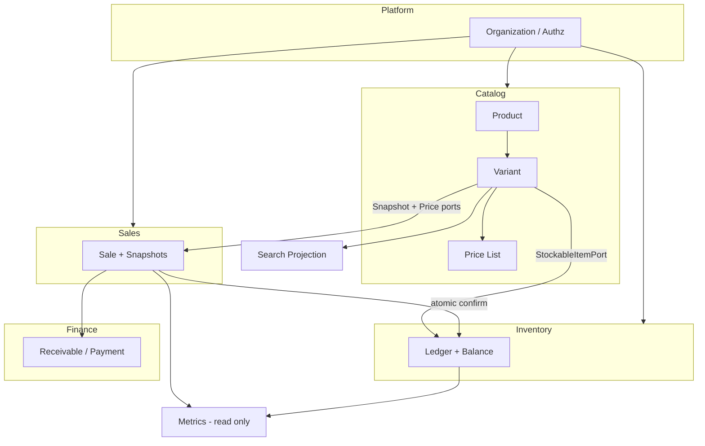

# Rescript — Architecture Decision Log

> Log consolidado das decisões arquiteturais aprovadas até Catalog Phase 0.
> Objetivo: um engenheiro novo compreender a arquitetura em poucos minutos.
> Detalhe normativo: ADRs individuais + `CatalogDomainStrategy.md` + `DomainContracts.md`.

---

## 1. Em uma frase

Rescript é um **monólito modular multi-tenant** (RLS) para varejo operacional: **Catalog** descreve o que se vende (Product → **Variant**), **Price List** precifica, **Inventory** quantifica por Variant (ledger), **Sales** confirma atomicamente com snapshots, **Finance** cobra, **Metrics** só lê.

---

## 2. Mapa mental

---

## 3. Decisões de plataforma (ADRs 0001–0015)

| ADR | Decisão |
|---|---|
| 0001 | Stack: TypeScript, React, Vite/TanStack, Supabase/Postgres |
| 0002 | Monólito modular — sem microserviços prematuros |
| 0003 | Multi-tenancy: `organization_id` + RLS |
| 0004 | Autorização RBAC por permissões (`can`) |
| 0005 | Estoque = ledger append-only; unidade = **ProductVariant** |
| 0006 | Financeiro: receivable/payment/cash separados — sem booleano `pago` |
| 0007 | Confirmação de Sale atômica (estoque + financeiro + auditoria) |
| 0008 | Eventos internos de domínio |
| 0009 | Outbox em PostgreSQL |
| 0010 | Insights determinísticos e rastreáveis |
| 0011 | Fiscal por adapter |
| 0012 | Monorepo mínimo |
| 0013 | Estratégia de deploy |
| 0014 | Estratégia de testes |
| 0015 | Observabilidade |

---

## 4. Decisões de operação comercial (ADRs 0016–0019)

| ADR | Decisão |
|---|---|
| 0016 | Custeio: média ponderada (Inventory) |
| 0017 | Reservation ≠ movimento físico; reserva no MVP (timing Sales: ver SalesDomainDesign) |
| 0018 | Um agregado Sale — sem Order separado no MVP |
| 0019 | Desconto acima do teto exige autorização |

---

## 5. Decisões Catalog (ADRs 0020–0025) — Phase 0

| ADR | Decisão |
|---|---|
| **0020** | Product = família; **Variant** = única identidade vendável/estocável/precificável; SaleItem → `variant_id` |
| **0021** | **Price List** (+ Entry) = única fonte de preço de lista; não coluna em Product/Variant |
| **0022** | Atributos genéricos + Variant Axes (sem schema por vertical) |
| **0023** | Cutover único Product→Variant no estoque; **proibido dual-write** |
| **0024** | Busca operacional = projeção reconstruível (`CatalogSearchPort`) |
| **0025** | Supplier **fora** do Catalog → Procurement futuro |

---

## 6. Decisões de produto / domínio (docs aprovados)

| Fonte | Decisão-chave |
|---|---|
| `CatalogDomainStrategy` | Catalog BC; Brand/Category roots; Metrics não calcula no Catalog; cutover único |
| `CatalogImplementationPlan` | Ordem Fases 0→8; Sales real só após cutover |
| `SalesDomainDesign` | Sale orquestra confirmação; snapshots; outbox table early / publisher late — **corrigido por ADR-0020** quanto a `product_id` na linha |
| `RetailDomainStrategy` | Beachhead moda; variantes+marca+busca no caminho crítico — preço canônico = ADR-0021 |

---

## 7. Ownership em 30 segundos

| Pergunta | Resposta |
|---|---|
| O que é este item? | Catalog (Product/Variant) |
| Quanto custa na prateleira (lista)? | Catalog Price List |
| Quanto tem no estoque? | Inventory |
| Quanto o cliente pagou? | Sales (+ Finance para receber) |
| Qual a margem/custo médio? | Inventory cost + Sales facts → Metrics/Finance |
| Quem é o cliente? | Customers |
| Qual a meta do mês? | Metrics / Goals |
| Como acho no balcão? | Search projection (não é a verdade) |

---

## 8. Ports que você deve conhecer

| Port | Dono | Uso |
|---|---|---|
| `CatalogSnapshotPort` | Catalog | Sales congela descrição |
| `PriceResolutionPort` | Catalog | Resolve preço de lista |
| `StockableItemPort` | Catalog | Inventory valida identidade |
| `StockAllocationPort` | Inventory | Sales reserva/baixa |
| `CatalogSearchPort` | Search/Catalog pipeline | UI/balcão busca |

Detalhe: `DomainContracts.md`.

---

## 9. O que nunca fazer (versão curta)

1. Tratar Product como stockable/vendável após o modelo canônico  
2. Gravar `list_price` no Product/Variant  
3. Dual-write de estoque  
4. Sales atualizar `inventory_balance`  
5. Metrics escrever no núcleo  
6. Finance ler Price List para reabrir Sale  
7. Reusar `product.id` como `variant.id`  
8. Começar Sales real antes do cutover  

Lista completa: `EngineeringGovernance.md` §5.

---

## 10. Ordem de implementação Catalog (não negociar no PR)

0. Governança (esta fase)  
1. Domínio puro  
2. Schema paralelo  
3. Repos/use cases  
4. Pricing  
5. UI Catalog  
6. **Cutover Inventory**  
7. Busca  
8. Hardening → go-ahead Sales  

Fonte: `CatalogImplementationPlan.md`.

---

## 11. Onde ler a seguir

| Se você vai trabalhar em… | Leia |
|---|---|
| Qualquer PR | `EngineeringGovernance.md` checklist |
| Catalog | `CatalogDomainStrategy` + ADR 0020–0025 |
| Inventory | ADR-0005, 0016, 0017, 0023 + InventoryArchitecture |
| Sales | SalesDomainDesign **+ ADR-0020** |
| Preço | ADR-0021 |
| Dependências | `DependencyRules.md` |
| Contratos | `DomainContracts.md` |

---

## 12. Histórico deste log

| Data | Evento |
|---|---|
| 2026-07-25 | Phase 0: ADRs 0020–0025 + pacote de governança criados |

Alterações futuras a decisões desta lista exigem **novo ADR** e atualização deste arquivo na mesma PR.
