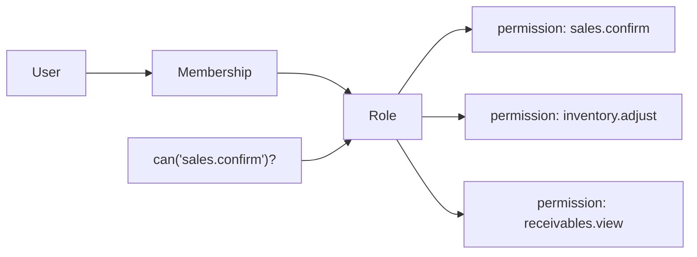
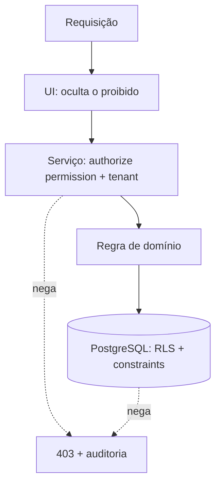
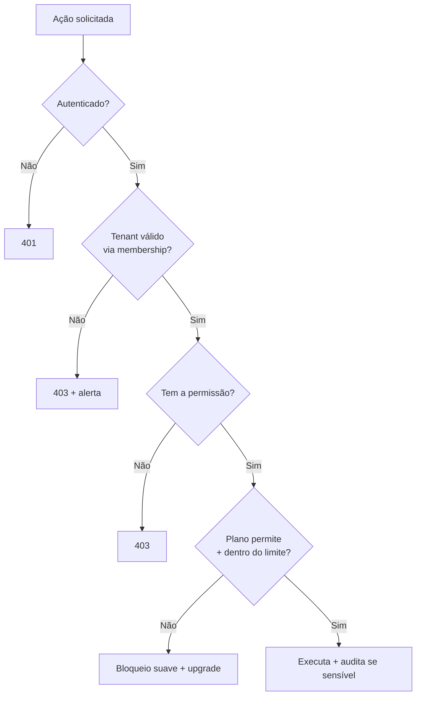

# Rescript — Autorização

> Estratégia de autorização: papéis, permissões, segregação de funções. Separada de autenticação e de entitlements.
> Status: Design de arquitetura (pré-implementação). Decisão formal em `adr/0004-authorization.md`.

---

## 1. Conceitos Distintos (nunca confundir)

| Conceito | Pergunta que responde | Onde vive |
|---|---|---|
| **Autenticação** | Quem é você? | Supabase Auth (`Identity`) |
| **Autorização** | O que você pode fazer? | Domínio `Authorization` |
| **Papel (role)** | Qual seu conjunto de permissões? | Membership |
| **Permissão** | Pode executar esta ação? | Authorization |
| **Entitlement** | Seu plano libera este recurso? | `Entitlements.md` |
| **Feature flag** | Este recurso está ligado? | `Entitlements.md` |
| **Plano comercial** | O que a empresa contratou? | Subscriptions |

> Regra de ouro: **autorização decide se o usuário pode; entitlement decide se o plano permite.** Uma ação só ocorre se **ambos** liberam. São checagens independentes e combinadas.

---

## 2. Modelo: RBAC com base em permissões

Adotamos **RBAC (Role-Based Access Control)** em que papéis são **conjuntos de permissões granulares** — não permissões cravadas no código por papel.

- **Permissão** = `recurso.ação` (ex.: `sales.confirm`, `inventory.adjust`, `receivables.reverse`).
- **Papel** = nome + conjunto de permissões.
- **Membership** = usuário + organização + papel(is).
- A verificação sempre pergunta por **permissão**, nunca por papel (`can('sales.confirm')`, não `if role == 'vendedor'`).

**Por que baseado em permissões:** permite criar papéis personalizados no futuro (só recombinar permissões) sem tocar no código — a checagem já é granular. Evita o anti-padrão de espalhar `if role ==` pelo sistema.

---

## 3. Papéis Iniciais (padrão, não permanente)

| Papel | Escopo típico de permissões |
|---|---|
| **Proprietário** | Tudo, incluindo gestão de assinatura, transferência de propriedade, exclusões sensíveis |
| **Administrador** | Gestão de usuários, configurações, quase tudo exceto propriedade/assinatura |
| **Gerente** | Operação completa + relatórios; sem gestão de conta/assinatura |
| **Vendedor** | Criar/confirmar vendas, ver clientes/produtos/estoque; sem ajustes financeiros sensíveis |
| **Estoquista** | Movimentar estoque, ajustes (com auditoria); sem financeiro |
| **Financeiro** | Recebíveis, pagamentos, estornos; sem alterar catálogo/estoque |
| **Consulta** | Somente leitura (ex.: contador) |

> Estes papéis são **presets** de permissões. O sistema não é permanentemente limitado a eles — papéis personalizados são um passo natural quando houver demanda (só recombinam permissões existentes).

---

## 4. Permissões Sensíveis e Segregação de Funções (SoD)

Certas ações são **sensíveis** e exigem tratamento especial (auditoria obrigatória, possivelmente permissão dedicada):

- Confirmar/cancelar venda.
- Ajustar estoque manualmente.
- Alterar preço.
- Alterar vencimento de recebível.
- Registrar/estornar pagamento.
- Importar dados.
- Mudar permissões/papéis.
- Emitir/cancelar documento fiscal.
- Transferir propriedade / gerenciar assinatura.

**Segregação de funções (futuro configurável):** evitar que a mesma pessoa acumule combinações de risco (ex.: quem ajusta estoque **e** aprova o inventário; quem registra a venda **e** estorna o pagamento sem rastro). No MVP, mitigado por papéis distintos + auditoria; SoD formal é evolução.

---

## 5. Camadas de Aplicação da Autorização (defesa em profundidade)

A autorização é verificada em **múltiplas camadas** (nunca só na UI):

1. **UI:** esconde/desabilita o que o usuário não pode (experiência), **nunca** como segurança.
2. **Serviço de aplicação:** toda operação sensível chama `authorize(permission)` antes de executar.
3. **Banco (RLS + constraints):** a última linha; a RLS restringe o que é visível/alterável por tenant, e permissões críticas podem ter reforço em funções SQL seguras.

---

## 6. Combinação Autorização × Entitlement (fluxo de decisão)

---

## 7. Invariantes de Autorização

1. **Default-deny:** o que não é explicitamente permitido é negado (AP9).
2. **Verificação por permissão**, nunca por nome de papel no código.
3. **Toda ação sensível** é autorizada **e** auditada.
4. **Autorização e entitlement são checagens independentes**; ambas precisam passar.
5. **A UI nunca é a fonte de segurança** — apenas de experiência.
6. **Mudança de papel** reflete rapidamente (sem privilégio preso em token antigo — `MultiTenancy.md` §5).

---

## 8. Evolução Futura (sem reescrita)

- **Papéis personalizados** por organização (recombinar permissões).
- **Permissões por módulo** ativadas conforme entitlements (ex.: permissões de Compras só existem se o módulo está ativo).
- **SoD configurável** e aprovações de duas pessoas para ações de altíssimo risco.
- **Permissões por unidade/filial** quando Units existirem.

> Como a checagem já é granular (por permissão), todas essas evoluções são **aditivas** — não exigem refazer o modelo (ADR-0004).
