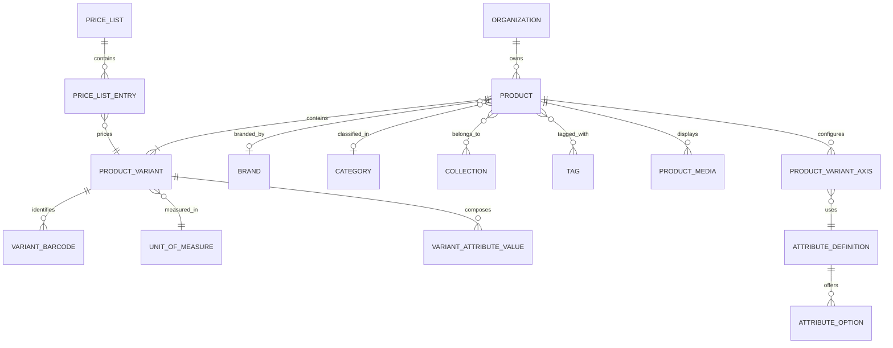
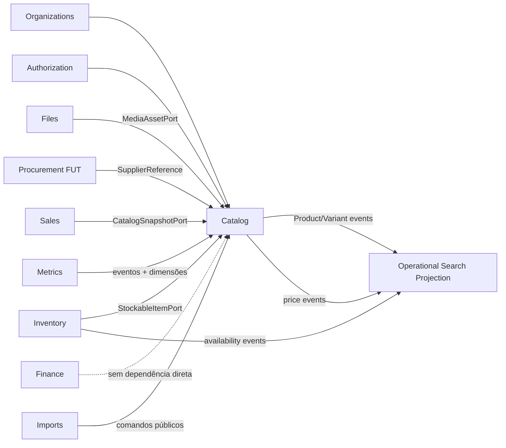
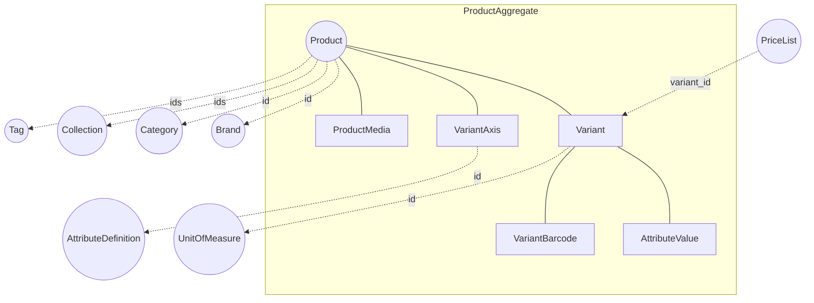
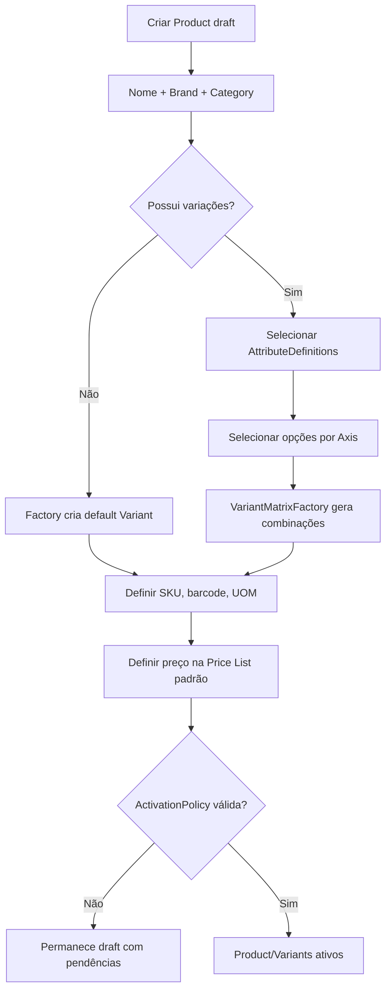
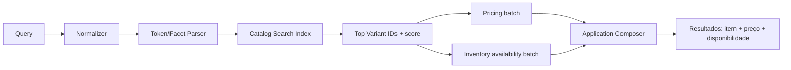
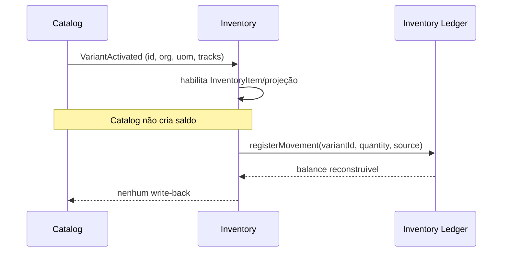
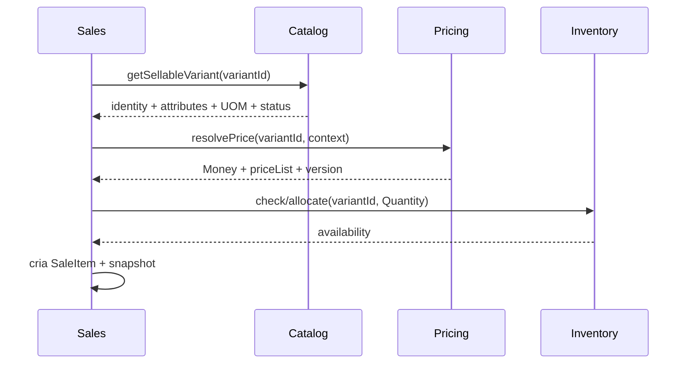
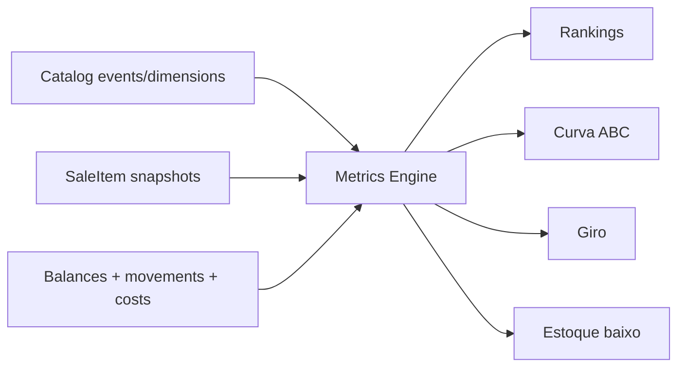

# Rescript — Catalog Domain Architecture

> Arquitetura oficial do domínio Catalog do Rescript.
> Status: **Design de domínio — referência normativa pré-implementação.**
> Esta sprint não cria código, banco, migration, API ou UI.
> Após aprovação, qualquer implementação divergente exige ADR explícito.

---

## 0. Autoridade, escopo e decisões fechadas

Este documento consolida e substitui, **somente para decisões do Catalog**, as
interpretações conflitantes encontradas em:

- `docs/database/ProductModel.md`
- `docs/database/VariantModel.md`
- `docs/database/PricingModel.md`
- `docs/architecture/SalesDomainDesign.md`
- `docs/product/RetailDomainStrategy.md`
- `docs/modules/Products*.md`
- `docs/modules/Inventory*.md`

ADRs aceitos permanecem superiores. Em especial, este documento não altera:

- ADR-0002 — monólito modular;
- ADR-0005 — estoque como ledger e unidade estocável = Variant;
- ADR-0007 — confirmação de Sale atômica;
- ADR-0009 — outbox;
- ADR-0016 — custo médio ponderado;
- ADR-0017 — Reservation distinta de Movement;
- ADR-0018 — Sale único, sem agregado Order;
- ADR-0019 — autorização de desconto.

### 0.1. Decisões centrais

Não há decisão crítica aberta neste design:

1. **Catalog é um Bounded Context**, não uma entidade ou “CRUD de produtos”.
2. **Product é o Aggregate Root** que representa uma família comercial.
3. **Variant é a única unidade vendável, precificável e estocável.**
4. Todo Product possui pelo menos uma Variant; produto simples usa uma
   **default Variant invisível**.
5. **SKU e Barcode pertencem à Variant**, nunca ao Product.
6. **Preço não pertence nem ao Product nem à Variant:** pertence a uma
   `PriceListEntry`, sempre endereçada por `variant_id`.
7. Toda organização possui exatamente uma **Price List padrão**.
8. Brand, Category, Collection, Tag, AttributeDefinition e UnitOfMeasure são
   Aggregate Roots independentes dentro de Catalog.
9. Supplier pertence ao futuro contexto **Procurement**, não ao Catalog.
10. Inventory é dono de saldo, movimento, reserva, custo e histórico físico.
11. Sales consome um contrato fino de Variant e congela snapshots.
12. Metrics calcula indicadores a partir de Sales/Inventory; Catalog fornece
    dimensões estáveis, nunca fórmulas.
13. Busca operacional usa uma projeção por Variant; catálogo continua fonte da
    identidade, não do saldo.
14. A migração do modelo flat terá **cutover único**: não haverá duas
    identidades estocáveis convivendo.

---

## 1. Executive Summary

Catalog responde a uma pergunta:

> **O que esta organização comercializa, como cada item é identificado,
> descrito, encontrado e precificado?**

O modelo oficial separa duas abstrações:

- **Product** — o conceito reconhecido pelo cliente: “Tênis Air Runner”,
  “Perfume X”, “Impermeabilizante Y”.
- **Variant** — a combinação concreta que pode ser vendida: “preto, 42”,
  “100 ml”, “galão 5 L”.

Essa separação representa roupas, calçados, perfumes, bolsas, malas, acessórios
e produtos de limpeza sem colunas específicas de segmento. Cor, tamanho,
volume, material, aroma ou capacidade são atributos configuráveis.

O Catalog:

- é simples para uma loja pequena, porque a default Variant fica oculta;
- é escalável, porque Variant já é a identidade usada por Sales e Inventory;
- preserva história, porque Sales copia snapshots;
- não conhece estoque, vendas, margem ou recebíveis;
- oferece uma linguagem publicada e contratos estáveis para os outros
  contextos.

### 1.1. Situação atual e destino

| Hoje implementado | Arquitetura oficial |
|---|---|
| Product flat | Product → Variant |
| SKU e unidade no Product | SKU, barcode e UOM na Variant |
| Categoria em texto livre | Category estruturada |
| Sem Brand | Brand normalizada |
| Sem preço | Price List padrão + PriceListEntry |
| Estoque por `product_id` | Estoque por `variant_id` |
| Busca por nome/SKU | Busca operacional por Variant |

O modelo atual é uma etapa legada. Não será estendido com novos campos
comerciais antes da transição para Catalog.

---

## 2. Objetivos do domínio

### 2.1. Objetivos

1. Representar qualquer produto físico sem especialização por segmento.
2. Dar identidade estável a cada unidade comercializável.
3. Permitir busca por linguagem operacional.
4. Separar descrição, preço, estoque e histórico em donos claros.
5. Alimentar Sales, Inventory e Metrics sem dependências circulares.
6. Evoluir para múltiplas listas de preço, integrações e multi-local sem
   remodelar Product ou Variant.
7. Preservar simplicidade visual para produtos sem variação.

### 2.2. Fora da responsabilidade de Catalog

| Tema | Contexto dono |
|---|---|
| Quantidade física e disponível | Inventory |
| Reserva | Inventory |
| Movimento e custo médio | Inventory |
| Preço praticado na venda | Sales |
| Desconto | Sales |
| Recebível e pagamento | Finance |
| Compra e relacionamento com fornecedor | Procurement |
| Fórmulas de indicadores | Metrics |
| Binários de foto | Files |

---

## 3. Revisão obrigatória — limitações e conflitos encontrados

### 3.1. Limitações implementadas

1. `product` acumula Product e Variant: nome, SKU, categoria e unidade.
2. `inventory_movement.product_id` e `inventory_balance.product_id` fixam
   Product como unidade física.
3. A RPC de movimento trava a linha de Product “para este SKU”.
4. Não existem preço, Brand, Category estruturada, Barcode ou atributos.
5. Permissões e repositórios usam o nome Products, não Catalog.
6. Auditoria de Products é apenas um port noop.

### 3.2. Conflitos documentais resolvidos

| Conflito | Decisão final |
|---|---|
| Sales inicial por Product vs varejo por Variant | **Variant precede Sales** |
| `product.list_price` vs `PriceCurrent` | **PriceListEntry por Variant** |
| Unidade em Product vs Variant | **Variant**; Product pode ter apenas default de criação |
| AttributeDef por Product vs facet global | Definição org-scoped + Axis por Product |
| Brand campo texto vs entidade | **Brand Aggregate Root** |
| Barcode index comum vs unique | **Único por organização** |
| Supplier no Product vs compras | **Procurement**, referência externa |
| `active/inactive` vs `active/archived` | `draft/active/archived` |
| Product como unidade estocável | **Proibido no modelo final** |

### 3.3. Risco de compatibilidade

O ledger existente referencia Product com `ON DELETE RESTRICT`. A evolução exige
criar uma default Variant por Product e remapear toda referência de Inventory
para ela. A implementação deverá preservar Product IDs como Product e criar
novos Variant IDs. Não se tentará reaproveitar `product.id` como `variant.id`.

---

## 4. Princípios arquiteturais

| ID | Princípio | Descrição e justificativa | Impacto | Consequência |
|---|---|---|---|---|
| CAT-P01 | Uma identidade vendável | Toda linha comercial referencia Variant | Elimina ambiguidade entre simples/variável | Até Product simples tem default Variant |
| CAT-P02 | Um dono por verdade | Catalog descreve; Inventory quantifica; Pricing precifica | Evita duplicidade e ciclos | Consultas compostas usam ports/projeções |
| CAT-P03 | Núcleo genérico, presets segmentais | Cor/Tamanho são configuração, não schema | Novos segmentos sem migration | Onboarding fornece presets |
| CAT-P04 | História não é reescrita | Alterar cadastro não altera Sale passada | Métricas históricas confiáveis | Sales usa snapshots |
| CAT-P05 | Identificadores não são nomes | Variant ID é identidade; SKU/barcode são códigos mutáveis auditados | Correções sem quebrar FKs | Histórico guarda snapshot anterior |
| CAT-P06 | Taxonomias controladas | Brand, Category e AttributeOption não são texto solto | Busca e métricas consistentes | Exige normalização e archive/merge |
| CAT-P07 | Configuração limitada | Eixos e variantes têm limites de segurança | Evita explosão combinatória | Limits são policy/entitlement |
| CAT-P08 | Busca é projeção | Índice é reconstruível; não é fonte de verdade | Evolução tecnológica sem mudar domínio | Eventos invalidam/reindexam |
| CAT-P09 | Preço é contextual | Price pertence a Price List + Variant | Múltiplas tabelas sem refatorar Variant | Lista padrão fica invisível no MVP |
| CAT-P10 | Sem hard delete comercial | Cadastros usados são arquivados | Preserva referências e auditoria | Códigos não são reutilizados automaticamente |
| CAT-P11 | Tenant em toda identidade | Toda entidade mutável é org-scoped | Isolamento e unicidade corretos | RLS + filtro de repositório |
| CAT-P12 | Ativação é uma garantia | Item ativo está completo para uso | Sales não encontra item incompleto | Ativação coordena Product e Pricing |
| CAT-P13 | Imports usam o domínio | Importação não escreve tabela diretamente | Mesmas invariantes em massa e UI | Preview + comandos idempotentes |
| CAT-P14 | Simplicidade por ocultação | Complexidade não usada não aparece | Pequeno lojista não “gerencia variantes” sem precisar | Modelo interno continua universal |

---

## 5. Linguagem ubíqua e modelo conceitual

### 5.1. Definições oficiais

| Termo | Definição |
|---|---|
| **Catalog** | Bounded Context que publica o que pode ser comercializado |
| **Product** | Família comercial reconhecida pelo cliente |
| **Variant** | Combinação concreta, vendável, precificável e estocável |
| **Variant Axis** | Atributo que diferencia variantes dentro de um Product |
| **Attribute** | Característica configurável e tipada |
| **SKU** | Código interno organizacional de uma Variant |
| **Barcode** | Identificador escaneável de uma Variant |
| **Price List** | Contexto comercial de preços para Variants |
| **Default Variant** | Variant única e visualmente oculta de Product simples |

### 5.2. Modelo

---

## 6. Entidades e responsabilidades

### 6.1. Catalog

**Natureza:** Bounded Context; não é Entity nem Aggregate Root.

**Responsabilidade:** linguagem, invariantes e contratos do catálogo.

**Dependências permitidas:** Organizations, Authorization, Files por port.

**Proibidas:** Inventory, Sales, Finance, Metrics e Procurement como
dependências internas.

### 6.2. Product

**Tipo:** Aggregate Root.

**Objetivo:** representar a família comercial que o cliente reconhece.

**Possui:**

- nome e descrição;
- `brand_id` opcional;
- `primary_category_id` opcional;
- memberships em Collections e Tags;
- Variant Axes;
- Variants;
- referências de Media;
- atributos descritivos de Product.

**Não possui:** SKU, barcode, saldo, custo, preço canônico ou fornecedor.

**Ciclo:** `draft → active → archived`; restauração retorna a `draft` e exige
nova validação para ativar.

**Invariantes:**

1. pertence a exatamente uma organização;
2. tem ao menos uma Variant;
3. ativo tem ao menos uma Variant ativa;
4. nome é obrigatório;
5. Product com referência externa nunca é apagado;
6. Product variável não possui default Variant;
7. Product simples possui exatamente uma default Variant.

### 6.3. ProductVariant

**Tipo:** Entity interna do Product Aggregate.

**Objetivo:** representar o item concreto vendido e movimentado.

**Possui:**

- SKU;
- zero ou mais Barcodes;
- UOM;
- combinação de atributos;
- `tracks_inventory`;
- `min_sale_qty` e `sale_multiple`;
- status;
- referências de Media específicas.

**Não possui:** preço, saldo, reserva ou custo médio.

**Ciclo:** `draft → active → archived`; pode retornar de archived para draft.

**Invariantes:**

1. ativa exige SKU, UOM e preço efetivo na Price List padrão;
2. SKU é único por organização, inclusive arquivado;
3. Barcode é único por organização, inclusive arquivado;
4. combinação de eixos é única no Product;
5. combinação e UOM tornam-se imutáveis após primeiro movimento ou Sale
   confirmada;
6. `tracks_inventory` torna-se imutável após primeiro movimento;
7. Variant com história não é apagada;
8. quantidade respeita precisão, mínimo e múltiplo.

### 6.4. Brand

**Tipo:** Aggregate Root org-scoped.

**Objetivo:** fabricante/marca comercial para busca, filtro e métricas.

**Ciclo:** `active → archived`.

**Invariantes:** nome normalizado único por organização. Arquivamento é
bloqueado enquanto houver Products ativos; primeiro reatribuir ou limpar.

**Relacionamento:** Product possui no máximo uma Brand.

**Proibido:** usar Brand como Supplier ou Collection.

### 6.5. Category

**Tipo:** Aggregate Root org-scoped.

**Objetivo:** classificação canônica para navegação e métricas.

**Estrutura:** árvore por adjacency (`parent_id`), profundidade máxima 5; UI MVP
mostra até 2 níveis.

**Relacionamento:** Product possui no máximo uma categoria primária. Não haverá
categorias secundárias no núcleo; agrupamentos transversais usam Collection ou
Tag.

**Invariantes:** nome normalizado único entre irmãos; sem ciclos; archive
bloqueado se houver Product ativo.

### 6.6. Collection

**Tipo:** Aggregate Root org-scoped.

**Objetivo:** agrupamento comercial temporal ou temático (“Verão 2027”,
“Volta às aulas”).

**Ciclo:** `draft → active → archived`, com período opcional.

**Relacionamento:** muitos Products para muitas Collections.

**Proibido:** determinar estoque, preço ou categoria contábil.

### 6.7. Supplier

**Tipo:** Aggregate Root do futuro Bounded Context **Procurement**, não do
Catalog.

**Objetivo:** representar parte fornecedora, condições e documentos de compra.

**Integração:** Catalog aceita um `SupplierReference` opaco em associações de
origem quando Procurement existir. Entrada de estoque referencia o documento de
compra, não um campo textual no Product.

**Decisão:** o MVP Catalog não terá campo livre `supplier`. Isso evitará
duplicatas e uma migração posterior de texto para entidade.

### 6.8. AttributeDefinition e AttributeOption

**Tipo:** AttributeDefinition é Aggregate Root org-scoped; opções são Entities
internas.

**Objetivo:** vocabulário configurável e reutilizável (“Cor”, “Tamanho”,
“Volume”, “Material”).

**Tipos:** `option`, `text`, `decimal`, `boolean`, `date`.

**Regras:**

- eixos de Variant usam apenas tipo `option`;
- atributos descritivos podem usar qualquer tipo;
- nome normalizado é único por organização;
- Option normalizada é única por Definition;
- Definition usada por Axis ativo não pode ser arquivada;
- Option usada por Variant ativa não pode ser arquivada.

### 6.9. ProductVariantAxis e Attribute Values

**Tipo:** Entities internas do Product Aggregate.

**Objetivo:** selecionar quais AttributeDefinitions diferenciam Variants e
quais opções são permitidas naquele Product.

**Invariantes:**

- máximo padrão de 3 eixos;
- máximo padrão de 500 Variants ativas por Product;
- hard safety limit de 10.000 combinações por Product;
- cada Variant variável tem exatamente um valor por Axis ativo;
- ordem dos eixos é estável;
- `combination_hash` é derivado de pares `attribute_id=option_id` ordenados.

Limites são políticas/entitlements; o modelo não muda para Enterprise.

### 6.10. SKU

**Tipo:** Value Object.

**Forma:** texto trimado, uppercase, sem ambiguidade de espaços.

**Escopo:** único por organização, inclusive em itens arquivados.

**Ciclo:** pode ser corrigido com auditoria; alteração emite evento. O ID da
Variant continua sendo identidade. Sales preserva o SKU antigo em snapshot.

**Geração:** manual ou por `SkuGenerationPolicy`; nunca é chave primária.

### 6.11. Barcode

**Tipo:** Value Object; `VariantBarcode` é Entity interna da Variant porque uma
Variant pode ter vários códigos.

**Tipos:** EAN-8, EAN-13, UPC-A, GTIN-14 e `internal`.

**Regras:** único por organização; no máximo um primário por Variant; formato
validado quando o padrão declara dígito verificador. Código removido fica
retirado, não é automaticamente reutilizado.

### 6.12. Media

**Tipo:** `ProductMedia` é Entity interna do Product; binário pertence a Files.

**Objetivo:** ordenar e descrever referências de imagem.

**Relacionamento:** mídia pode ser geral do Product ou específica de uma
Variant. Exatamente uma mídia primária por escopo quando existir.

**Invariantes:** referência pertence à mesma organização; alt text; ordem
única; Catalog nunca armazena binário.

### 6.13. Tag

**Tipo:** Aggregate Root org-scoped, leve.

**Objetivo:** agrupamento livre (“novidade”, “presente”, “outlet”) sem
contaminar Category.

**Invariantes:** nome normalizado único; Tag não é dimensão oficial de
contabilidade ou estoque. Metrics pode filtrar, mas não reclassifica história.

### 6.14. UnitOfMeasure

**Tipo:** Aggregate Root híbrido: defaults de plataforma + unidades custom da
organização.

**Pertence à Variant.** Product pode oferecer apenas `default_unit_id` como
conveniência da Factory; esse valor não é fonte comercial.

**Campos conceituais:** code, name, precision, integer_only, rounding policy.

**Decisão de precisão:**

| UOM | Precisão |
|---|---:|
| un, par, cx, pct | 0 |
| g, ml | 0 |
| kg, L, m | 3 |
| custom | 0–6; default 3 |

Inputs com precisão excedente são rejeitados, nunca arredondados
silenciosamente. Precisão/UOM não muda para Variant com história.

---

## 7. Bounded Contexts e Context Map

### 7.1. Context Mapping

| Relação | Padrão DDD | Contrato |
|---|---|---|
| Catalog ← Organizations/Auth | Conformist / upstream | tenant + `can` |
| Sales → Catalog | Customer/Supplier + ACL | `CatalogSnapshotPort` |
| Inventory → Catalog | Customer/Supplier | `StockableItemPort` |
| Metrics ← Catalog | Published Language | eventos versionados |
| Files → Catalog | ACL | `MediaAssetPort` |
| Procurement → Catalog | ACL | `SupplierReferencePort` |
| Imports → Catalog | Open Host Service | casos de uso idempotentes |

### 7.2. Dependências proibidas

- Catalog → Inventory/Sales/Finance/Metrics;
- Inventory → tabelas internas de Catalog;
- Sales → tabelas internas de Catalog;
- Metrics escrevendo Catalog;
- Catalog guardando DTO de provedor de marketplace;
- qualquer contexto lendo preço por coluna de Variant.

---

## 8. Aggregates e relacionamentos

### 8.1. Aggregate Roots

1. Product (Variants, Axes, Values, Media, memberships)
2. Brand
3. Category
4. Collection
5. AttributeDefinition
6. Tag
7. UnitOfMeasure
8. PriceList

### 8.2. Por que Variant não é Aggregate Root

Alternativas:

- Variant como root independente: permite escrita isolada, mas rompe as
  invariantes de combinação e default Variant.
- Variant dentro de Product: toda alteração valida o conjunto.

**Decisão:** Variant é Entity interna. Escritas passam por ProductRepository.
Leituras operacionais podem usar projeções por Variant sem transformar a
projeção em Aggregate Root.

---

## 9. Estratégia universal de variantes

### 9.1. Quando há variantes

Um Product é variável quando duas unidades comercializáveis diferem em um ou
mais atributos que afetam identificação, preço, disponibilidade ou escolha do
cliente.

Não é variável quando a diferença é apenas descritiva, sem unidade comercial
distinta.

### 9.2. Representação por segmento

| Produto | Product | Eixos possíveis | Variant exemplo |
|---|---|---|---|
| Camiseta | Camiseta Básica | Cor × Tamanho | Preta / M |
| Calçado | Tênis Runner | Número × Cor | 42 / Preto |
| Perfume | Perfume X | Volume × Concentração | 100 ml / EDP |
| Bolsa | Bolsa Tote | Cor × Material | Caramelo / Couro |
| Mala | Mala Travel | Tamanho × Cor | Grande / Azul |
| Limpeza | Impermeabilizante | Volume | 5 L |
| Acessório simples | Cinto Classic | nenhum | default Variant |

Nenhum desses nomes é coluna fixa.

### 9.3. Produto simples

- exatamente uma Variant;
- `is_default = true`;
- zero Variant Axes e zero combination values;
- UI apresenta campos de SKU, barcode, preço e unidade diretamente no Product;
- internamente Sales/Inventory continuam usando `variant_id`.

### 9.4. Mudança de topologia

Antes da primeira Sale confirmada ou InventoryMovement:

- simples pode virar variável;
- variável pode trocar eixos;
- Factory reconstrói combinações após confirmação explícita.

Depois do primeiro fato operacional:

- combinação e UOM são bloqueadas;
- Product simples não pode ser convertido em variável;
- Product variável não troca eixos;
- a correção segura é arquivar e criar novo Product/Variant.

Isso evita reinterpretar o passado.

### 9.5. Fluxo de cadastro

---

## 10. Estratégia de atributos

### 10.1. Dois usos, um vocabulário

| Uso | Exemplo | Armazenamento |
|---|---|---|
| **Variant Axis** | Cor, Tamanho, Volume | Option controlada |
| **Descritivo** | Material, gênero, resistência à água | valor tipado |

### 10.2. Evolução sem remodelagem

Nova característica cria AttributeDefinition e opções; não altera schema.

Presets são pacotes de configuração:

- Moda: Cor, Tamanho;
- Calçados: Número, Cor;
- Perfumes: Volume, Concentração;
- Limpeza: Volume, Fragrância.

Presets não têm privilégios no domínio e podem ser editados.

### 10.3. Consumo por Sales

`CatalogSnapshotPort` fornece:

- `product_id`, `variant_id`;
- nomes;
- SKU e barcode primário;
- UOM;
- atributos da combinação em ordem;
- Brand e Category;
- `tracks_inventory`;
- preço efetivo;
- `snapshot_schema_version`.

Sales não interpreta AttributeDefinition; apenas exibe e congela o mapa
publicado.

### 10.4. Consumo pela busca

O índice recebe display value, normalized value e aliases. Query `calça 42`
combina nome/categoria com option `42`; `perfume 100ml` reconhece alias
normalizado de “100 ml”.

---

## 11. Estratégia de busca operacional

### 11.1. Documento de índice

Uma projeção reconstruível por Variant contém:

- Variant/Product IDs;
- nome e aliases;
- Brand;
- caminho de Category;
- Collections e Tags;
- SKU;
- Barcodes;
- atributos e opções;
- status;
- preço efetivo da lista padrão.

Saldo não pertence ao documento canônico de Catalog.

### 11.2. Relevância oficial

Ordem:

1. Barcode exato;
2. SKU exato;
3. prefixo de SKU/barcode;
4. frase exata de Product;
5. Product + Brand;
6. Product + AttributeOption;
7. Category/Brand;
8. Collection/Tag;
9. fuzzy/trigram.

Normalização: trim, lowercase, casefold, remoção de acento, espaços e
pontuação; preserva original para exibição.

### 11.3. Parsing

- tokens livres são buscados em todos os campos;
- tokens explícitos (`tamanho m`, `marca nike`) viram filtros;
- números são avaliados em SKU/barcode e opções;
- sinônimos pertencem a um léxico org-scoped;
- o MVP não usa IA generativa ou vetores.

### 11.4. Filtros

Brand, Category, Collection, Tag, AttributeDefinition/Option, status e faixa de
preço.

Disponibilidade é filtro/enriquecimento de Inventory, não de Catalog.

### 11.5. Fluxo

### 11.6. Evolução tecnológica

- **MVP:** PostgreSQL FTS + trigram + índices exatos;
- **V2:** projeção operacional denormalizada alimentada por outbox;
- **Enterprise:** motor externo somente se volume/latência medidos justificarem.

O contrato `CatalogSearchPort` não expõe tecnologia; trocar motor não altera
domínio.

---

## 12. Estratégia de preços

### 12.1. Decisão

Preço pertence a:

> **PriceListEntry, dentro do Aggregate PriceList, endereçada por Variant.**

Não existe `product.price` nem `variant.price` como fonte de verdade.

### 12.2. MVP simples

- exatamente uma Price List padrão ativa por organização e moeda;
- criada automaticamente;
- UI não mostra “lista de preço” enquanto só existe uma;
- cada Variant ativa tem exatamente uma entrada vigente na lista padrão;
- valor zero é válido, mas exige motivo ao ser usado em Sale;
- Money usa decimal exato; persistência futura `NUMERIC(19,6)`, display BRL
  scale 2, half-up.

### 12.3. Evolução

| Etapa | Capacidade |
|---|---|
| MVP | Lista padrão |
| V2 | Atacado, varejo, promocional com vigência/prioridade |
| Enterprise | Segmento de cliente, canal, região, contrato |

`PriceResolutionPolicy` recebe `variant_id`, `price_list_id?`, customer/channel
e instante; retorna preço, lista, moeda, regra e versão. Sales congela o
resultado.

### 12.4. Histórico

Mudança cria novo intervalo; não reescreve histórico. `PriceChanged` é auditado
e emitido. PriceHistory é registro do agregado Pricing, não AuditEvent.

---

## 13. Integração com Inventory

### 13.1. Fronteira oficial

| Responsabilidade | Dono |
|---|---|
| Identidade e `tracks_inventory` | Catalog / Variant |
| Saldo físico | Inventory |
| Disponível | Inventory |
| Movimento | Inventory |
| Reserva | Inventory |
| Custo médio | Inventory |
| Histórico físico | Inventory ledger |
| Estoque mínimo / reposição | Inventory policy por Variant/Location |

Estoque mínimo **não pertence ao Catalog**, embora apareça na experiência de
Product. É uma configuração de Inventory.

### 13.2. Contrato

`StockableItemPort` publica: variant ID, org ID, status efetivo, UOM,
`tracks_inventory`. Inventory não recebe nome, Brand, Category ou preço para
proteger o saldo.

### 13.3. Diagrama

### 13.4. Migração do estoque atual

1. criar default Variant para cada Product legado;
2. copiar SKU e unidade;
3. criar mapa `product_id → default_variant_id`;
4. remapear movimentos e balances em uma transação/migration controlada;
5. reconciliar saldos por ledger;
6. mudar RPC/locks para Variant;
7. remover a interpretação de Product como stockable;
8. nunca manter dual-write.

---

## 14. Integração com Sales

### 14.1. Consumo sem acoplamento

Sales usa três contratos:

1. `CatalogSnapshotPort` — descrição estável;
2. `PriceResolutionPort` — preço de lista;
3. `StockAllocationPort` — Inventory, não Catalog.

### 14.2. Snapshot obrigatório

SaleItem guarda:

- product/variant IDs;
- Product e Variant display names;
- SKU;
- UOM e precision;
- Brand ID/name;
- Category ID/path;
- combinação de atributos (IDs + labels);
- list price, currency e Price List ID;
- `tracks_inventory_at_confirm`;
- schema version.

Confirmação revalida status e preço conforme política, mas só atualiza snapshot
mediante comando explícito antes de confirmar. Pós-confirmação é imutável.

### 14.3. Correção do SalesDomainDesign

Onde `SalesDomainDesign.md` usa `product_id` como unidade da linha, a
implementação aprovada deverá usar `variant_id`, mantendo `product_id` como
dimensão/snapshot. Essa correção exige ADR recomendado (§20), pois resolve a
divergência previamente registrada em D-01.

---

## 15. Integração com Metrics e Finance

### 15.1. Metrics

Catalog não calcula:

- top products/brands/categories;
- produtos parados;
- curva ABC;
- giro;
- estoque baixo.

Catalog fornece dimensões estáveis e eventos. Metrics combina:

| Indicador | Fontes |
|---|---|
| Mais vendidos por Product/Brand/Category | SaleItem snapshots |
| Parados | Sales facts + Inventory balance |
| Curva ABC | Revenue/COGS de Sales/Inventory, dimensão snapshot |
| Giro | units sold ou COGS / estoque médio de Inventory |
| Estoque baixo | Inventory balance + Inventory minimum policy |

Métrica histórica usa **snapshot da Sale**, não classificação atual. Uma
alteração de Brand/Category hoje não reclassifica vendas antigas. Uma visão
“catálogo atual” poderá ser oferecida separadamente e rotulada.

### 15.2. Finance

Finance não depende diretamente de Catalog. Usa:

- valores e dimensões congelados em SaleItem;
- custo aplicado no InventoryMovement;
- eventos `SaleConfirmed` e `InventoryMoved`.

Preço atual do catálogo nunca recalcula receita, margem ou recebível passado.

---

## 16. Artefatos DDD oficiais

### 16.1. Repositories

| Repository | Aggregate |
|---|---|
| ProductRepository | Product completo |
| BrandRepository | Brand |
| CategoryRepository | Category |
| CollectionRepository | Collection |
| AttributeDefinitionRepository | Definition + Options |
| TagRepository | Tag |
| UnitOfMeasureRepository | UOM |
| PriceListRepository | PriceList + Entries |

`CatalogSearchPort` é query/projection port, não repository de agregado.

### 16.2. Factories

- `ProductFactory` — cria Product simples + default Variant;
- `VariantMatrixFactory` — gera combinações controladas;
- `SkuGenerationPolicy` — sugere código; não garante unicidade sozinho;
- `CatalogSnapshotFactory` — constrói Published Language;
- `DefaultPriceListFactory` — cria lista padrão organizacional.

### 16.3. Domain Services e Policies

| Artefato | Responsabilidade |
|---|---|
| CatalogActivationService | valida Product + Variant + preço efetivo |
| VariantCombinationPolicy | eixo, opção e hash |
| PriceResolutionPolicy | resolve PriceListEntry efetiva |
| ProductTopologyPolicy | simples/variável e lock histórico |
| IdentifierPolicy | SKU/barcode normalizados e únicos |
| AttributeValuePolicy | tipagem/normalização |
| CatalogArchivePolicy | dependências ativas antes de arquivar |

### 16.4. Domain Events

- `ProductCreated`, `ProductActivated`, `ProductUpdated`, `ProductArchived`;
- `VariantCreated`, `VariantActivated`, `VariantUpdated`, `VariantArchived`;
- `VariantSkuChanged`, `VariantBarcodeChanged`;
- `ProductClassificationChanged`;
- `BrandChanged`, `CategoryChanged`, `CollectionChanged`;
- `AttributeDefinitionChanged`;
- `PriceListCreated`, `PriceChanged`;
- `CatalogItemReindexRequested`.

Payloads carregam `organization_id`, aggregate ID, version, timestamp, actor e
correlation ID. Eventos publicados via outbox quando houver consumidor.

### 16.5. Anti-Corruption Layers

- Marketplace Product/Offer → Catalog Product/Variant via adapter;
- Supplier/Vendor → Procurement SupplierReference;
- Storage object → MediaAsset;
- Fiscal NCM/tributos → FiscalClassificationReference futuro;
- motor externo de busca → CatalogSearchPort.

---

## 17. Decisões arquiteturais avaliadas

### CAT-D01 — Product flat ou Product + Variant

- **Problema:** produtos simples e variáveis precisam de identidade uniforme.
- **Alternativas:** Product como stockable; Variant opcional; Variant sempre.
- **Trade-off:** Variant sempre adiciona uma entidade interna.
- **Risco:** complexidade visível para pequenos lojistas.
- **Benefício:** Sales/Inventory têm uma única referência.
- **Impacto futuro:** nenhuma refatoração para novos segmentos.
- **Decisão:** Variant sempre, default invisível.
- **Justificativa:** complexidade interna controlada é menor que duas
  identidades comerciais.

### CAT-D02 — Atributos fixos ou configuráveis

- **Problema:** segmentos têm características distintas.
- **Alternativas:** colunas Cor/Tamanho; JSON livre; definitions tipadas.
- **Trade-off:** definitions exigem mais modelagem.
- **Risco:** excesso de configuração.
- **Benefício:** universalidade com facets confiáveis.
- **Impacto futuro:** atributos sem migration.
- **Decisão:** definitions tipadas; axes option-based; presets na UX.
- **Justificativa:** JSON livre não garante combinação nem métrica.

### CAT-D03 — Brand texto ou entidade

- **Problema:** grafias diferentes quebram busca e rankings.
- **Alternativas:** texto; Tag; Brand root.
- **Trade-off:** precisa lifecycle.
- **Risco:** duplicatas por import.
- **Benefício:** dimensão estável.
- **Impacto futuro:** marketplace e metas por marca.
- **Decisão:** Brand Aggregate Root org-scoped.
- **Justificativa:** Brand é identidade comercial, não decoração.

### CAT-D04 — Category única ou múltipla

- **Problema:** múltiplas categorias duplicam métricas.
- **Alternativas:** texto; many-to-many; uma primária + Collections/Tags.
- **Trade-off:** menor flexibilidade taxonômica.
- **Risco:** lojista querer merchandising cruzado.
- **Benefício:** métricas e navegação inequívocas.
- **Impacto futuro:** Collection cobre campanhas sem reclassificar.
- **Decisão:** uma Category primária opcional.
- **Justificativa:** uma dimensão oficial precisa de um valor oficial.

### CAT-D05 — Preço em Product, Variant ou PriceList

- **Problema:** preço varia por Variant, canal e cliente.
- **Alternativas:** coluna Product; coluna Variant; PriceListEntry.
- **Trade-off:** PriceList parece complexa no MVP.
- **Risco:** over-modeling.
- **Benefício:** evolução sem mover dados.
- **Impacto futuro:** atacado/promocional nativos.
- **Decisão:** PriceListEntry por Variant; lista padrão oculta.
- **Justificativa:** simplificar UI não justifica empobrecer o domínio.

### CAT-D06 — Supplier no Catalog

- **Problema:** produto pode ter vários fornecedores, condições e códigos.
- **Alternativas:** texto no Product; Supplier Catalog; Procurement.
- **Trade-off:** fornecedor não entra no Catalog MVP.
- **Risco:** necessidade antecipada.
- **Benefício:** evita duplicar Business Partner/compra.
- **Impacto futuro:** compras evoluem sem migrar texto.
- **Decisão:** Supplier pertence a Procurement.
- **Justificativa:** fornecedor é relação de suprimento, não identidade do item.

### CAT-D07 — Busca transacional ou projeção

- **Problema:** join vivo de taxonomias, atributos, preço e saldo escala mal.
- **Alternativas:** SQL direto; projeção interna; engine externo imediato.
- **Trade-off:** projeção é eventualmente consistente.
- **Risco:** atraso curto na indexação.
- **Benefício:** índice reconstruível e substituível.
- **Impacto futuro:** troca de engine sem domínio.
- **Decisão:** projection-first; PostgreSQL no MVP.
- **Justificativa:** engine externo agora é prematuro; join vivo é frágil.

### CAT-D08 — Variant como Root

- **Problema:** operações isoladas são convenientes, mas combinações são do
  conjunto.
- **Alternativas:** Variant Root; Variant dentro de Product.
- **Trade-off:** Product Aggregate pode crescer.
- **Risco:** Products com milhares de Variants.
- **Benefício:** invariantes atômicas.
- **Impacto futuro:** leitura usa projeção; escrita continua consistente.
- **Decisão:** Variant Entity interna; hard safety 10.000.
- **Justificativa:** combinações/default não são validáveis isoladamente.

### CAT-D09 — UOM herdada ou por Variant

- **Problema:** embalagens podem mudar unidade.
- **Alternativas:** Product; Variant; conversão livre.
- **Trade-off:** repetição entre Variants.
- **Risco:** edição indevida pós-movimento.
- **Benefício:** Quantity inequívoca.
- **Impacto futuro:** conversões podem ser novo conceito, sem mover UOM.
- **Decisão:** UOM na Variant, imutável após fato.
- **Justificativa:** estoque e Sale operam a Variant.

### CAT-D10 — Transição do legado

- **Problema:** ledger atual usa Product ID.
- **Alternativas:** dual-write longo; Product como Variant; cutover.
- **Trade-off:** cutover exige migration cuidadosa.
- **Risco:** saldo remapeado errado.
- **Benefício:** uma verdade após transição.
- **Impacto futuro:** elimina dívida permanente.
- **Decisão:** default Variant + remapeamento + cutover único.
- **Justificativa:** dualidade de identidade é risco maior que migration.

---

## 18. Segurança, permissões e RLS

### 18.1. Permissões

Reutilizar:

- `products.read`
- `products.create`
- `products.edit`
- `products.write`

Essas permissões cobrem Product, Variant, Brand, Category, Collection,
Attribute e Tag para evitar explosão de chaves.

Adicionar em implementação futura:

- `products.price` — criar/alterar Price Lists e preços.

Custos permanecem Inventory/Finance e exigirão permissão própria daquele
contexto, nunca `products.price`.

### 18.2. RLS

- `organization_id` obrigatório em todos os roots/linhas;
- SELECT por membro ativo;
- app/use case garante permissão granular;
- repositório sempre recebe organization ID;
- inserts/updates validam ator;
- sem DELETE comercial para authenticated;
- projeções de busca preservam tenant e não cruzam organizações.

---

## 19. Riscos e mitigações

| ID | Tipo | Risco | Mitigação |
|---|---|---|---|
| R1 | Domínio | Explosão de combinações | preview, limits 3/500/10k |
| R2 | Migração | Ledger remapeado incorretamente | mapa explícito + reconciliação antes/depois |
| R3 | Manutenção | Product Aggregate grande | projections de leitura; limites; comandos focados |
| R4 | Evolução | Texto livre fragmenta facets | taxonomias/Options normalizadas |
| R5 | Integração | Sales consulta tabela Catalog | ports + import boundary lint |
| R6 | Escala | Search com joins lentos | projeção + FTS/trigram; engine por evidência |
| R7 | Histórico | Reclassificação altera métricas | Sale snapshots oficiais |
| R8 | Preço | Duas fontes de preço | proibir colunas Product/Variant |
| R9 | Segurança | Busca vaza tenant | org no índice + testes RLS |
| R10 | UX | Default Variant expõe complexidade | ocultação sistemática |
| R11 | Domínio | Supplier vira texto legado | Supplier somente Procurement |
| R12 | Evolução | SKU alterado quebra integração | Variant ID canônico + evento + snapshot |
| R13 | Performance | Reindex storm em mudança de Brand | eventos agregados + batch/coalescing |
| R14 | Consistência | Preço ativo ausente | ActivationService exige entrada padrão |
| R15 | Integração | Barcode duplicado de fornecedor | unicidade org + fluxo de conflito |
| R16 | Manutenção | Preset vira regra de segmento | preset é dados/config, nunca branch de domínio |

---

## 20. ADRs recomendados

Criar antes da implementação:

1. **ADR-0020 — Product/Variant como modelo canônico do Catalog**
2. **ADR-0021 — Price Lists como fonte única de preço**
3. **ADR-0022 — Sistema genérico de atributos e Variant Axes**
4. **ADR-0023 — Migração do estoque Product→Variant com cutover**
5. **ADR-0024 — Busca operacional por projeção**
6. **ADR-0025 — Supplier fora do Catalog**

Os ADRs formalizam decisões deste documento; não reabrem alternativas sem nova
evidência.

---

## 21. Roadmap

### 21.1. Catalog MVP

1. Product + default/multi Variant;
2. Brand e Category;
3. AttributeDefinition/Option + Variant Axes;
4. SKU, Barcode e UOM;
5. Price List padrão;
6. cutover Inventory para Variant;
7. busca PostgreSQL por Variant;
8. snapshot contract para Sales;
9. importação com preview.

**Motivo:** mínimo que resolve loja física sem dívida Product flat.

### 21.2. Catalog V2

- Collections e Tags ricas;
- Media/fotos;
- múltiplas Price Lists e vigência;
- alias histórico de SKU/barcode;
- sinônimos organizacionais;
- labels/etiquetas;
- ACL Procurement/Supplier;
- projeção operacional assíncrona via outbox.

### 21.3. Catalog Enterprise

- catálogos compartilhados entre organizações do mesmo grupo;
- localização de conteúdo;
- milhares de Variants por Product via policy;
- external PIM/marketplace mappings;
- engine externo de busca;
- aprovação de alteração comercial;
- Price Lists por canal/contrato/região.

---

## 22. Checklist de prontidão para implementação

### Arquitetura

- [x] Catalog definido como Bounded Context
- [x] Product e Variant definidos sem ambiguidade
- [x] Aggregate Roots fechados
- [x] Atributos e variantes universais
- [x] Price ownership definido
- [x] Supplier ownership definido
- [x] Busca e evolução tecnológica definidas
- [x] Fronteiras Inventory/Sales/Metrics/Finance definidas
- [x] Migração conceitual do legado definida
- [x] Permissões/RLS definidas
- [x] Riscos e ADRs recomendados documentados

### Pré-condições para iniciar código

- [ ] Aprovação formal deste documento
- [ ] ADRs 0020–0025 registrados
- [ ] Plano operacional de migration/backfill/reconciliação revisado
- [ ] Contratos `CatalogSnapshotPort`, `StockableItemPort`,
      `PriceResolutionPort` versionados
- [ ] Cenários de teste de cutover e paridade de saldo aprovados

### Veredito

**Não existe decisão arquitetural crítica em aberto no Catalog.** Os itens ainda
desmarcados são etapas de governança e preparação de implementação, não
ambiguidades do domínio.

> Após aprovação, Sales, Inventory, Search e Metrics devem tratar `variant_id`
> como a única identidade comercial operacional. Qualquer exceção exige ADR.
