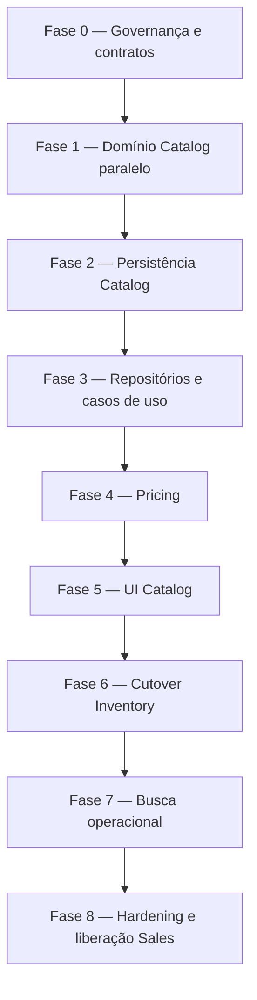
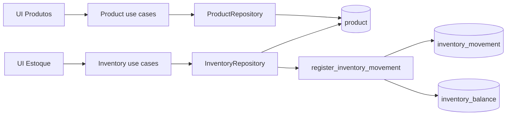
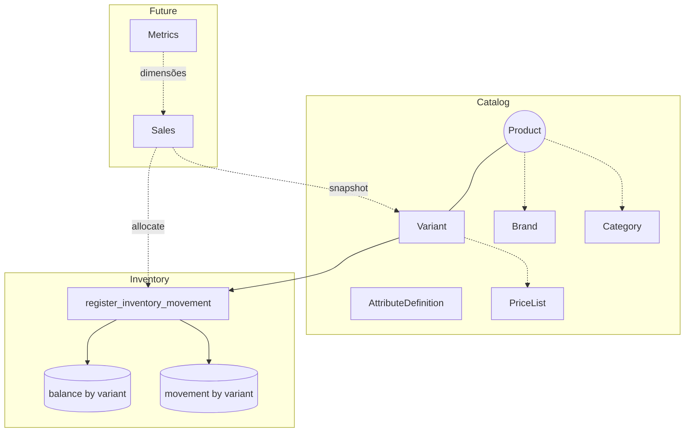

# Rescript — Catalog Implementation Plan

> Plano oficial de implementação e migração do domínio Catalog.
> Status: **Planejamento de execução — sem código, migration, banco, API ou UI nesta sprint.**
> Base normativa: `CatalogDomainStrategy.md` (aprovada arquiteturalmente).
> Complementa: `SalesDomainDesign.md`, `RetailDomainStrategy.md`, ADRs 0002–0019.
> Qualquer execução divergente deste plano exige aprovação explícita.

---

## 1. Executive Summary

O Catalog atual é um cadastro flat (`product` com SKU, categoria texto e unidade). O Inventory grava saldo e movimento em `product_id`. Sales ainda não existe como módulo (apenas mocks em `/vendas`). Metrics ainda não existe.

O destino aprovado é:

- **Product** = família comercial (Aggregate Root);
- **Variant** = única identidade vendável, precificável e estocável;
- **Price List padrão** = única fonte de preço;
- Inventory, Sales e Metrics operam por **`variant_id`**.

### 1.1. Estratégia de execução



Princípios do plano:

1. **Expandir antes de cortar.** Criar o modelo Catalog ao lado do flat; só depois remapear Inventory.
2. **Cutover único no estoque.** Sem dual-write Product/Variant.
3. **Não iniciar Sales real até o cutover.** Evita construir Sales sobre `product_id`.
4. **Cada fase tem critério de conclusão e rollback.**
5. **Gates verdes** (typecheck, lint, test, build) após toda fase que altera código.

### 1.2. Veredito de prontidão arquitetural

Não há decisão de domínio em aberto que impeça o planejamento.

Bloqueiam **início de código** (não o plano):

| Gate | Status |
|---|---|
| Aprovação formal deste plano | Pendente |
| ADRs 0020–0025 registrados | Pendente (não existem ainda) |
| Contratos versionados dos ports | Pendente (Fase 0) |
| Plano operacional de cutover/reconciliação revisado | Este documento; aprovação pendente |

---

## 2. Estado Atual

### 2.1. Como o sistema funciona hoje

| Área | Realidade |
|---|---|
| Catálogo | Tabela `product` flat; SKU único por org; category texto; unit texto; sem preço |
| Estoque | Ledger `inventory_movement` + `inventory_balance` por `(org, product_id)` |
| Escrita de estoque | Somente RPC `register_inventory_movement(p_product_id, …)` |
| Soft archive | `product.status = inactive` + `archived_at`; bloqueia movimentos |
| Sales | Rotas mock `/vendas`; sem `modules/sales`; sem FK para produto |
| Metrics | Não implementado |
| Busca | SearchBar local nas listas; sem índice operacional |
| Permissões | `products.*`, `inventory.read\|move\|adjust` |

### 2.2. Entidades físicas existentes

| Tabela | Papel |
|---|---|
| `organization` | Tenant |
| `membership` | Papéis |
| `customer` | Clientes |
| `product` | Catálogo + identidade estocável |
| `inventory_movement` | Ledger append-only |
| `inventory_balance` | Saldo materializado |

### 2.3. Módulos de código impactados

| Módulo | Path | Impacto |
|---|---|---|
| Products | `apps/web/src/modules/products/**` | **Alto** — reestruturação completa |
| Inventory | `apps/web/src/modules/inventory/**` | **Alto** — identidade `productId` → `variantId` |
| Routes produtos | `routes/_app/produtos/**` | **Alto** |
| Routes estoque | `routes/_app/estoque/**` | **Alto** |
| Query keys | `platform/cache/query-keys.ts` | Médio |
| Permissions | `packages/permissions/**` | Médio (`products.price`) |
| Database types | `packages/database/**` | Alto (regen) |
| Domain package | `packages/domain/**` | Médio (Money/Quantity + tipos Catalog) |
| Commands / Home | `platform/commands`, `components/home` | Baixo |
| Vendas (mock) | `routes/_app/vendas/**` | Baixo até Sales real |
| Customers | `modules/customers/**` | Nenhum direto |

### 2.4. Dependências atuais



Inventory **lê** `product` para listar saldos (embed balance). Catalog flat é a fonte de nome/SKU/unit.

---

## 3. Estado Final

### 3.1. Como ficará o sistema

| Área | Destino |
|---|---|
| Catálogo | Product → Variant (+ Brand, Category, Attribute*, PriceList) |
| Identidade vendável | `variant_id` |
| Preço | `price_list` + `price_list_entry` (lista padrão por org) |
| Estoque | Ledger e balance por `variant_id` |
| RPC | `register_inventory_movement(p_variant_id, …)` |
| Busca | Projeção operacional por Variant |
| Sales (futuro) | Consome `CatalogSnapshotPort` + `PriceResolutionPort` + `StockAllocationPort` |
| Metrics (futuro) | Dimensões de snapshot/Variant; não lê Catalog como FT |

### 3.2. Diagrama alvo



### 3.3. Garantias pós-migração

1. Nenhum código operacional trata Product como stockable.
2. Toda Variant ativa tem SKU, UOM e preço na lista padrão.
3. Product simples tem exatamente uma default Variant (UI oculta).
4. Saldos reconciliam com o ledger após cutover.
5. Sales, quando iniciar, nasce já em `variant_id`.

---

## 4. GAP Analysis

| # | Atual | Desejado | Código afetado | Módulo | Risco | Ordem |
|---|---|---|---|---|---|---|
| G01 | Product flat | Product Aggregate + Variants | `modules/products/**` → `modules/catalog/**` (ou evolução) | Catalog | Alto | Fases 1–3 |
| G02 | SKU no Product | SKU na Variant | validation, form, unique index | Catalog | Alto | 2–3, 6 |
| G03 | Category texto | Category Aggregate | create/update/list filters | Catalog | Médio | 2–3, 5 |
| G04 | Sem Brand | Brand Aggregate | create/list/search | Catalog | Médio | 2–3, 5 |
| G05 | Sem atributos | AttributeDefinition + Axes | domain + UI grade | Catalog | Alto | 1–3, 5 |
| G06 | Sem preço | PriceList + Entry | pricing ports + UI | Pricing | Alto | 4–5 |
| G07 | Sem barcode | VariantBarcode | domain + search | Catalog | Médio | 2–3, 7 |
| G08 | Unit texto | UnitOfMeasure | Variant.unit_id | Catalog | Médio | 2–3 |
| G09 | Balance por product | Balance por variant | SQL + repo + RPC | Inventory | **Crítico** | 6 |
| G10 | Movement por product | Movement por variant | SQL + mappers + UI | Inventory | **Crítico** | 6 |
| G11 | Lock RPC em product | Lock em variant/product+variant | RPC | Inventory | **Crítico** | 6 |
| G12 | Stock UI por product | Stock UI por variant | estoque routes | Inventory UI | Alto | 5–6 |
| G13 | Query keys productStock | variantStock | query-keys | Platform | Baixo | 3, 6 |
| G14 | Sem search index | Catalog search projection | novo módulo/projeção | Search | Médio | 7 |
| G15 | Sem ports | Snapshot/Price/Stockable ports | packages/contracts ou modules | Integração | Alto | 0–1 |
| G16 | Sales mock product-centric | Sales variant-centric | futuro `modules/sales` | Sales | Alto se antecipado | 8 (não antes) |
| G17 | Metrics inexistente | Dimensões Variant | futuro Metrics | Metrics | Baixo agora | pós-Catalog |
| G18 | Sem `products.price` | Permissão de preço | permissions keys/roles | Authz | Baixo | 0, 4 |
| G19 | Status active/inactive | draft/active/archived | domain + SQL checks | Catalog | Médio | 2–3 |
| G20 | Docs Sales D-01 product_id | variant_id na linha | SalesDomainDesign + ADR | Docs/ADR | Médio | 0 |

### 4.1. O que NÃO muda

- Atomicidade do ledger (ADR-0005);
- RLS via `is_org_member`;
- Soft archive (sem DELETE);
- Padrão use case `{ repository, can, organizationId, … }`;
- Clientes e Organizations;
- Proibição de Catalog escrever saldo.

---

## 5. Plano de Implementação (fases)

### Fase 0 — Governança e contratos

**Objetivo:** destravar execução sem reabrir arquitetura.

**Pré-requisitos:** `CatalogDomainStrategy.md` aprovada.

**Entregas:**

1. Registrar ADRs 0020–0025 (conteúdo já decidido na strategy).
2. Versionar interfaces TypeScript (stubs, sem implementação):
   - `CatalogSnapshotPort`
   - `PriceResolutionPort`
   - `StockableItemPort`
   - `CatalogSearchPort`
   - `StockAllocationPort` (Inventory — shape estável)
3. Adicionar chave `products.price` em permissions (sem UI ainda).
4. Atualizar nota em `SalesDomainDesign.md`: SaleItem usa `variant_id` (referência a ADR-0020).
5. Checklist de cutover e reconciliação revisado pela equipe.

**Arquivos impactados (planejados):**

- `docs/architecture/adr/0020–0025-*.md`
- `packages/domain` ou `packages/catalog-contracts` (tipos de port)
- `packages/permissions/src/keys.ts`, `roles.ts`
- `docs/architecture/SalesDomainDesign.md` (nota corretiva, não redesign)

**Riscos:** começar código sem ports versionados → acoplamento precoce.

**Conclusão:** ADRs existentes; ports compilam; `products.price` no catálogo de permissões; Sales doc alinhado.

**Rollback:** reverter commits de docs/ports; sem efeito em produção.

---

### Fase 1 — Domínio Catalog (puro, sem I/O)

**Objetivo:** modelar o domínio em TypeScript sem tocar banco legado.

**Pré-requisitos:** Fase 0.

**Entregas:**

1. Estrutura `apps/web/src/modules/catalog/` (ou evolução controlada de `products` → `catalog` com barrel de compatibilidade).
2. Tipos: Product, Variant, Brand, Category, AttributeDefinition/Option, Axis, Value, Barcode, UnitOfMeasure, PriceList/Entry.
3. Value Objects: SKU, Barcode, Money (decimal), Quantity.
4. Policies: Activation, Combination, Identifier, Topology.
5. Factories: ProductFactory (default Variant), VariantMatrixFactory.
6. State machine de status: `draft | active | archived`.
7. Testes unitários de invariantes (default Variant, hash, unicidade lógica, ativação).

**Arquivos impactados:** novo domínio + testes; **não** substitui `modules/products` ainda.

**Riscos:** modelagem anêmica; copiar tipos flat.

**Conclusão:** testes de domínio verdes; nenhuma alteração em rotas/SQL.

**Rollback:** remover módulo novo; sistema legado intacto.

---

### Fase 2 — Persistência Catalog (schema paralelo)

**Objetivo:** criar tabelas novas **sem** quebrar `product` / inventory existentes.

**Pré-requisitos:** Fase 1; ADR-0020/0021/0022.

**Tabelas a criar (planejamento — não executar nesta sprint):**

| Tabela | Notas |
|---|---|
| `brand` | org-scoped, nome normalizado unique |
| `category` | árvore `parent_id`, unique por irmãos |
| `unit_of_measure` | platform defaults + org custom |
| `attribute_definition` | org-scoped |
| `attribute_option` | por definition |
| `product_v2` **ou** evolução de `product` | ver §8.1 |
| `product_variant` | FK product; `is_default`; sku unique org; combination_hash |
| `product_variant_axis` | eixos do product |
| `product_variant_attribute_value` | combinação |
| `product_variant_barcode` | barcodes |
| `price_list` | lista padrão por org |
| `price_list_entry` | preço vigente por variant |
| `price_history` | append/close-interval |
| `collection` / `tag` / memberships | opcional MVP mínimo (Brand+Category obrigatórios) |

**Estratégia de tabela Product:**

| Alternativa | Avaliação |
|---|---|
| A. Criar `product_new` e trocar depois | Seguro, mais trabalho de dual-read |
| B. Alterar `product` in-place removendo sku/unit | **Perigoso** antes do cutover Inventory |
| C. Manter `product` como Product; **mover** sku/unit para variant na mesma migration do cutover | ✅ Escolhida |

**Decisão oficial:** na Fase 2, criar tabelas filhas e taxonomias; **manter** `product.sku`/`unit`/`category` até a Fase 6. Introduzir em `product` apenas colunas nullable autorizadas em §8.2/§8.5: `brand_id`, `primary_category_id`, `lifecycle_status` (representação transitória de status draft/active/archived sem mutar `status` legado). SKU continua no Product legado até cutover.

**Índices/constraints planejados:** ver §8.

**Riscos:** migration parcial deixa schema híbrido longo demais.

**Conclusão:** migrations aplicadas em ambiente de staging; app legado continua 100% funcional.

**Rollback:** down migration das tabelas novas (ainda sem FKs de inventory nelas).

---

### Fase 3 — Repositórios e casos de uso Catalog

**Objetivo:** CRUD/ativação do novo modelo em paralelo; UI ainda no flat (ou feature flag).

**Pré-requisitos:** Fase 2.

**Entregas:**

1. Repositories: Product, Brand, Category, AttributeDefinition, PriceList (stubs de Price se Fase 4 conjunta).
2. Use cases: create/update/archive/restore/activate; create variants; manage axes.
3. Mappers snake_case ↔ domínio.
4. Feature flag `catalog.v2` (settings/env) — default off.
5. Manter `modules/products` legado operando.

**Arquivos impactados:** `modules/catalog/**`, possivelmente adapters; query-keys novos sob `catalog.*`.

**Riscos:** dois CRUDs confundem a equipe; flag mal usada em produção.

**Conclusão:** testes de integração Catalog verdes; legado intacto; flag off.

**Rollback:** desligar flag; repositórios novos não são chamados.

---

### Fase 4 — Pricing

**Objetivo:** Price List padrão + PriceResolutionPort.

**Pré-requisitos:** Variant persistida (Fase 2–3).

**Entregas:**

1. Auto-criar Price List padrão por organização (migration/backfill).
2. `price_list_entry` obrigatória para Variant ativa.
3. `PriceResolutionPort.resolve(variantId, context)`.
4. Histórico de preço.
5. Gate `products.price` nos use cases de preço.
6. ActivationService exige preço efetivo.

**Riscos:** Variant ativa sem preço; float em Money.

**Conclusão:** toda Variant de teste ativa resolve preço; Money decimal testado.

**Rollback:** feature flag; entries podem permanecer sem consumo.

---

### Fase 5 — Frontend Catalog

**Objetivo:** UI do novo catálogo atrás da flag (ou rota canary).

**Pré-requisitos:** Fases 3–4.

**Entregas:**

1. Lista de Products (nome, brand, category, #variants, status).
2. Criação simples (default Variant oculta: SKU, barcode, unit, preço).
3. Criação com eixos (grade Cor×Tamanho etc.).
4. Detalhe Product + tabela de Variants.
5. Gestão Brand/Category (telas mínimas ou dialogs).
6. Não remover UI flat até Fase 6+ validada.

**Arquivos impactados:**

- Novas rotas ou substituição gradual de `produtos/**`
- Forms, dialogs, empty states
- Command palette entries

**Riscos:** UX complexa para produto simples; regressão de fluxo atual.

**Conclusão:** checklist UX: criar simples, criar variável, arquivar, ativar, editar preço; flag pode ir a on em staging.

**Rollback:** flag off → UI flat.

---

### Fase 6 — Cutover Inventory (crítico)

**Objetivo:** tornar Variant a única identidade estocável.

**Pré-requisitos:**

- Toda org com Products migrados para Product+default Variant (backfill);
- Mapa `product_id → default_variant_id` completo e verificado;
- Staging com cópia de produção (ou dump) e ensaio de reconciliação;
- Janela de manutenção / write freeze curto.

**Passos oficiais:**

1. **Freeze writes** de inventory (maintenance mode ou feature freeze).
2. Backfill: para cada `product`, garantir default Variant com SKU/unit/preço.
3. Inserir mapa de migração (tabela temporária `catalog_product_variant_map`).
4. Em transação controlada:
   - adicionar `variant_id` nullable em `inventory_movement` e `inventory_balance`;
   - popular `variant_id` via mapa;
   - verificar `COUNT(*)` e soma de quantidades;
   - trocar PK/FK para `variant_id`;
   - dropar `product_id` das tabelas de estoque (ou tornar nullable deprecated por uma release — **preferência do plano: remover no mesmo cutover** para evitar dualidade);
   - atualizar RPC para `p_variant_id` + lock adequado;
   - atualizar `compute_*` helpers.
5. Remover leitura de stock a partir de `product` flat; Inventory passa a join Variant (+ Product).
6. Atualizar UI estoque (picker = Variant).
7. Mover SKU/unit de `product` para apenas Variant (colunas legadas dropadas ou unused).
8. **Reconciliar:** `compute_stock(variant) == balance.quantity` para 100% das linhas.
9. Abrir writes.

**Arquivos impactados:**

- `supabase/migrations/*_inventory_variant_cutover.sql` (futuro)
- `modules/inventory/**` inteiro
- `modules/products` legado → deprecado
- routes estoque
- query-keys
- generated database types

**Riscos:** perda/duplicação de saldo; downtime longo; RPC incompleta.

**Conclusão:**

- zero linhas de movement/balance sem `variant_id`;
- reconciliação 100%;
- smoke: entry/exit/adjust em Variant;
- produto arquivado bloqueia movimento;
- testes Inventory reescritos verdes.

**Rollback:**

- Restaurar backup pré-freeze **antes** de abrir writes;
- Se falha no meio da TX, rollback da TX;
- Após writes novos em Variant, rollback completo exige restore de backup (documentar RPO/RTO).
- **Não** há rollback parcial para dual-write.

---

### Fase 7 — Busca operacional

**Objetivo:** `CatalogSearchPort` com FTS/trigram sobre projeção Variant.

**Pré-requisitos:** Cutover concluído; preço e taxonomias estáveis.

**Entregas:**

1. Tabela/projeção `catalog_search_document` (ou materialized view) por Variant.
2. Triggers/outbox jobs para reindex em mudanças Catalog/Price.
3. Disponibilidade enriquecida via batch Inventory (não no documento canônico).
4. UI SearchBar de venda/lista usa o mesmo port.
5. Testes de queries canônicas (`calça preta`, EAN, SKU).

**Riscos:** índice stale; vazamento multi-tenant.

**Conclusão:** queries canônicas passam; RLS/tenant tests passam; latência p95 aceitável em staging.

**Rollback:** fallback para busca SQL simples por nome/SKU; desligar projeção.

---

### Fase 8 — Hardening e liberação para Sales

**Objetivo:** aposentar flat; liberar início do módulo Sales.

**Pré-requisitos:** Fases 6–7 estáveis em produção por período de observação definido (ex.: 7 dias / N orgs).

**Entregas:**

1. Remover feature flag / UI flat.
2. Remover use cases legado `modules/products` ou reduzir a adapters thin.
3. Documentar `CatalogSnapshotPort` como contrato obrigatório de Sales.
4. Checklist Sales: linha = `variant_id`; snapshot schema v1.
5. Não implementar Sales nesta fase — apenas **liberar** o início.

**Conclusão:** nenhum path de código usa Product como stockable; gates verdes; ADR-0020 cumprido.

**Rollback:** não reintroduzir Product stockable; rollback = hotfix no Catalog/Inventory, não retorno ao flat.

---

## 6. Ordem de Execução (definitiva)

| Ordem | Fase | Por quê nesta posição |
|---|---|---|
| 0 | Governança + ports + ADRs | Sem contratos, o resto acopla errado |
| 1 | Domínio puro + testes | Valida invariantes barato |
| 2 | Schema Catalog paralelo | Expande sem quebrar estoque |
| 3 | Repos/use cases Catalog | Persistência atrás de flag |
| 4 | Pricing | Ativação exige preço |
| 5 | UI Catalog | Exercita domínio antes do cutover |
| 6 | **Cutover Inventory** | Momento único e irreversível na prática |
| 7 | Busca | Depende de Variant estável + preço |
| 8 | Hardening / go-ahead Sales | Sales não nasce no modelo morto |

**Proibido:**

- Começar Sales real antes da Fase 6;
- Dual-write Inventory Product+Variant;
- Dropar `product.sku` antes do cutover;
- Entregar Metrics Engine antes do Catalog estável (pode planejar em paralelo, não consumir Product como FT).

---

## 7. Impacto por módulo

### 7.1. Catalog / Products

| Item | Ação |
|---|---|
| `modules/products` | Evolui para `catalog` ou fica adapter até Fase 8 |
| Types / validation | Reescritos |
| Forms | Simples + grade de variantes |
| List/Detail | Novas colunas (brand, variants count) |
| Audit port | Eventos Product/Variant/Price |

### 7.2. Inventory

| Item | Ação |
|---|---|
| Domain types | `productId` → `variantId` |
| Repository / RPC | Retarget |
| listStock | Join Variant (+ Product name) |
| Movement form | Select Variant |
| Tests | Reescrita massiva |
| Errors | `variant_not_found`, `variant_archived` |

### 7.3. Sales

| Item | Ação |
|---|---|
| Mocks atuais | Ignorar para cutover |
| Módulo futuro | **Só após Fase 8** |
| SaleItem | `variant_id` + snapshots |
| Ports | Snapshot + Price + StockAllocation |

### 7.4. Metrics

| Item | Ação |
|---|---|
| Ainda inexistente | Planejar grãos Variant/Brand/Category |
| Não calcular no Catalog | Apenas consumir eventos/snapshots |

### 7.5. Platform

| Item | Ação |
|---|---|
| query-keys | Namespace `catalog` + `inventory.variantStock` |
| permissions | `products.price`; roles owner/admin/manager |
| commands | Deep links atualizados |
| Money em `@rescript/domain` | Decimal antes de Pricing |

---

## 8. Impacto no banco (planejamento)

### 8.1. Tabelas a criar

`brand`, `category`, `unit_of_measure`, `attribute_definition`, `attribute_option`, `product_variant`, `product_variant_axis`, `product_variant_attribute_value`, `product_variant_barcode`, `price_list`, `price_list_entry`, `price_history`, (opcional MVP) `collection`, `tag`, `product_collection`, `product_tag`, `product_media`, tabela temporária `catalog_product_variant_map`.

### 8.2. Tabelas a alterar

| Tabela | Alteração |
|---|---|
| `product` | Adicionar `brand_id`, `primary_category_id` (§8.5), e `lifecycle_status` (`draft\|active\|archived`, nullable) como forma transitória de “status draft” **sem** alterar o `status` legado `active\|inactive`. Remover depois `sku`/`unit`/`category` texto (cutover / Fase 6–8). **Não** persistir `topology` nem `default_unit_of_measure_id` no Product nesta fase (topologia deriva dos eixos; UOM canônica fica na Variant). |
| `inventory_movement` | `product_id` → `variant_id` |
| `inventory_balance` | PK `(org, variant_id)` |

### 8.3. Índices necessários

- `(organization_id, sku)` UNIQUE em `product_variant` WHERE sku IS NOT NULL (MVP: sku obrigatório em active → tratar NOT NULL em active via check parcial ou app+DB)
- `(organization_id, barcode)` UNIQUE em `product_variant_barcode`
- `(product_id, combination_hash)` UNIQUE
- `(organization_id, status)` em product/variant
- FTS/trigram na projeção de busca
- Balance `(organization_id, quantity)`
- Movement `(organization_id, variant_id, occurred_at DESC)`

### 8.4. Constraints

- Archive/status checks em product/variant;
- `quantity > 0` movements; `quantity >= 0` balance;
- Price amount >= 0;
- Uma price list padrão por org;
- Uma default variant por product simples;
- Imutabilidade de movement (triggers existentes adaptados).

### 8.5. FKs que mudam

| De | Para (hoje) | Para (final) |
|---|---|---|
| `inventory_movement.product_id` | `product.id` | `product_variant.id` |
| `inventory_balance.product_id` | `product.id` | `product_variant.id` |
| `price_list_entry.variant_id` | — | `product_variant.id` |
| `product.brand_id` | — | `brand.id` |
| `product.primary_category_id` | — | `category.id` |

### 8.6. RPCs

| RPC | Mudança |
|---|---|
| `register_inventory_movement` | `p_variant_id`; lock variant; check variant/product active |
| `compute_product_stock` | Renomear/alias `compute_variant_stock(p_variant_id)` |
| `inventory_movement_delta` | Manter; estender tipos `return`/`reversal` quando Sales/devolução |

---

## 9. Impacto no backend

### 9.1. Repositories

| Novo / alterado | Responsabilidade |
|---|---|
| `CatalogProductRepository` | Product Aggregate |
| `BrandRepository` | Brand |
| `CategoryRepository` | Category |
| `AttributeDefinitionRepository` | Defs/options |
| `PriceListRepository` | Lists/entries/history |
| `InventoryRepository` | Retarget variant |
| `ProductRepository` (legado) | Deprecated pós-Fase 6 |

### 9.2. Use cases / services

Catalog: create/update/activate/archive product; manage variants/axes; set price; manage brand/category.

Inventory: register entry/exit/adjust por variant; list stock/movements por variant.

Domain services: `CatalogActivationService`, `PriceResolutionPolicy`, `VariantCombinationPolicy`.

### 9.3. Queries / mutations

| Tipo | Exemplos |
|---|---|
| Queries | listProducts, getProduct, listVariants, searchCatalog, listStock, listMovements |
| Mutations | createProduct, activateProduct, setVariantPrice, registerMovement |

### 9.4. Policies / validators

IdentifierPolicy, ActivationPolicy, CombinationPolicy, TopologyPolicy, UOM precision validators, Money decimal.

### 9.5. Tipos

`packages/database` regenerado; `packages/domain` Money/Quantity; ports em pacote compartilhado.

### 9.6. Eventos

Emitir (outbox quando houver consumidor): Product/Variant activated, PriceChanged, CatalogItemReindexRequested. Inventory continua emitindo movimentos.

---

## 10. Impacto no frontend

### 10.1. Páginas

| Página | Mudança |
|---|---|
| `/produtos` | Lista Catalog; filtros brand/category/status |
| `/produtos/$id` | Detalhe + variants + preço |
| `/estoque` | Linhas por variant; label Product + attrs |
| `/estoque/movimentacoes` | Filtro/link variant |
| `/vendas` | Sem mudança até Sales real |

### 10.2. Formulários / dialogs

- ProductForm simples (default variant);
- Variant matrix wizard;
- Brand/Category quick-create;
- Price field com `products.price`;
- MovementForm: select variant (nome + SKU + attrs).

### 10.3. Tabelas / busca / filtros

- Colunas: brand, category, variants, price, stock status;
- SearchBar → CatalogSearchPort;
- Facets: brand, category, cor, tamanho (quando eixos existem).

### 10.4. Sem implementar agora

Nenhum componente é alterado nesta sprint; a lista acima é o mapa de trabalho das Fases 5–7.

---

## 11. Estratégia de testes

### 11.1. Unitários

- Policies e factories Catalog;
- Combination hash / unicidade;
- Activation exige preço;
- Money decimal / Quantity precision;
- Inventory delta e insufficient stock por variant.

### 11.2. Integração (DB)

- CRUD Product+Variant+Price;
- Unique SKU/barcode;
- RPC movement com `variant_id`;
- Archive bloqueia movimento;
- **Cutover rehearsal:** mapa → remap → reconcile 100%.

### 11.3. E2E

- Criar produto simples e vender caminho estoque (entry → exit);
- Criar produto variável (2 eixos) e movimentar uma combinação;
- Busca `SKU`, EAN, `marca + atributo`;
- Flag off/on sem quebrar legado (pré-cutover).

### 11.4. Regressão

- Customers intacto;
- Permissions viewer/seller/inventory;
- Gates: typecheck, lint, test, build.

### 11.5. Performance

- listStock 10k variants;
- search p95;
- cutover duration em dump realista;
- RPC lock contention com variants do mesmo product.

### 11.6. Critérios de paridade do cutover

```
∀ variant: balance.quantity == compute_variant_stock(variant)
Σ balance.quantity (pré, por product) == Σ balance.quantity (pós, por default variant)
COUNT(movements) pré == COUNT(movements) pós
```

---

## 12. Estratégia de rollback

| Fase | Rollback |
|---|---|
| 0–1 | Reverter git; zero produção |
| 2 | Down migration tabelas novas |
| 3–5 | Feature flag off |
| 4 | Flag; prices órfãos inofensivos |
| **6** | Restore backup pré-freeze se cutover falhar **antes** de reabrir writes; após writes, só forward-fix |
| 7 | Desligar search projection; fallback SQL |
| 8 | Forward-fix apenas |

### 12.1. Regras de ouro do cutover

1. Backup verificado antes do freeze.
2. Ensaio completo em staging com dados realistas.
3. Runbook com dono, horário, comunicação.
4. Abortar se reconciliação ≠ 100%.
5. Não improvisar dual-write como “rollback”.

---

## 13. Checklist de validação (por fase)

### Fase 0
- [ ] ADRs 0020–0025 no repositório
- [ ] Ports versionados compilando
- [ ] `products.price` nas keys/roles
- [ ] SalesDomainDesign nota `variant_id`
- [ ] Plano de cutover aprovado

### Fase 1
- [ ] Testes de domínio ≥ cobertura das invariantes CAT
- [ ] Gates verdes
- [ ] Legado intocado

### Fase 2
- [ ] Schema novo em staging
- [ ] App legado funciona sem regressão
- [ ] Down migration testada

### Fase 3
- [ ] CRUD Catalog via use cases
- [ ] Flag default off
- [ ] Integração repo + RLS

### Fase 4
- [ ] Lista padrão por org
- [ ] Resolve preço
- [ ] Activate bloqueia sem preço
- [ ] Money sem float

### Fase 5
- [ ] Fluxo simples e variável na UI staging
- [ ] Flag rollback testado
- [ ] A11y básica forms

### Fase 6
- [ ] Backup + freeze
- [ ] Mapa 100% products → variants
- [ ] Reconciliação 100%
- [ ] RPC variant smoke
- [ ] UI estoque variant
- [ ] Testes Inventory reescritos
- [ ] Gates verdes

### Fase 7
- [ ] Queries canônicas
- [ ] Tenant isolation search
- [ ] p95 aceitável

### Fase 8
- [ ] Flat removido/desligado
- [ ] Nenhum `product_id` stockable no código
- [ ] Go/No-Go Sales documentado

---

## 14. Critérios de conclusão

### 14.1. Deste plano (Sprint 012)

- [x] Estado atual mapeado
- [x] Estado final mapeado
- [x] GAP completo
- [x] Fases com objetivo, pré-requisitos, riscos, conclusão e rollback
- [x] Ordem definitiva de execução
- [x] Impacto banco/backend/frontend
- [x] Testes e rollback
- [x] Sem código/migration/UI alterados nesta sprint
- [x] Sem decisão arquitetural crítica em aberto

### 14.2. Da migração Catalog (execução futura)

A migração só estará concluída quando:

1. Variant for a única identidade estocável e vendável;
2. Price List for a única fonte de preço;
3. Reconciliação de estoque for 100%;
4. Busca operacional usar Variant;
5. Sales estiver autorizado a iniciar sobre os ports;
6. ADRs 0020–0025 estiverem Aceitos.

---

## 15. Migração conceitual (resumo narrativo)

### Product
Permanece como família. Ganha Brand/Category/status draft. Perde SKU/unit/category texto após cutover.

### Variant
Nasce 1:1 com cada Product legado (default). Products novos variáveis nascem via eixos. Novos UUIDs — nunca reutilizar `product.id`.

### SKU / Barcode
SKU copia Product → default Variant. Barcodes começam vazios (legado não tem). Unicidade org-scoped na Variant.

### Price List
Toda org recebe lista padrão. Backfill exige preço inicial (obrigar input na UI Catalog ou política temporária de preço 0 com motivo — **recomendação:** exigir preço na ativação; Products legados inativos até preço definido no ensaio de cutover).

### Inventory
Cutover Fase 6; RPC e balances em Variant; UI picker Variant.

### Sales
Não adaptar mocks. Construir módulo novo pós-Fase 8 com `variant_id`.

### Metrics
Consumir Sale snapshots + Inventory; dimensões Brand/Category/Variant; implementar depois do Catalog estável.

---

## 16. Riscos consolidados

### Críticos
| Risco | Mitigação |
|---|---|
| Cutover corrompe saldo | Ensaio + reconcile 100% + backup + abort |
| Sales inicia no flat | Gate Fase 8 explícito |
| Dual-write eterno | Proibido pelo plano e ADR-0023 |

### Médios
| Risco | Mitigação |
|---|---|
| Escopo UI demais na Fase 5 | MVP UI: simples + 2 eixos; Collections/Media depois |
| Índice de busca stale | Reindex job + fallback |
| Money float | Corrigir `@rescript/domain` na Fase 0/4 |
| SKU legado duplicado edge-case | Relatório pré-cutover; resolução manual |

### Baixos
| Risco | Mitigação |
|---|---|
| Rename permissions confuso | Manter `products.*`; só adicionar `products.price` |
| Docs desatualizados | Atualizar modules/* após Fase 8 |
| Command palette links | Atualizar na Fase 5/8 |

---

## 17. Equipe e runbook (orientação)

| Papel | Responsabilidade |
|---|---|
| Tech Lead | Ordem das fases; Go/No-Go cutover |
| Backend | Domínio, repos, RPC, migrations |
| Frontend | UI Catalog + estoque |
| DBA/Migration specialist | Ensaio cutover, backup, reconcile |
| QA | Matriz E2E + paridade |
| Product | Prioridade flag on; comunicação downtime |

**Downtime estimado do cutover:** função do volume de movements; medir no ensaio. Planejar janela com freeze de escritas de estoque.

---

## 18. Próximo passo após aprovação deste plano

1. Executar **Fase 0** (ADRs + ports).
2. Só então abrir PRs da **Fase 1**.
3. Não misturar Sales Implementation com Catalog cutover no mesmo trilho.

> Este documento é a ordem oficial. Improvisar dual-write, antecipar Sales ou dropar SKU do Product antes do cutover é regressão arquitetural.
