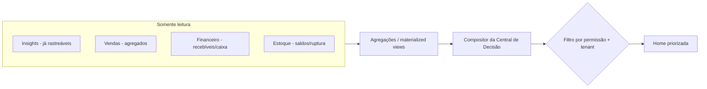

# Rescript — Arquitetura da Central de Decisão (Home Inteligente)

> A Home não é um dashboard: é um **centro de decisão** que responde ao dono o que exige atenção.
> Status: Design de arquitetura (pré-implementação). Governa-se por `DecisionCenter.md` (produto) e consome `InsightArchitecture.md`.

---

## 1. Papel Arquitetural

A Central de Decisão é uma **camada de leitura e composição** (`Dashboard` em `ModuleBoundaries.md`). Ela **não** possui dados próprios nem escreve no núcleo. Agrega insights + leituras do núcleo para responder cinco perguntas:

1. Como está a empresa?
2. O que mudou?
3. O que exige atenção?
4. O que pode acontecer?
5. Qual ação deve ser tomada?

> Não é BI (`Positioning.md`): não é um mar de gráficos configuráveis. É uma resposta curada e priorizada.

---

## 2. Fontes de Dados

- **Insights** (`InsightArchitecture.md`) — já vêm rastreáveis e classificados.
- **Agregações** do núcleo (vendas do dia, a receber, ruptura) — via views/materialized views.
- Tudo filtrado por **tenant** e **permissão** do usuário.

---

## 3. Composição dos Blocos

A Home compõe blocos que mapeiam as 5 perguntas (alinhado a `DecisionCenter.md`):

| Bloco | Pergunta | Fonte |
|---|---|---|
| Panorama / "Como está" | Como está a empresa? | Agregados de vendas/caixa/estoque |
| "O que mudou" | O que mudou? | Comparação com período anterior (snapshots) |
| "Requer atenção" | O que exige atenção? | Insights de severidade atenção/crítico |
| "Próximos dias / pode acontecer" | O que pode acontecer? | Projeções (recebíveis a vencer, ruptura iminente) |
| "Ação sugerida" | Qual ação tomar? | `suggested_action` dos insights |

---

## 4. Priorização e Ordenação

- Ordenação por **relevância** (`InsightArchitecture.md` §7): severidade × recência × impacto financeiro × acionabilidade.
- **Poucos itens certos** — teto de itens por bloco (anti-alarmismo). O excesso vai para "ver tudo".
- Itens **acionáveis** primeiro: o que o dono pode resolver hoje.

---

## 5. Cache, Atualização e Consistência

- A Central lê **materializações/snapshots** para ser instantânea; recomputadas por evento (`SaleConfirmed`, `PaymentRegistered`) e por job (`pg_cron`).
- **Consistência:** os dados-fonte (ledgers) são sempre corretos; o painel pode ter atraso de segundos (consistência eventual aceitável para *visualização*, nunca para *operação* — `SaleTransaction.md`).
- Indicar **frescor** quando relevante ("atualizado há X min") em vez de fingir tempo real.
- Recomputação é **idempotente** e deduplicada (não recomputar sem mudança material).

---

## 6. Estados Especiais (obrigatórios)

| Estado | Tratamento |
|---|---|
| **Empresa nova / vazia** | Onboarding em vez de números falsos; guia à primeira operação (`Activation.md`) |
| **Dados insuficientes** | "Ainda aprendendo" / mostrar o que há; **nunca inventar** (IP1) |
| **Sem alertas** | Estado positivo e calmo ("está tudo sob controle"), não uma tela vazia |
| **Falha ao computar insight** | Degradar para os dados-fonte; nunca mostrar erro cru (`FailureModes.md`) |

---

## 7. Permissões e Diferença Dono × Operador

- A Central respeita **permissões** (`Authorization.md`): quem não vê financeiro não vê blocos financeiros.
- **Dono/Gerente:** visão de decisão (caixa, inadimplência, tendências, o que exige atenção).
- **Operador (Vendedor/Estoquista):** visão operacional (minhas vendas, o que fazer hoje) — menos estratégia, mais ação.
- A composição é **por papel/permissão**, não uma tela única para todos.

---

## 8. Personalização Futura (sem comprometer simplicidade)

- Personalização é **evolução**, não MVP (P9 — bons padrões primeiro).
- Quando vier: ordenar/ocultar blocos, preferências por usuário — sempre partindo de um padrão curado. Nunca vira "monte seu dashboard" (isso seria virar BI, o que `Positioning.md` proíbe).

---

## 9. Invariantes

1. A Central **lê**, nunca escreve no núcleo (`DependencyMap.md`).
2. Respeita **tenant** e **permissões** em todo bloco.
3. **Nunca inventa** dados; trata estados vazios/insuficientes explicitamente.
4. Prioriza **poucos itens relevantes e acionáveis** (anti-alarmismo).
5. Cache é otimização; a verdade está nos ledgers.
6. Todo item acionável leva a uma **ação real** no núcleo (drill-down/ação), fechando o ciclo Registrar→Automatizar→Interpretar.
