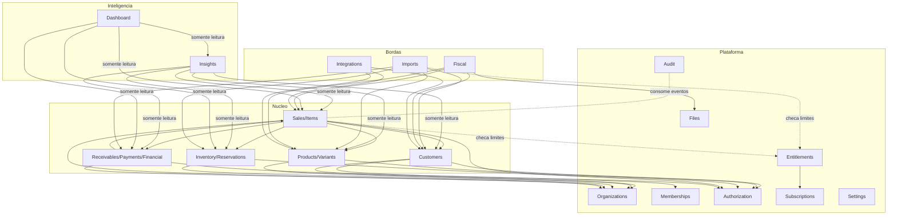

# Rescript — Mapa de Dependências

> Quais módulos podem depender de quais. Dependências proibidas são tão importantes quanto as permitidas.
> Status: Design de arquitetura (pré-implementação). Complementa `ModuleBoundaries.md`.

---

## 1. Regras Macro

1. **Fluxo de dependência permitido:** `Plataforma → Núcleo → Inteligência`; `Bordas → Núcleo` (via contratos).
2. **O Núcleo nunca depende de Inteligência nem de Bordas.**
3. **Inteligência só lê o Núcleo; nunca escreve.**
4. **Nenhum módulo acessa tabelas de outro módulo diretamente** — apenas contratos de aplicação e eventos.
5. **Dependências apontam para dentro** (regras estáveis no centro; detalhes voláteis nas bordas) — estilo dependências invertidas.

---

## 2. Diagrama de Dependências Permitidas

> Auditoria (`Audit`) consome eventos de praticamente todos os módulos sensíveis; a seta foi omitida do diagrama para legibilidade, mas a dependência é **de Audit para os eventos**, não o contrário.

---

## 3. Matriz de Dependências (permitido / proibido)

| Módulo | Pode depender de | NUNCA pode depender de |
|---|---|---|
| Identity | Supabase Auth (via `auth`) | Qualquer domínio de negócio |
| Organizations | — | Núcleo, Inteligência, Bordas |
| Memberships | Organizations, Identity, Authorization | Núcleo comercial |
| Authorization | Memberships | Entitlements, Núcleo, plano comercial |
| Entitlements | Subscriptions | Authorization, Núcleo (só é consultado por eles) |
| Subscriptions/Billing | Gateway externo (adapter) | Núcleo comercial (Financeiro do cliente) |
| Customers | Plataforma | Sales, Inventory, Financial |
| Products/Variants | Plataforma | Sales, Inventory, Financial |
| Inventory | Plataforma, Products | Sales (Sales é que depende de Inventory), Inteligência |
| Sales | Plataforma, Customers, Products, Inventory, Financial | Inteligência, Fiscal, Integrations |
| Receivables/Payments/Financial | Plataforma, Sales | Inteligência, Billing (SaaS) |
| Insights | Leitura do Núcleo | Escrita no Núcleo; Bordas |
| Dashboard | Leitura de Insights + Núcleo | Escrita em qualquer lugar |
| Imports | Núcleo (via serviços de aplicação), Files, Entitlements | Inteligência |
| Fiscal | Sales, Customers, Products, Files (via adapter) | Ser acoplado a 1 provedor específico |
| Integrations | Núcleo via contratos | Guardar segredo fora do cofre |
| Audit | Eventos de todos | Ser escrito/editado por regra de negócio |

---

## 4. Dependências Especialmente Vigiadas

### 4.1. Sales → tudo do Núcleo
`Sales` é o **orquestrador da operação crítica** (confirmar venda), então concentra dependências para Customers, Products, Inventory e Financial. Isso é intencional e encapsulado no **serviço de aplicação da venda** (`SaleTransaction.md`). Nenhum outro módulo deve orquestrar essa combinação.

### 4.2. Entitlements é **consultado**, não **depende**
O Núcleo consulta Entitlements (ex.: "posso criar mais uma venda neste plano?") por um contrato fino (`can(feature)` / `withinLimit(...)`), evitando espalhar `if plano == X` (ver `Entitlements.md`). A dependência é do Núcleo para um contrato estável, não para a lógica comercial de preços.

### 4.3. Inteligência é uma folha de leitura
`Insights` e `Dashboard` são **terminais**: ninguém depende deles para operar. Se a Inteligência cair, o Núcleo continua registrando e automatizando (degradação graciosa — `FailureModes.md`).

---

## 5. Como a fronteira é imposta (na prática)

- **Organização de código** por módulo (pastas/pacotes) com APIs públicas explícitas; o interno de um módulo não é importável por outro.
- **Sem acesso cruzado a tabelas:** cada módulo acessa apenas seu schema/entidades; leituras de outro domínio passam por contrato ou por views de leitura dedicadas (Inteligência).
- **Eventos** para efeitos assíncronos e desacoplamento (`DomainEvents.md`).
- **Linters/regras de import** (na fase de implementação) para falhar o build quando uma dependência proibida é introduzida.
- **RLS + `organization_id`** em toda tabela como invariante transversal (`MultiTenancy.md`).

---

## 6. Evolução

Estas fronteiras são desenhadas para permitir, **se e quando a escala justificar**, extrair um módulo de alta carga (ex.: Insights) para um processo/serviço separado sem reescrever o Núcleo — porque a comunicação já é por contrato/evento (`Scalability.md`). Até lá, tudo vive no mesmo monólito modular (AP1, AP5).
