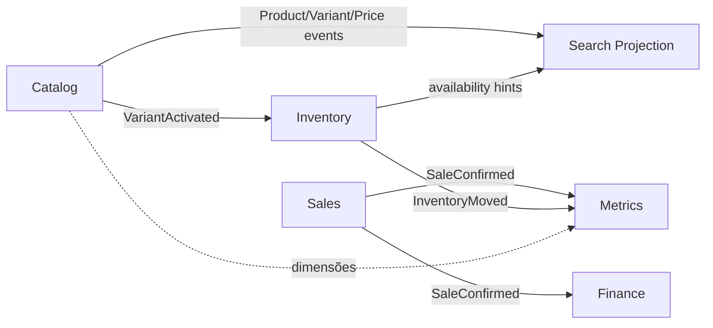

# Rescript — Dependency Rules (Catalog Phase 0)

> Regras oficiais de dependência entre Bounded Contexts / módulos.
> Status: **Governança — normativo.**
> Complementa e, onde conflitar sobre Catalog/Pricing/Variant, **prevalece sobre** `DependencyMap.md` legado (ainda útil para Platform/Inteligência).
> Matriz: **P** = Permitido (código do módulo pode importar/usar). **PORT** = Permitido apenas via Port/Published Language. **X** = Proibido.

---

## 1. Princípios

1. Dependências apontam para estabilidade: Platform ← Core; Core não depende de Intelligence/Borders.
2. Cross-domain **write** só no dono da entidade (`DomainContracts.md` §2).
3. Cross-domain **read** de outro BC = **PORT** (nunca repository/SQL interno).
4. Orquestração multi-BC (ex.: confirmar Sale) vive no **application service do orquestrador** (Sales), chamando ports — não em Controllers/UI.
5. Eventos são unidirecionais para projeções; consumidores não escrevem de volta no produtor sem comando explícito do dono.

---

## 2. Legenda da matriz

| Símbolo | Significado |
|---|---|
| **P** | Dependência de código/plataforma permitida (mesmo “lado” ou shared kernel estável: auth, money VO, tenant). |
| **PORT** | Apenas interface pública versionada / eventos publicados. |
| **X** | Proibido. PR deve falhar review/gate. |
| **—** | Não aplicável (mesmo módulo). |

Linha = **dependente** (quem importa). Coluna = **dependido** (quem é usado).

---

## 3. Matriz Core + Catalog

| ↓ depende de → | Platform | Customers | Catalog | Inventory | Sales | Finance | Metrics | Search | Workspace | Procurement |
|---|---|---|---|---|---|---|---|---|---|---|
| **Platform** | — | X | X | X | X | X | X | X | X | X |
| **Customers** | P | — | X | X | X | X | X | X | X | X |
| **Catalog** | P | X | — | X | X | X | X | X* | X | PORT† |
| **Inventory** | P | X | PORT | — | X | X | X | X | X | X |
| **Sales** | P | PORT | PORT | PORT | — | PORT | X | PORT | X | X |
| **Finance** | P | X | X | PORT‡ | PORT | — | X | X | X | X |
| **Metrics** | P | X | PORT | PORT | PORT | PORT | — | X | X | X |
| **Search** | P | X | PORT | PORT | X | X | X | — | X | X |
| **Workspace** | P | PORT | PORT | PORT | PORT | PORT | PORT | PORT | — | X |
| **Procurement** | P | X | PORT | PORT | X | PORT | X | X | X | — |

\* Catalog **emite** eventos para Search; não **depende** da projeção para regras.  
† Apenas `SupplierReference` opcional (ADR-0025) — Catalog não implementa Supplier.  
‡ Finance lê custo aplicado via fatos/movimentos publicados ou port de leitura de movimento — **não** muta Inventory.

---

## 4. Justificativas por célula crítica

| Regra | Decisão | Justificativa |
|---|---|---|
| Catalog ↛ Inventory | X | Catalog descreve; não quantifica (INV-C07) |
| Catalog ↛ Sales/Finance/Metrics | X | Evita ciclo; Core upstream |
| Inventory → Catalog | PORT (`StockableItemPort`) | Precisa saber se Variant é stockable; não precisa PIM completo |
| Inventory ↛ Sales | X | Sales depende de Inventory, não o inverso (DependencyMap 4.1 invertido seria ciclo) |
| Sales → Catalog | PORT (Snapshot + Price) | ACL; snapshots; ADR-0020/0021 |
| Sales → Inventory | PORT (`StockAllocationPort` / confirm RPC) | ADR-0007; nunca SQL balance |
| Sales → Finance | PORT / application API do Finance | Receivable na confirmação; Sales não edita ledger financeiro |
| Finance ↛ Catalog | X | Preço atual não recalcula passado |
| Metrics → \* | PORT/read only | INV-C10; AP18 |
| Metrics writes | X | Indicador nunca é fonte |
| Workspace → repos | X | Só use cases/ports; presentation |
| Search → mutações Catalog | X | Projeção (ADR-0024) |
| Qualquer → tabelas de outro BC | X | Quebra ownership |
| Dual identity stock Product+Variant | X | ADR-0023 |

---

## 5. Shared Kernel permitido

Pacotes/conceitos que **qualquer** BC Core pode usar sem ser “dependência de domínio”:

- `organization_id` / tenant context
- `can(permission)` / permission keys
- Money / Quantity value objects (`@rescript/domain`)
- Result/Error shapes estáveis
- Outbox envelope (ADR-0009) — sem conhecer payload de outro BC além do contrato de evento

**Não** é shared kernel: entidades Product, Variant, Sale, Balance, PriceListEntry.

---

## 6. Direção de eventos

Consumidores **não** chamam comandos do produtor em reação, salvo policy explícita do dono (ex.: Inventory habilita item interno sem write-back no Catalog).

---

## 7. Regras de import (implementação futura — critério de gate)

Quando houver código:

1. `modules/inventory/**` não importa `modules/catalog/**/repository` nem `modules/products/**/repository`.
2. `modules/sales/**` não importa repos Catalog/Inventory — só ports.
3. `modules/catalog/**` não importa inventory/sales/finance/metrics.
4. Rotas/UI não importam clients Supabase de tabelas de outro módulo além do próprio adapter do BC.
5. Proibições enforceáveis via lint/path rules na Fase 1+ (`EngineeringGovernance.md`).

---

## 8. Exceções

Únicas exceções exigem **ADR novo** + atualização desta matriz:

- Read model compartilhado materializado sob ownership explícito (ex.: Search).
- Admin/support tooling fora do path de produção (ainda assim tenant-scoped).

Não são exceções: “só um join”, “mais rápido”, “frontend precisa”.
