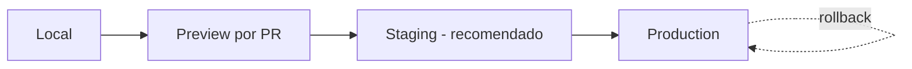
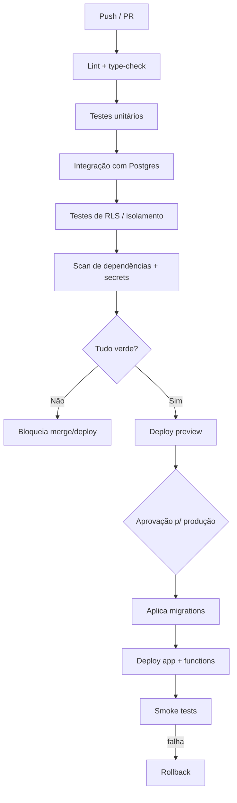

# Rescript — Estratégia de Deploy

> Como o Rescript sai do repositório para produção com segurança, previsibilidade e reversibilidade.
> Status: Design de arquitetura (pré-implementação). Decisão em `adr/0013-deploy.md`.

---

## 1. Componentes de Deploy

| Componente | Onde | Como implanta |
|---|---|---|
| **App web** (TanStack Start) | Vercel | Deploy por push/PR; preview por PR |
| **Banco + RLS + funções** | Supabase (PostgreSQL) | **Migrations versionadas** via CI |
| **Edge Functions** (webhooks, tarefas curtas) | Supabase | Deploy versionado |
| **Workers/jobs** (outbox, importação, insights) | Fila em PostgreSQL + `pg_cron`/worker | Versionado com o app |
| **Segredos** | Cofre por ambiente | Nunca no repositório |

---

## 2. Ambientes

| Ambiente | Propósito | Dados |
|---|---|---|
| **Local** | Desenvolvimento | Sintéticos |
| **Preview** (por PR) | Revisão de feature isolada | Sintéticos/efêmeros |
| **Staging** (recomendado) | Homologar migrations/RLS/integrações | Anonimizados/realistas |
| **Production** | Clientes reais | Reais |

> **Recomendação forte:** manter **staging**. O maior risco de deploy no Rescript são **migrations e políticas RLS** — validá-las em staging antes de produção evita incidentes de consistência/isolamento (`FailureModes.md`).

---

## 3. Pipeline CI/CD (GitHub Actions)

- **Bloqueadores:** lint, type-check, testes (incluindo RLS e cenários críticos de `TestingStrategy.md` §4), scans de segurança.
- **Migrations** aplicadas de forma controlada e versionada, testadas antes em staging.

---

## 4. Migrations de Banco (o ponto mais delicado)

- **Versionadas** no repositório, revisadas, testadas em preview/staging.
- **Compatíveis para frente** (expand/contract): adicionar antes de remover, para permitir deploy sem downtime e rollback do app.
- Migrations destrutivas exigem cuidado extra e nunca destroem histórico (AP16).
- RLS faz parte da migration e é testada junto.

---

## 5. Estratégia de Release

- **Deploy contínuo** para preview; **promoção controlada** para produção (aprovação humana enquanto o time é pequeno).
- **Feature flags** (`Entitlements.md`) desacoplam *deploy* de *release*: código pode ir a produção desligado e ser ativado depois (rollout gradual, kill switch).
- Reversibilidade: rollback do app é rápido (Vercel); rollback de dados é evitado por migrations expand/contract.

---

## 6. Rollback e Recuperação

| Situação | Ação |
|---|---|
| Bug no app | Rollback de deploy (Vercel) para versão anterior |
| Feature problemática | Desligar via feature flag |
| Migration ruim detectada em staging | Não promove; corrige |
| Incidente de dados | Backups + PITR (`Security.md`); postmortem (`Observability.md`) |

---

## 7. Segurança no Deploy

- Segredos por ambiente em cofre; credenciais de deploy com menor privilégio.
- Preview nunca usa dados de produção.
- Scans de segurança bloqueiam o pipeline (`Security.md` §9).

---

## 8. Invariantes

1. Nada vai a produção sem passar por CI (testes + RLS + segurança).
2. Migrations são versionadas, testadas em staging e **expand/contract**.
3. Deploy é **reversível** (rollback de app; flags; backups).
4. Ambientes são isolados; produção não compartilha dados.
5. Release ≠ deploy: flags controlam a exposição ao usuário.
