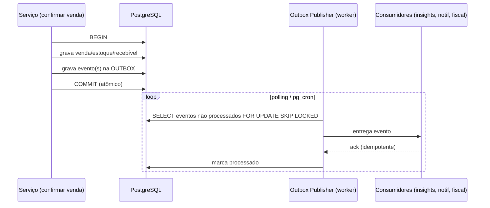
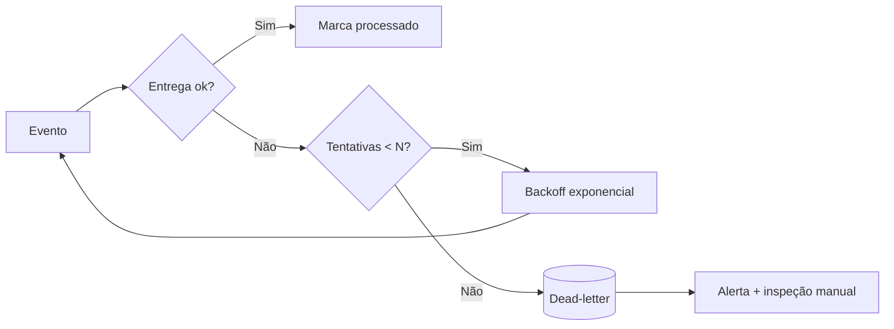

# Rescript — Eventos de Domínio e Outbox

> Comunicação interna desacoplada e efeitos assíncronos confiáveis, **sem** infraestrutura de event streaming prematura.
> Status: Design de arquitetura (pré-implementação). Decisões em `adr/0008-internal-events.md` e `adr/0009-outbox.md`.

---

## 1. Filosofia

- Eventos de domínio comunicam **fatos que já aconteceram** (`SaleConfirmed`, não "confirme a venda").
- No monólito modular, eventos **desacoplam** módulos: quem confirma a venda não precisa saber que os insights, notificações e fiscal reagem a isso.
- **Não usamos Kafka/streaming agora** (AP5, AP7). Começamos com o mecanismo mais simples que garante confiabilidade: **outbox transacional + processamento assíncrono via fila em PostgreSQL** (`TechnologyEvaluation.md` §7).

---

## 2. Catálogo Inicial de Eventos

| Evento | Produzido por | Consumidores típicos |
|---|---|---|
| `SaleCreated` | Sales | — (histórico) |
| `SaleConfirmed` | Sales | Insights, Notifications, Fiscal, Onboarding |
| `SaleCancelled` | Sales | Insights, Notifications, Financial |
| `PaymentRegistered` | Financial | Insights, Notifications |
| `PaymentReversed` | Financial | Insights, Audit |
| `ReceivableOverdue` | Financial (job) | Insights, Notifications, Decision Center |
| `InventoryReserved` | Inventory | Insights |
| `InventoryReleased` | Inventory | Insights |
| `InventoryMoved` | Inventory | Insights (ruptura, parado) |
| `CustomerCreated` | Customers | Onboarding, Insights |
| `ProductCreated` | Products | Onboarding |
| `ImportCompleted` | Imports | Onboarding, Notifications, Insights |
| `InsightGenerated` | Insights | Notifications, Decision Center |

> Nomes no passado, imutáveis, com `organization_id`, timestamp, ator e payload mínimo rastreável.

---

## 3. Padrão Outbox (o coração da confiabilidade)

**Problema:** se gravamos a venda no banco e *depois* publicamos o evento numa fila externa, uma falha entre os dois passos causa inconsistência (venda sem evento, ou evento sem venda).

**Solução — Outbox:** o evento é gravado numa **tabela outbox na mesma transação** do dado. Assim, evento e dado são atômicos: existem juntos ou não existem. Um **publisher** lê a outbox depois do commit e entrega os eventos aos consumidores, marcando-os como processados.

---

## 4. Processamento Assíncrono

- **Worker** consome a outbox via polling curto e/ou `pg_cron`, usando `FOR UPDATE SKIP LOCKED` para permitir concorrência sem processar o mesmo evento duas vezes.
- Cada consumidor é **idempotente** (ver §5): reprocessar um evento não causa efeito duplo.
- Carga de tenant preservada: todo evento carrega `organization_id`; o consumidor opera sob esse tenant (`MultiTenancy.md` §8).

---

## 5. Idempotência dos Consumidores

- Cada evento tem um **id único**; cada consumidor registra os eventos já processados (ou torna a operação naturalmente idempotente).
- Reentrega (após crash, retry) é segura: o consumidor detecta "já processei este id" e não repete.
- Exemplo: recomputar um insight a partir de `SaleConfirmed` é idempotente por natureza (recomputar dá o mesmo resultado).

---

## 6. Retries, Backoff e Dead-Letter

- **Retries com backoff exponencial** para falhas transitórias.
- Após N tentativas, o evento vai para **dead-letter** (tabela dedicada) + alerta (`Observability.md`).
- Dead-letter é inspecionável e reprocessável manualmente.

---

## 7. Ordenação e Consistência Eventual

- **Ordenação global não é garantida nem necessária** para a maioria dos consumidores.
- Onde a ordem importa (ex.: eventos de um mesmo recebível), ordena-se **por chave** (`organization_id` + agregado) usando o timestamp/sequência da outbox.
- Consumidores toleram **consistência eventual**: os efeitos secundários convergem em segundos. O dado-fonte (venda, estoque, financeiro) já é consistente no commit — o assíncrono só atualiza derivados (`SaleTransaction.md` §3).

---

## 8. Quando a Outbox se torna necessária?

Resposta direta à pergunta do briefing:

> A outbox torna-se necessária **assim que um efeito secundário precisa ser garantido de forma confiável fora da transação original** — ou seja, desde a primeira feature que reage a `SaleConfirmed` (insights, notificações, fiscal).

- **Sem efeitos assíncronos garantidos:** poderíamos viver sem outbox (chamadas diretas dentro da transação — mas isso acopla e arrisca alongar a transação).
- **Com qualquer efeito que não pode se perder** (ex.: "gerar insight de ruptura", "notificar vencimento"): a outbox é a forma correta e barata de garantir "aconteceu → será processado".

**Decisão:** adotar a outbox **desde o início** para os poucos eventos que já existem, porque o custo é baixo (uma tabela + um worker simples) e o benefício — nunca perder um efeito — é central para a confiança (ADR-0009). Não adotamos streaming; a fila em PostgreSQL basta por muitos anos (`Scalability.md`).

---

## 9. O que NÃO fazemos (evitar overengineering)

- ❌ Kafka/event streaming distribuído no MVP.
- ❌ Event sourcing de todo o domínio (usamos ledgers específicos — estoque/financeiro — não event sourcing universal).
- ❌ Barramento de eventos entre serviços (só há um serviço).
- ❌ Sagas complexas quando uma transação de banco resolve (`SaleTransaction.md`).

---

## 10. Invariantes

1. Evento e dado que o originou são **atômicos** (mesma transação, via outbox).
2. Todo consumidor é **idempotente**.
3. Todo evento carrega `organization_id`, id único, timestamp e ator.
4. Falhas vão para **dead-letter** com alerta, nunca somem.
5. Nenhuma operação crítica (`SaleTransaction.md` §3.3) depende do processamento de eventos.
