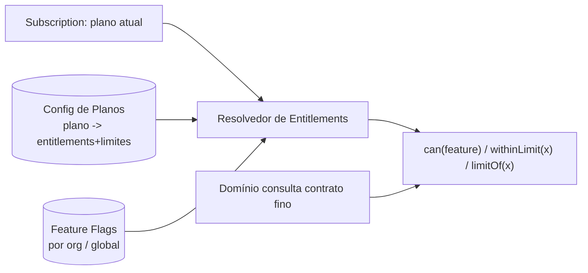

# Rescript — Entitlements, Planos e Feature Flags

> Como os planos comerciais controlam recursos **sem espalhar condicionais** pelo domínio.
> Status: Design de arquitetura (pré-implementação).

---

## 1. O Problema a Evitar

Se o domínio ficar cheio de `if plano == 'profissional'`, mudar preços/pacotes vira uma reescrita e o código apodrece. **A regra comercial (o que cada plano dá) deve ser dado/configuração, não código espalhado.**

> Objetivo: **mudar preços, limites e pacotes sem tocar no domínio central.**

---

## 2. Conceitos

- **Plano (Plan):** pacote comercial (Free, Essencial, Profissional, Empresarial).
- **Entitlement:** um direito de uso concedido pelo plano (ex.: `module.purchases`, `insights.projections`).
- **Limite (Limit):** um teto quantitativo (ex.: `max_users`, `max_sales_per_month`, `max_products`).
- **Feature flag:** liga/desliga um recurso independentemente do plano (rollout, teste A/B, acesso temporário, kill switch).
- **Subscription:** o estado da assinatura da organização (plano atual, período de teste, status).



---

## 3. Arquitetura: um resolvedor central + contrato fino

- Existe **um serviço de Entitlements** que resolve, para a organização ativa: seus entitlements, limites e flags.
- O domínio consulta um **contrato fino e estável**:
  - `can(feature: string): boolean` — tem direito de uso?
  - `withinLimit(limit: string, current: number): boolean` — está dentro do limite?
  - `limitOf(limit: string): number | 'unlimited'`
- **O domínio nunca conhece nomes de planos.** Ele pergunta por capacidade/limite, não por plano. Assim, remapear "quem tem o quê" é mudar **configuração**, não código.

Exemplo conceitual (pseudocódigo, apenas ilustrativo):

```
// No serviço de aplicação da venda:
if (!entitlements.withinLimit('sales_per_month', currentCount))
    return softBlockWithUpgrade('sales_per_month')
```

> Nenhum `if plano == X` — apenas capacidades e limites.

---

## 4. Configuração Plano → Entitlements (dado, não código)

A relação plano→entitlements/limites é **dado versionado** (tabela/config), não lógica embutida. Exemplo conceitual de mapa (ilustrativo):

| Capacidade / Limite | Free | Essencial | Profissional | Empresarial |
|---|---|---|---|---|
| `module.core` | ✓ (limitado) | ✓ | ✓ | ✓ |
| `insights.basic` | ✓ | ✓ | ✓ | ✓ |
| `insights.projections` | — | ✓ | ✓ | ✓ |
| `module.purchases` | — | — | opcional | ✓ |
| `module.fiscal` | — | opcional | ✓ | ✓ |
| `integrations.whatsapp` | — | — | ✓ | ✓ |
| `api.public` | — | — | limitada | ✓ |
| `max_users` | 1 | 3 | 10 | alto/ilimitado |
| `max_sales_per_month` | baixo | confortável | alto | ilimitado |

> Valores são referência estratégica (`Product.md`/`GoToMarket.md`); a arquitetura só exige que sejam **configuráveis**.

---

## 5. Estados de Assinatura que afetam entitlements

| Estado | Efeito nos entitlements |
|---|---|
| **Trial (teste)** | Acesso temporário a um conjunto (ex.: Profissional) por período |
| **Ativo** | Entitlements do plano contratado |
| **Inadimplente** | Bloqueio suave progressivo; leitura preservada; sem apagar dados |
| **Suspenso** | Operação bloqueada; dados retidos (`Privacy.md`) |
| **Downgrade** | Entitlements reduzidos; dados excedentes preservados mas em modo leitura/limite |
| **Cancelado** | Acesso encerrado conforme política; retenção por janela |
| **Grandfathering** | Organização mantém condições antigas mesmo após mudança de pacote |
| **Promoção / acesso temporário** | Entitlement/flag com validade |

> **Grandfathering** e **promoções** são a prova de fogo do desenho: por serem dados (não código), uma organização pode ter um mapa de entitlements próprio sem exceção no domínio.

---

## 6. Limites: onde e como checar

- Limites são checados **no serviço de aplicação**, no momento da ação (criar venda, convidar usuário, importar).
- A checagem usa a **contagem real** (fonte de verdade), não um contador que pode divergir.
- Ao atingir o limite: **bloqueio suave** + caminho de upgrade (nunca perda de dados; nunca erro técnico cru) — alinhado a `Retention.md` (não punir o crescimento).

---

## 7. Feature Flags (distintas de entitlements)

- **Entitlement** = "seu plano dá direito".
- **Feature flag** = "este recurso está ligado para você" (independente de plano).
- Usos: rollout gradual, teste com subconjunto de orgs, kill switch de emergência, acesso antecipado.
- Flags podem ser **globais** ou **por organização**.
- Flags nunca substituem autorização nem entitlement — são uma terceira dimensão ortogonal.

---

## 8. Invariantes

1. O domínio **nunca** referencia nomes de planos; só capacidades e limites.
2. Mapear plano→entitlements é **configuração versionada**, não código.
3. Autorização (pode o usuário?) e Entitlement (permite o plano?) são checagens **independentes e combinadas**.
4. Atingir limite = bloqueio suave + upgrade, nunca perda de dado ou erro cru.
5. Suspensão/cancelamento **restringem acesso**, nunca destroem histórico (AP16, `Privacy.md`).

---

## 9. Por que isto protege a evolução comercial

Preços e pacotes vão mudar muitas vezes em 10 anos. Com este desenho, o time comercial altera o **mapa de entitlements** e cria flags/promoções sem pedir mudança no domínio. O núcleo (vendas, estoque, financeiro) permanece intocado — exatamente o que o Mandamento XI ("crescer sem migrar") e o AP17 exigem.
