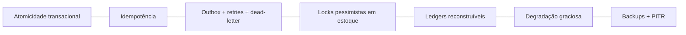

# Rescript — Análise de Modos de Falha

> Para cada falha possível em operações críticas: impacto, prevenção, detecção e recuperação.
> Status: Design de arquitetura (pré-implementação). Complementa `SaleTransaction.md`, `DomainEvents.md`, `FiscalIntegration.md`.

---

## 1. Filosofia

Falhas **vão** acontecer. A arquitetura garante que, quando acontecem, os dados críticos (estoque/financeiro) **nunca** ficam inconsistentes e a operação **degrada graciosamente** — nunca corrompe.

---

## 2. Respostas às Perguntas do Briefing (operação: confirmar venda)

| Cenário | O que acontece |
|---|---|
| **Banco falha no meio** | Transação sofre rollback; venda **não** confirmada; estoque/financeiro intactos; usuário repete com a mesma idem-key |
| **Requisição repetida** | Idempotência retorna o resultado da 1ª execução; sem efeito duplo |
| **Usuário clica 2x** | 2º clique absorvido pela chave de idempotência (`SaleTransaction.md` §5) |
| **Job executa 2x** | Consumidores idempotentes; outbox marca processado; sem duplicação |
| **Webhook fora de ordem** | Aplica estado mais avançado por timestamp; nunca regride (`FiscalIntegration.md` §4) |
| **Provedor externo indisponível** | Operação central independe dele; fiscal/mensageria em retry+dead-letter; venda continua válida |
| **Transação parcialmente processada** | Impossível: é tudo-ou-nada (atomicidade). Não existe "meia venda" |
| **Cache desatualizado** | Cache é derivado; a verdade está nos ledgers; recomputa; nunca decide operação por cache |
| **Dois usuários alteram o mesmo registro** | Lock pessimista + transação serializam; o 2º relê estado atualizado (`InventoryArchitecture.md` §5) |
| **Permissão muda durante a operação** | Autorização revalidada; token não "prende" privilégio; ação sensível recheca (`MultiTenancy.md` §5) |

---

## 3. Matriz de Modos de Falha (FMEA simplificada)

| # | Modo de falha | Impacto | Prevenção | Detecção | Recuperação |
|---|---|---|---|---|---|
| 1 | Rollback de confirmação | Baixo (venda não criada) | Transação atômica | Erro logado + métrica | Repetir com idem-key |
| 2 | Clique duplo / retry | Alto se sem proteção | Idempotency key + unique constraint | Conflito registrado | Retorna resultado existente |
| 3 | Baixa de estoque duplicada | Crítico | Idempotência + invariantes ledger | Reconciliação saldo×ledger | Estorno compensatório |
| 4 | Recebimento duplicado | Crítico | Idempotência de pagamento | Reconciliação financeira | Estorno |
| 5 | Corrida de estoque | Alto | Lock `FOR UPDATE` por variante | Testes de concorrência; alertas | Transação serializa; ajuste auditado |
| 6 | Outbox não publica | Médio (efeitos atrasam) | Outbox transacional + worker | Backlog/idade de eventos | Worker retoma; reprocessa |
| 7 | Evento em dead-letter | Médio | Retries+backoff | Alerta de DLQ | Inspeção + reprocesso manual |
| 8 | Webhook forjado | Crítico (segurança) | Verificação de assinatura | Rejeições logadas | Descarta; alerta |
| 9 | Webhook fora de ordem | Médio | Aplicar por estado/timestamp | Divergência de status | Convergência idempotente |
| 10 | Provedor fiscal fora | Baixo p/ operação | Desacoplado da venda | Erros de integração | Retry; usuário reemite depois |
| 11 | Migration ruim | Crítico | Staging + expand/contract + testes RLS | Smoke tests | Não promove / rollback app |
| 12 | Política RLS falha | Crítico (vazamento) | Testes de isolamento bloqueiam deploy | Testes + alertas de acesso anômalo | Corrige política; incidente |
| 13 | Cache/materialização stale | Baixo | Recomputo por evento/job | Frescor exibido; divergência | Recomputar do ledger |
| 14 | Worker cai | Baixo (só assíncrono) | Fila persistente | Backlog crescendo | Reinicia; processa pendências |
| 15 | Importação corrompe dados | Crítico | Validação+preview+idempotência | Relatório por linha | Rollback do job |
| 16 | Segredo vazado | Crítico | Cofre; sem logs de segredo | Scan de secrets | Rotação; incidente |
| 17 | Estoque negativo indevido | Médio | Política configurável + alerta | Insight/alerta | Ajuste auditado |
| 18 | Perda de banco | Catastrófico | Backups + PITR | Monitoramento infra | Restauração testada |

---

## 4. Padrões de Resiliência Usados

- **Atomicidade:** operações críticas tudo-ou-nada.
- **Idempotência:** repetição é segura em todo ponto sensível.
- **Outbox + retries + DLQ:** efeitos secundários nunca se perdem silenciosamente.
- **Locks:** concorrência de estoque sem corrupção.
- **Ledgers reconstruíveis:** a verdade sempre pode ser recomputada.
- **Degradação graciosa:** se o assíncrono/insights/fiscal caem, a operação diária continua correta.
- **Backups/PITR:** última rede contra desastre.

---

## 5. Degradação Graciosa (o que continua funcionando)

| Componente que cai | O que ainda funciona |
|---|---|
| Worker de jobs/outbox | Registrar e confirmar vendas, estoque, financeiro (efeitos atrasam) |
| Insights/Dashboard | Toda a operação (Registrar/Automatizar) |
| Provedor fiscal | Vendas e financeiro (nota emitida depois) |
| Mensageria/WhatsApp | Tudo (mensagem enfileirada/adiada) |
| Provedor de observabilidade | Operação (perde-se visibilidade, não dados) |

> Nunca o contrário: a **operação crítica não depende** de nenhum desses (`SaleTransaction.md` §3.3).

---

## 6. Invariantes

1. Nenhuma falha deixa estoque/financeiro **parcialmente** processados.
2. Toda operação crítica é **repetível com segurança** (idempotente).
3. Efeitos secundários falham para **dead-letter + alerta**, nunca em silêncio.
4. A operação diária **degrada graciosamente** quando periféricos caem.
5. A verdade é sempre **reconstruível** dos ledgers e backups.
