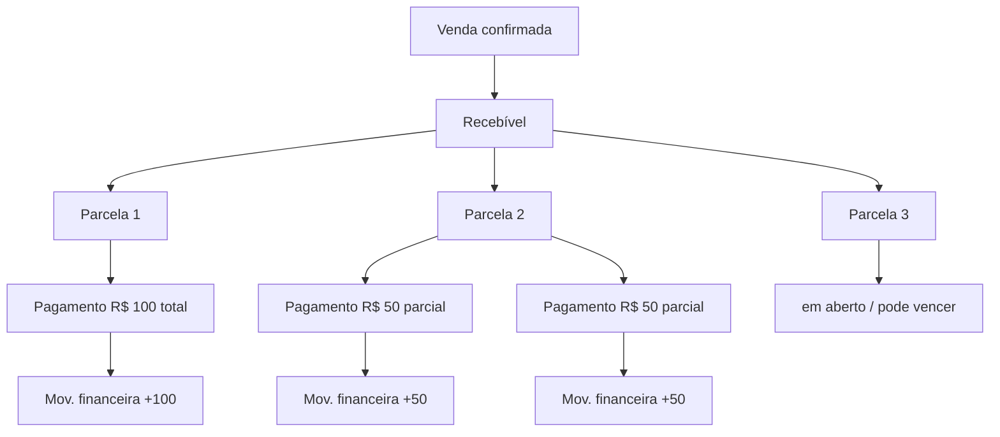
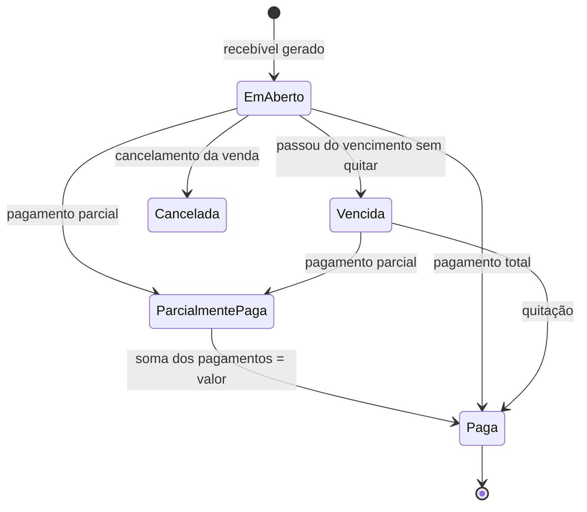

# Rescript — Arquitetura Financeira

> Recebíveis, parcelas, pagamentos e o razão financeiro. "Pago" **não** é um booleano.
> Status: Alinhado a FD-04 (sem juros/multa no MVP), FD-07 (BRL; Money com moeda). ADR-0006.

---

## 1. Separação de Conceitos (a base de tudo)

O erro clássico é modelar "venda paga = true/false". O Rescript separa entidades distintas com ciclos de vida próprios:

| Conceito | O que é | Situações possíveis |
|---|---|---|
| **Venda (Sale)** | O negócio comercial | rascunho, confirmada, cancelada |
| **Recebível (Receivable)** | O direito de receber, originado pela venda | em aberto, parcialmente recebido, quitado, cancelado |
| **Parcela (Installment)** | Fração de um recebível com vencimento | em aberto, paga, parcialmente paga, vencida, cancelada |
| **Pagamento (Payment)** | Um evento de recebimento (total/parcial) | registrado, estornado |
| **Movimentação financeira (FinancialTransaction)** | Lançamento no razão (entrada/saída efetivada) | efetivada, estornada |

> Regra: **a situação de "pago" é sempre derivada** dos pagamentos aplicados às parcelas — nunca um campo booleano solto. Isso permite pagamentos parciais, múltiplos pagamentos, estornos e conciliação sem ambiguidade.

---

## 2. Razão Financeiro como Ledger

Assim como o estoque, o **caixa é derivado de um ledger de movimentações financeiras** (append-only). O saldo/projeção de caixa é reconstruível a partir dos lançamentos (AP17).

- Cada pagamento efetivado gera uma movimentação financeira.
- Estornos geram movimentações **compensatórias** (não apagam a original — AP15/AP16).
- O caixa projetado agrega recebíveis futuros + contas a pagar futuras (rastreável, é projeção — `IntelligencePrinciples.md`).

---

## 3. Ciclo de Vida da Parcela

> "Vencida" é um **estado derivado** da data de vencimento + saldo aberto, recalculado por job/consulta — não um campo que alguém precisa marcar manualmente.

---

## 4. Pagamentos: total, parcial e múltiplos

- Um pagamento aplica um valor a **uma parcela** (ou a um recebível, distribuindo por regra).
- Vários pagamentos podem incidir sobre a mesma parcela (parciais).
- O **saldo aberto da parcela** = valor − soma dos pagamentos válidos.
- Pagamento pode ter **forma de pagamento** (dinheiro, PIX, cartão, boleto...) e **taxa** associada (ex.: taxa de cartão) — a taxa é um lançamento separado, não some do valor bruto.
- Pagamentos podem ocorrer em **datas diferentes** das parcelas (recebimento antecipado/atrasado) — registrados com a data real.

---

## 5. Elementos financeiros adicionais

| Elemento | Tratamento |
|---|---|
| **Juros / multa** | **Fora do MVP** (FD-04); fronteira V1 como lançamentos adicionais |
| **Descontos** | No item/venda sob `DiscountAuthorizationPolicy` (FD-05); ou no recebimento — distintos e auditados |
| **Estornos** | Movimento compensatório; parcela/recebível recalculam situação |
| **Cancelamentos** | Venda cancelada cancela recebíveis não pagos; recebimentos já feitos exigem estorno explícito |
| **Inadimplência** | Derivada de parcelas vencidas em aberto (alimenta insights e Central de Decisão) |
| **Taxas** | Lançamento próprio, preserva valor bruto e líquido |
| **Formas de pagamento** | Atributo do pagamento; base para conciliação futura |
| **Venda parcelada** | Recebível com N parcelas geradas na confirmação |
| **Conciliação (futuro)** | Casar movimentações previstas × efetivadas; o ledger torna isso possível |

---

## 6. Invariantes Financeiras (invioláveis)

1. **"Pago" é derivado**, nunca um booleano solto.
2. **Sem duplicidade de recebimento:** o mesmo pagamento não é registrado duas vezes (idempotência — chave por operação/origem).
3. **Soma dos pagamentos válidos nunca excede** o valor da parcela sem tratamento explícito (troco/crédito é decisão consciente, não acidente).
4. **Estorno é compensação**, nunca exclusão do pagamento original.
5. **Cancelar venda não apaga histórico financeiro** — gera cancelamentos/estornos auditáveis (AP13).
6. **Caixa reconstruível** a partir do ledger financeiro.
7. **Recebível sempre tem origem** (uma venda ou importação rastreável).
8. **Valores monetários** tratados com precisão adequada (sem float binário para dinheiro).

---

## 7. Como impedir inconsistências e duplicidade

- **Idempotência no registro de pagamento:** cada tentativa carrega uma chave; repetição retorna o mesmo resultado sem novo lançamento (`SaleTransaction.md`, `FailureModes.md`).
- **Transação atômica:** registrar pagamento = criar Payment + FinancialTransaction + recalcular situação da parcela, tudo ou nada.
- **Constraints no banco (AP12):** valores não negativos onde aplicável, chaves de origem obrigatórias, unicidade de chave de idempotência.
- **Estados derivados calculados**, não digitados.
- **Auditoria** de estornos, alterações de vencimento e registros de pagamento (`AuditArchitecture.md`).

---

## 8. Fronteira: Financeiro do cliente ≠ Billing do SaaS

- **Financeiro (este documento):** os recebíveis das **vendas do cliente** (o dinheiro dele).
- **Billing (`Entitlements.md`/Subscriptions):** a cobrança da **assinatura do Rescript** (o dinheiro que o cliente paga a nós).
- São domínios **separados**, com ledgers separados. Nunca se misturam.

---

## 9. Relação com outras áreas

- **Vendas:** confirmação gera recebível atomicamente (`SaleTransaction.md`).
- **Insights:** inadimplência, vencimentos próximos, caixa projetado (`InsightCatalog.md`).
- **Central de Decisão:** "o que vence", "quem está devendo", "quanto entra" (`DecisionCenterArchitecture.md`).
- **Fiscal:** valores da venda alimentam a emissão (`FiscalIntegration.md`), mas fiscal não altera o financeiro.

---

## 10. Decisões fechadas vs. adiadas

**Fechadas:** entidades separadas; “pago” derivado; sem juros/multa no MVP; moeda operacional BRL via Organization.currency (Money carrega moeda; sem FX).

**Adiadas:** estrutura física; representação exacta (centavos vs numeric — nunca float); conciliação bancária; InterestPolicy (V1).
