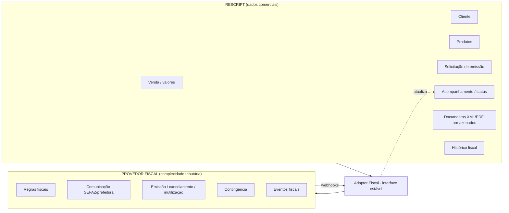

# Rescript — Integração Fiscal

> O fiscal é feito por **integração especializada**. Não reconstruímos a complexidade tributária brasileira internamente.
> Status: Design de arquitetura (pré-implementação). Decisão em `adr/0011-fiscal-integration.md`.

---

## 1. Princípio e Fronteira

A tributação brasileira (NF-e, NFC-e, NFS-e, regras por estado/município, SEFAZ, contingência) é um domínio enorme e em constante mudança. **Delegamos a um provedor fiscal especializado.** O Rescript é dono dos **dados comerciais**; o provedor é dono das **regras fiscais e da comunicação com o fisco**.



### Rescript é responsável por
Dados comerciais, cliente, produtos, pedido, valores, **solicitação de emissão**, acompanhamento, armazenamento dos documentos, histórico.

### Provedor fiscal é responsável por
Regras fiscais especializadas, comunicação com SEFAZ/prefeituras, emissão, cancelamento, inutilização, contingência, consulta, eventos fiscais.

---

## 2. Adapter Pattern e Isolamento do Fornecedor

- Toda comunicação fiscal passa por um **adapter** atrás de uma **interface estável** (`requestIssue`, `cancel`, `getStatus`, `fetchDocument`).
- O domínio conhece apenas a interface, **não** o provedor concreto.
- Isso permite **múltiplos provedores futuros** e troca sem reescrever o núcleo (`DependencyMap.md`).

> Invariante: **o sistema nunca fica tecnicamente preso a um único provedor fiscal.**

---

## 3. Fluxo de Emissão (assíncrono, resiliente)

```mermaid
sequenceDiagram
    participant U as Usuário
    participant R as Rescript (Fiscal)
    participant DB as PostgreSQL
    participant A as Adapter
    participant P as Provedor Fiscal
    U->>R: solicitar emissão (venda #123)
    R->>DB: cria FiscalRequest (status=pendente, idem-key)
    R->>A: requestIssue(dados comerciais)
    A->>P: emitir
    P-->>A: aceito (processando)
    A-->>R: protocolo
    R->>DB: status=processando
    P-->>R: webhook (autorizado + XML/PDF)
    R->>DB: status=autorizado; guarda XML/PDF (Storage)
    R->>U: nota disponível
```

- A emissão é **assíncrona** (o provedor pode demorar; SEFAZ pode estar lenta).
- Estados: `pendente → processando → autorizado / rejeitado / cancelado`.
- O usuário acompanha o status; falhas são explicadas (não erro cru).

---

## 4. Webhooks, Retries e Idempotência

- O provedor notifica resultado via **webhook** (autenticado por assinatura — `Security.md`).
- Webhooks são **idempotentes** (o mesmo evento fiscal não é aplicado duas vezes) e toleram **chegada fora de ordem** (aplica-se o estado mais avançado — `FailureModes.md`).
- **Retries com backoff** para solicitações que falham por indisponibilidade; após N tentativas → dead-letter + alerta.
- **Idempotência na solicitação:** reenviar "emitir venda #123" não gera duas notas (chave por venda/solicitação).

---

## 5. Armazenamento de XML/PDF, Certificados e Segredos

- **XML/PDF** guardados em Storage isolado por tenant, com retenção adequada à legislação (`Privacy.md`).
- **Certificados digitais e segredos** do provedor/cliente **nunca** ficam no código nem em logs; ficam em cofre de segredos, com acesso mínimo e auditado (`Security.md`). Preferência por deixar o certificado **sob custódia do provedor fiscal** quando o modelo permitir, reduzindo nossa superfície de risco.
- Acesso a documentos fiscais respeita permissões (`Authorization.md`).

---

## 6. Erros, Status e Contingência

- Rejeições fiscais (ex.: dado inválido) retornam **motivo legível** ao usuário, com o dado a corrigir.
- **Contingência** e regras fiscais são responsabilidade do provedor; o Rescript apenas reflete o status.
- Todo evento fiscal (emissão, cancelamento, rejeição) é **auditado** (`AuditArchitecture.md`).

---

## 7. Relação com a Venda

- A emissão fiscal é **posterior e desacoplada** da confirmação da venda (`SaleTransaction.md` §3.2): a venda é válida e consistente **independentemente** de haver nota.
- Emitir nota **nunca** altera estoque/financeiro (são domínios separados); apenas produz o documento fiscal a partir dos dados comerciais.
- `SaleConfirmed` pode **oferecer** emissão, mas não a torna obrigatória nem bloqueante.

---

## 8. Invariantes

1. Rescript detém dados comerciais; provedor detém complexidade tributária.
2. Comunicação fiscal **sempre** via adapter (sem lock-in).
3. Solicitação de emissão é **idempotente**; sem notas duplicadas.
4. Webhooks autenticados, idempotentes e tolerantes a desordem.
5. Certificados/segredos em cofre, nunca em código/logs.
6. Emissão fiscal **não** altera estoque/financeiro.
7. A venda é consistente **independentemente** do fiscal.

---

## 9. Decisões adiadas

Escolha do(s) provedor(es) fiscal(is), modelo de custódia de certificado e cobertura de tipos de documento — decisões de negócio/modelagem. A arquitetura garante que sejam reversíveis e isoladas.
