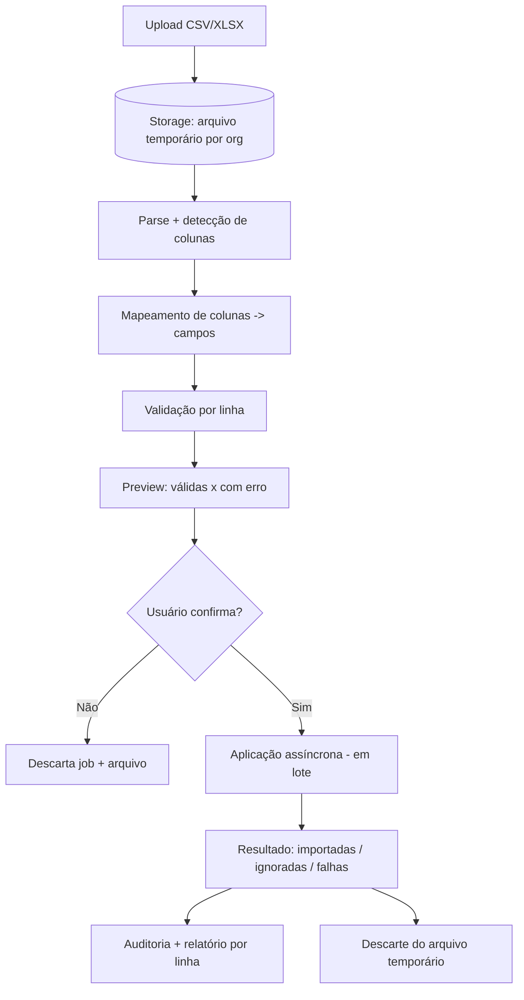

# Rescript — Arquitetura de Importação de Dados

> Reduzir o medo da tela em branco (`Activation.md`) sem comprometer a integridade do sistema.
> Status: Design de arquitetura (pré-implementação).

---

## 1. Objetivo e Tensão Central

A importação é crítica para ativação (o cliente chega com dados em planilhas), mas é também um **vetor de corrupção de dados** se malfeita. A arquitetura resolve a tensão com um pipeline **validado, previsível, reversível e idempotente**.

> Princípio: **nenhuma importação corrompe dados existentes.** Na dúvida, a importação falha de forma segura e explicada, nunca "meio importa".

---

## 2. O que se importa

Clientes, produtos, **estoque inicial**, vendas futuras, recebíveis futuros. Cada tipo tem seu conjunto de validações e destino no núcleo (via serviços de aplicação do domínio — nunca escrevendo tabelas diretamente).

---

## 3. Pipeline de Importação

### Etapas
1. **Upload** para Storage (arquivo temporário, isolado por `organization_id`, com expiração — `Privacy.md`).
2. **Parse** de CSV/XLSX e detecção de colunas.
3. **Mapeamento** de colunas → campos do domínio (com sugestões automáticas; o usuário confirma).
4. **Validação por linha** (tipos, obrigatórios, referências, duplicidade).
5. **Preview**: mostra quantas linhas estão OK e quais têm erro, com o motivo por linha.
6. **Decisão** do usuário (importar as válidas / corrigir / cancelar).
7. **Aplicação assíncrona** em lotes (fila/worker — `DomainEvents.md`).
8. **Resultado + auditoria + relatório** por linha; **descarte** do arquivo.

---

## 4. Validação e Erros por Linha

- Validação em duas fases: **estrutural** (colunas, tipos) e **de domínio** (regras de negócio, referências, unicidade).
- Cada linha inválida gera um **erro específico** ("linha 42: SKU duplicado", "linha 88: cliente sem nome").
- O usuário vê tudo **antes** de aplicar (preview) — sem surpresas.

---

## 5. Importação Parcial e Rollback

- **Importação parcial permitida:** aplicar só as linhas válidas é uma opção consciente do usuário (não um acidente).
- **Rollback:** cada `ImportJob` é rastreável e **reversível** — é possível desfazer uma importação (as entidades criadas pelo job são identificadas pelo `import_job_id`). Para dados que já geraram efeitos (ex.: estoque inicial que já foi vendido), o rollback é bloqueado/parcial e explicado (integridade acima da conveniência).
- Erros de sistema no meio do lote: o lote é transacional por chunk; o que falhou não fica "meio aplicado".

---

## 6. Idempotência e Duplicidades

- Cada `ImportJob` tem **chave de idempotência**; reenviar o mesmo arquivo/job não duplica.
- Detecção de **duplicidade de registro** (ex.: cliente com mesmo documento, SKU repetido) — regra por tipo: ignorar, atualizar ou reportar (escolha do usuário).
- Reprocessar um job idempotente não cria dados novos.

---

## 7. Processamento Assíncrono e Limites

- Importações grandes rodam em **worker assíncrono** (não no request do usuário — respeita limites de Edge Functions, `TechnologyEvaluation.md` §7).
- **Limite de tamanho** de arquivo/linhas por plano (`Entitlements.md`).
- Progresso visível ao usuário; ao terminar, notificação + evento `ImportCompleted` (`DomainEvents.md`).

---

## 8. Segurança, Privacidade e Arquivos Temporários

- Arquivos ficam em Storage **isolado por tenant**, com **URLs assinadas curtas** e **expiração/descarte** após o processamento (`Privacy.md`, `Security.md`).
- Dados pessoais em importações seguem a LGPD (base legal, minimização).
- Todo o processo é **auditado** (quem importou, quando, quantas linhas, resultado — `AuditArchitecture.md`).

---

## 9. Origem dos Dados (rastreabilidade)

- Registros criados por importação carregam referência ao `import_job_id` (origem rastreável — invariante de `DataTrust.md`).
- Dados importados são distinguíveis de dados digitados/operados, permitindo auditoria e correção.

---

## 10. Invariantes

1. **Nenhuma importação corrompe dados existentes.**
2. Validação e **preview** antes de qualquer escrita.
3. **Idempotência** por job; sem duplicação em reenvio.
4. **Rollback** possível enquanto não houver efeitos irreversíveis.
5. Escrita sempre via **serviços de aplicação do domínio** (respeita invariantes de estoque/financeiro), nunca por INSERT direto que burla regras.
6. Arquivos temporários **isolados por tenant** e **descartados** após uso.
7. Todo import é **auditado** e **rastreável** à origem.
