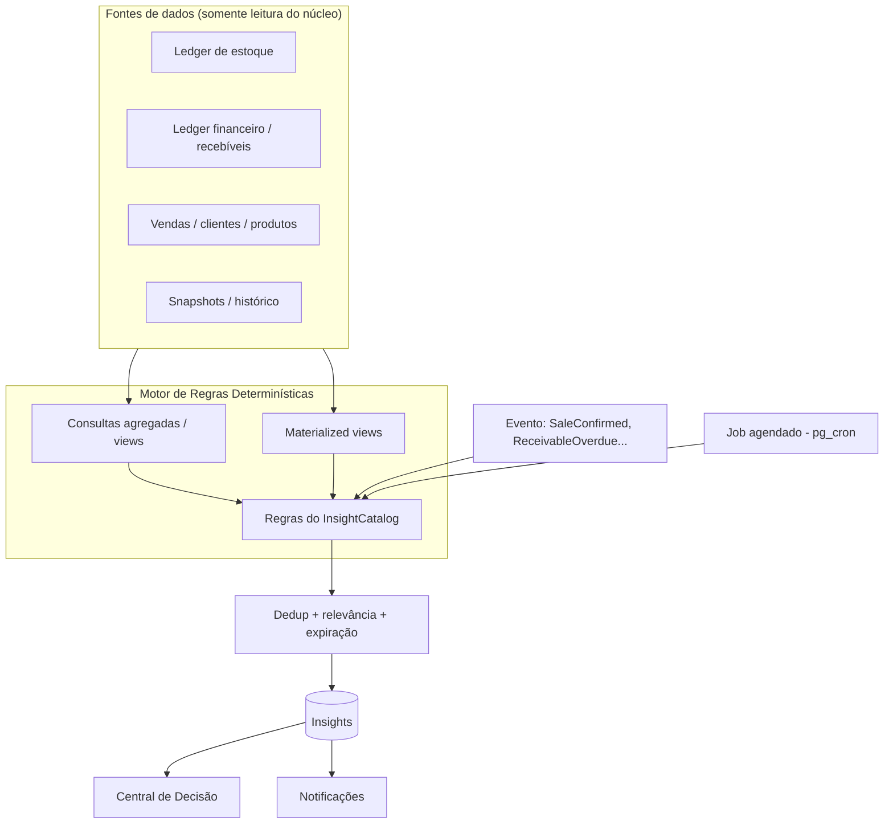
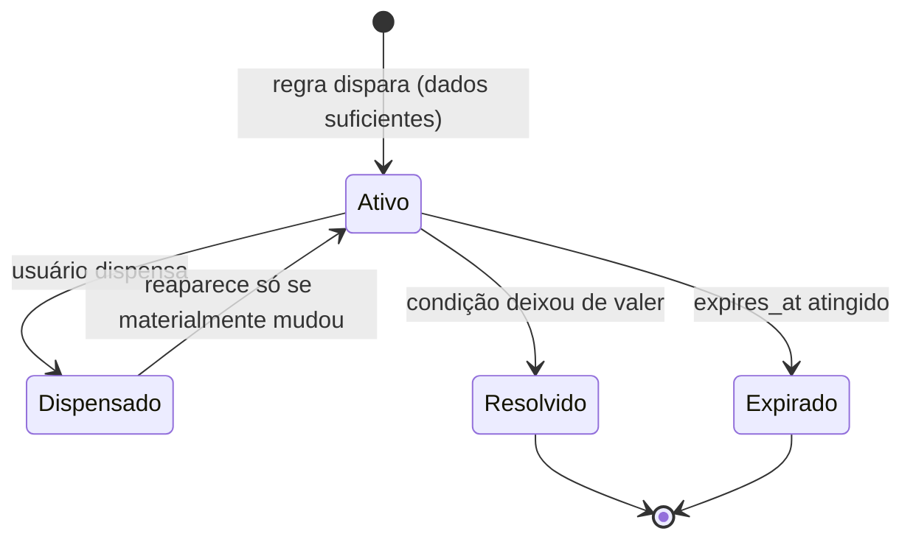

# Rescript — Arquitetura de Insights (Camada Interpretar)

> Como a inteligência funciona **sem depender de IA generativa**: regras determinísticas sobre dados transacionais consistentes, sempre rastreáveis.
> Status: Design de arquitetura (pré-implementação). Decisão em `adr/0010-insights.md`. Governa-se por `IntelligencePrinciples.md` e alimenta-se de `InsightCatalog.md`.

---

## 1. Princípios que governam esta camada

Herdados de `IntelligencePrinciples.md` (invioláveis):
- **Nunca inventar dados** (IP1). Sem dados suficientes → não conclui.
- **Toda conclusão é rastreável** (IP2): regra, registros, período, tipo.
- **Diferenciar fato / projeção / recomendação** (IP3).
- **Sem alarmismo** (IP4): relevância acima de volume.
- **Determinístico primeiro** (IP7): regra explicável antes de qualquer modelo.
- **Explicável sempre** (IP8): o usuário entende o porquê.

> A inteligência é **consequência da simplicidade e da confiança nos dados** (`DataTrust.md`), não um módulo de IA acoplado.

---

## 2. Anatomia de um Insight

Todo insight é um registro estruturado que responde 8 perguntas obrigatórias:

| Pergunta | Campo |
|---|---|
| Qual regra foi aplicada? | `rule_id` + versão |
| Quais registros foram usados? | referências rastreáveis (ids) |
| Quando foi calculado? | `computed_at` |
| Qual período foi analisado? | `period` |
| É fato, projeção ou recomendação? | `nature` |
| Qual ação é sugerida? | `suggested_action` |
| Por que está aparecendo? | `explanation` + severidade/relevância |
| Quando deixa de valer? | `expires_at` / condição de invalidação |

Campos adicionais: `organization_id`, `severity` (informativo/atenção/crítico), `relevance`, `status` (ativo/dispensado/expirado/resolvido), `dedup_key`.

> Isso é o que torna cada insight **auditável**: dá para reconstruir exatamente por que o Rescript disse aquilo (`DataTrust.md`).

---

## 3. Como os insights são gerados

Combinação de três gatilhos, todos determinísticos:

- **Por evento** (`DomainEvents.md`): reagir a fatos (ex.: recebível venceu → recalcular inadimplência).
- **Por job agendado** (`pg_cron`): varreduras periódicas (ex.: produto parado há N dias, resumo diário).
- **Sob demanda**: ao abrir a Central de Decisão, leituras agregadas.

**Materialização:** agregações caras usam **materialized views**/snapshots recomputados por job — cache derivado, nunca fonte de verdade (AP17).

---

## 4. Motor de Regras (determinístico)

- Cada regra vem do **catálogo** (`InsightCatalog.md`): objetivo, dados de entrada, condição, severidade, mensagem, ação, expiração.
- Regras são **versionadas** (`rule_id` + versão) — mudar uma regra não reescreve o histórico de insights antigos.
- Uma regra só dispara se houver **dados suficientes** (IP1); caso contrário, não gera nada (evita "conclusão sem base").
- Regras são testáveis isoladamente (`TestingStrategy.md`).

---

## 5. Deduplicação, Expiração e Ciclo de Vida

- **Deduplicação:** `dedup_key` (ex.: `org + rule + entidade + período`) evita o mesmo insight repetido. Recomputar atualiza o existente, não cria outro.
- **Expiração:** todo insight tem condição de invalidação; insights velhos **não** persistem.
- **Dispensa:** o usuário pode dispensar; um insight dispensado **só reaparece** se houver mudança material (não incomoda de novo pelo mesmo motivo).
- **Ação tomada:** se o usuário age (ex.: registra o recebimento), o insight se resolve automaticamente.

---

## 6. Como evitar os problemas clássicos

| Problema | Defesa |
|---|---|
| **Fadiga de alertas** | Relevância + severidade; limite de itens exibidos; agrupamento; dispensa que "gruda" |
| **Duplicidade** | `dedup_key`; recomputar atualiza em vez de recriar |
| **Informações contraditórias** | Fonte única de verdade (ledgers); regras coerentes; recomputo determinístico |
| **Alertas antigos** | Expiração obrigatória; resolução automática por ação |
| **Conclusões sem dados** | IP1: sem dados suficientes, não gera (estado "ainda aprendendo") |
| **Recomputações desnecessárias** | Materialização + gatilho por evento/mudança material, não a cada request |

---

## 7. Severidade × Relevância (priorização)

- **Severidade:** o quão sério é (informativo / atenção / crítico).
- **Relevância:** o quão prioritário é **para exibir agora**, combinando severidade, recência, impacto financeiro e acionabilidade.
- A Central de Decisão ordena por relevância e mostra **poucos itens certos** (`DecisionCenterArchitecture.md`), respeitando o Mandamento contra alarmismo.

---

## 8. Falso positivo e feedback do usuário

- Cada insight pode receber **feedback** ("não é útil", "não é verdade").
- Feedback é registrado (`InsightFeedback`) e usado para **calibrar regras** (ajuste de limiares/relevância) — de forma determinística e auditável, não como "aprendizado" opaco.
- Falsos positivos recorrentes disparam revisão da regra (`TechnicalRisks.md`).

---

## 9. Rastreabilidade (o requisito não-negociável)

Todo insight guarda referências suficientes para, a qualquer momento, **abrir os dados que o originaram** (drill-down até os registros). Se um insight não consegue apontar sua origem, ele **não deve existir** (IP2). Essa é a diferença entre o Rescript e "um chatbot que chuta".

---

## 10. Evolução para além do determinístico

- **Camada 1 (agora):** regras determinísticas — a base.
- **Camada 2 (futuro):** detecção de anomalias estatística sobre o histórico (ainda explicável, com baseline rastreável).
- **Camada 3 (só se simplificar):** IA generativa **apenas** para *redação* de explicações/resumos a partir de dados já verdadeiros — nunca para *decidir* ou *inventar* números (IP10).

> A ordem é lei: nada de IA generativa antes de a base determinística ser sólida e confiável.

---

## 11. Invariantes

1. Todo insight responde às 8 perguntas (§2) e aponta dados rastreáveis (AP18/IP2).
2. Sem dados suficientes → sem insight (IP1).
3. Fato, projeção e recomendação são **sempre** distinguidos (IP3).
4. Insights expiram e deduplicam; nada de alertas velhos ou repetidos.
5. A camada de insights **lê** o núcleo; nunca escreve nele (`DependencyMap.md`).
6. Regras são versionadas, determinísticas e testadas.
