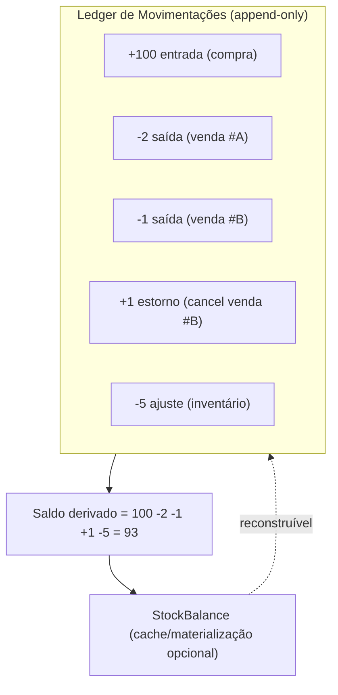
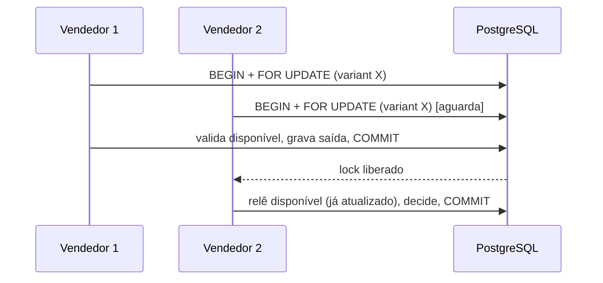
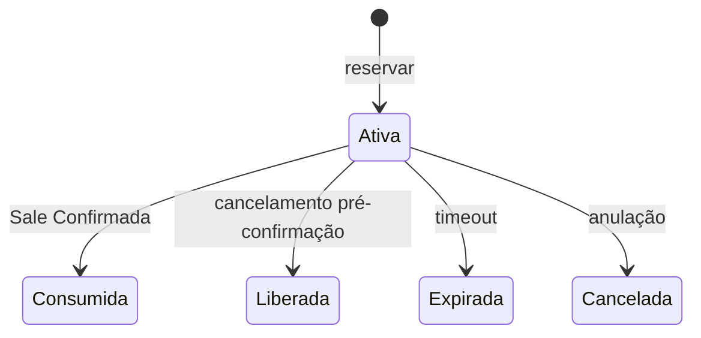

# Rescript — Arquitetura de Estoque

> O estoque é área crítica. Desenho conceitual baseado em **ledger** (razão de movimentações) com saldos deriváveis e concorrência controlada.
> Status: Alinhado a FD-01 (custeio médio), FD-02 (reserva no MVP), ADR-0005 / 0016 / 0017.
> Unidade estocável = **ProductVariant** (variante padrão se não houver variações).

---

## 1. Princípio Central: Estoque é um Ledger

O saldo de estoque **não** é um número mutável guardado numa coluna. É a **soma de um registro imutável e append-only de movimentações** (ledger). O saldo atual é **derivado** e sempre reconstruível (AP17).

> Invariante fundamental: **o saldo atual não pode existir sem possibilidade de reconstrução/auditoria a partir do ledger.**

**Por quê:** um saldo mutável isolado é impossível de auditar ("por que está 7 e não 9?") e frágil sob concorrência. O ledger dá rastreabilidade total (`DataTrust.md`), base para insights confiáveis (ruptura, produto parado) e correção auditável.

---

## 2. Os Três Saldos

| Saldo | Definição | Uso |
|---|---|---|
| **Físico (on-hand)** | O que está fisicamente no estoque | Base contábil/física |
| **Reservado (reserved)** | Comprometido por vendas/pedidos não baixados | Proteção contra vender o mesmo item duas vezes |
| **Disponível (available)** | Físico − Reservado | O que pode ser vendido agora |

> **Reserva ≠ saída.** Reservar compromete sem retirar; a saída definitiva ocorre na baixa. Confundir os dois é um dos erros mais graves de sistemas de estoque (invariante explícita).

---

## 3. InventoryMovement vs Reservation (separação oficial)

### 3.1. InventoryMovement (ledger do físico)
Altera **somente o saldo físico** (ou o compensa). Append-only. Tipos
implementados: entrada, saída, ajuste positivo/negativo, transferência entre
`StockLocation` e estorno.

### 3.2. Reservation (compromisso — não é movimento do ledger)
Altera **reservado/disponível**, **não** o físico. Situações: ativa, consumida, liberada, expirada, cancelada. Campos: origem, quantidade, data, situação, expiração opcional, histórico.

### 3.3. Na confirmação da venda
Reserva Ativa → **Consumida** e, na mesma coordenação atômica, nasce InventoryMovement de **saída**. Reserva ≠ saída.

---

## 4. Invariantes de Estoque (invioláveis)

1. Nenhum movimento sem origem.
2. Nenhuma venda confirmada duas vezes (idempotência).
3. Nenhuma baixa duplicada.
4. **Reserva não é saída** — Reservation ≠ InventoryMovement.
5. Cancelamento gera compensação, nunca edição/remoção do original.
6. Movimentos e custo aplicado históricos não são editados silenciosamente.
7. Saldo físico reconstruível do ledger; reservado das reservas.
8. **Custeio = médio ponderado** (FD-01); PEPS fora do MVP.
9. Estoque na **variante** (InventoryItem → ProductVariant).

---

## 5. Concorrência: dois usuários vendendo o mesmo produto

Cenário: Aline e outro vendedor confirmam vendas do último item quase ao mesmo tempo.

**Estratégia (dentro da transação de venda — `SaleTransaction.md`):**

1. A confirmação da venda abre uma transação de banco.
2. Ao afetar o saldo de uma variante, adquire-se um **lock pessimista** na linha de controle daquele item (`SELECT ... FOR UPDATE` sobre o registro de saldo/variante, ou `advisory lock` por `(organization_id, variant_id)`).
3. Recalcula-se o disponível **dentro do lock**, aplica-se a política de estoque (bloquear ou permitir com alerta — `Settings`), grava-se o movimento e libera-se o lock ao commit.
4. O segundo vendedor espera o lock; ao prosseguir, vê o saldo já atualizado e recebe o resultado correto (bloqueio ou alerta), sem condição de corrida.

> **Por que lock pessimista e não apenas otimista:** estoque é ponto de alta contenção e alto custo de erro. O lock por item é curto (dura a transação) e escopado por variante, com impacto de performance aceitável. Estratégia otimista (retry) pode complementar, mas a garantia base é o lock + a transação atômica.

---

## 6. Reservas no MVP (FD-02 / ADR-0017)

- **Reserva entra no MVP** para: pedidos em aberto, vendas não confirmadas, orçamentos convertidos em pedido, separação de mercadoria, B2B, prevenção de oversell.
- Tipicamente criada ao promover Sale a **Pedido** (Orçamento conforme política).
- Expiração opcional (job). Liberação em PedidoCancelado / OrçamentoExpirado / Recusado / Descartada.
- Confirmar: reserva **Consumida** + **saída** no ledger (atômico).
- Cancelar venda **confirmada**: estorno no ledger (a reserva já foi consumida).

## 6b. Custeio — custo médio ponderado (FD-01 / ADR-0016)

- Média recalculada a cada **entrada com custo**.
- Saída usa e **persiste** a média vigente no movimento.
- Entrada sem custo: não altera média.
- Devoluções/estornos/ajustes: regras de compensação; sem edição silenciosa de histórico.
- PEPS: não no MVP.

---

## 7. Política de Estoque Negativo

Configurável por organização (`Settings`), padrão recomendado **permitir com alerta** (não travar a operação — `BusinessRules.md` RN-34):
- **Permitir com alerta:** grava a saída, saldo fica negativo e visível como inconsistência a reconciliar.
- **Bloquear:** a confirmação falha se não há disponível.

A escolha é do cliente; o sistema respeita e sinaliza.

---

## 8. Saldos Derivados e Performance

- O saldo é materializado em `inventory_item`, atualizado na mesma transação do
  movimento; é projeção, não fonte de verdade.
- `reconcile_inventory_ledger` recompõe o saldo esperado e detecta divergências
  sem alterar dados (`DataTrust.md` DT9).
- Insights de estoque (ruptura, parado) leem saldos + histórico do ledger (`InsightArchitecture.md`).

---

## 9. Relação com outras áreas

- **Vendas:** confirmação gera saídas atomicamente (`SaleTransaction.md`).
- **Compras (futuro):** recebimento gera entradas.
- **Financeiro:** custo das movimentações alimenta margem (`FinancialArchitecture.md`).
- **Insights:** ruptura, produto parado, reposição atrasada (`InsightCatalog.md`).
- **Auditoria:** ajustes e estornos são ações sensíveis (`AuditArchitecture.md`).

---

## 10. Decisões fechadas vs. adiadas

**Fechadas:** ledger; reserva no MVP; custeio médio ponderado; estoque na variante; reserva ≠ movimento físico (FD-01, FD-02, ADR-0016, ADR-0017).

**Implementadas:** estrutura física variant-scoped, múltiplas
`StockLocation`, transferências atômicas, Reservation, Picking, Packing e
Shipment.

**Adiadas:** Warehouse como nova hierarquia, lotes, séries, validade e
valoração/custeio físico completo.
