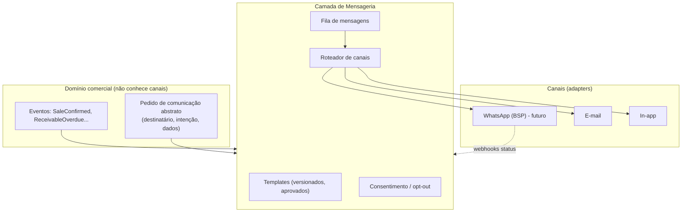

# Rescript — Arquitetura de Mensageria (WhatsApp e Canais)

> Fronteiras arquiteturais para comunicação externa (WhatsApp e outros canais). **Fase posterior** — nada é implementado; nenhum provedor é escolhido definitivamente.
> Status: Design de arquitetura (pré-implementação).

---

## 1. Princípio

O WhatsApp (e canais em geral) é um **ponto de entrega/conveniência**, **não** a fonte de dados nem parte do domínio comercial (alinhado a `Product.md` — "WhatsApp como ponto de entrada, não o coração"). O sistema continua funcionando sem ele. As mensagens **carregam** o que o domínio produz; nunca são a verdade.

> Fronteira central: **o domínio comercial não conhece "WhatsApp".** Ele emite fatos (eventos) e pedidos de comunicação abstratos; a camada de mensageria decide canal, template e entrega.

---

## 2. Casos de uso futuros (não implementar)

- Envio de orçamento / pedido.
- Cobrança (lembrete de vencimento).
- Atualização de status (pedido pronto, a caminho).
- Resumo diário para o dono.
- Notificações relevantes (insights críticos).
- Confirmação do cliente (ex.: "confirma o pedido?").

---

## 3. Camadas e Separação de Responsabilidades

- **Domínio comercial:** emite eventos e "intenções de comunicação" abstratas.
- **Templates:** conteúdo versionado e (no caso do WhatsApp) pré-aprovado pelo provedor; separados do domínio.
- **Canais:** cada canal é um **adapter** isolado (WhatsApp/BSP, e-mail, in-app). Trocar de BSP não afeta o domínio.
- **Consentimento:** registro de opt-in/opt-out por destinatário e finalidade (`Privacy.md`).
- **Fila de mensagens:** desacopla envio da operação; suporta retries e limites.
- **Status de entrega:** via webhooks do provedor, atualizando o estado da mensagem.

---

## 4. Elementos a separar (conforme briefing)

| Elemento | Responsabilidade | Onde vive |
|---|---|---|
| Domínio comercial | Produz fatos e dados | Núcleo |
| Templates | Conteúdo parametrizável e versionado | Mensageria |
| Canais | Entrega física (WhatsApp, e-mail...) | Adapters |
| Consentimento | Opt-in/opt-out por finalidade | Mensageria + Privacy |
| Fila de mensagens | Buffer, ordenação, retries | Mensageria (fila em PostgreSQL) |
| Status de entrega | Enviado/entregue/lido/falho | Mensageria (via webhook) |
| Webhooks | Recepção de status do provedor | Integrations/Edge Function |
| Limites | Rate limits do provedor e do plano | Mensageria + Entitlements |
| Opt-out | Descadastro respeitado sempre | Mensageria + Privacy |
| Auditoria | Registro de o que foi enviado a quem | Audit |

---

## 5. Fila, Retries e Idempotência

- Mensagens entram numa **fila** (mesma infra de jobs — `DomainEvents.md`).
- Envio é **idempotente** (uma intenção → no máximo uma mensagem, mesmo com retry).
- **Retries com backoff**; falha persistente → dead-letter + alerta.
- **Rate limiting** respeita limites do provedor e do plano (`Entitlements.md`).

---

## 6. Webhooks de Status (fora de ordem)

- Status podem chegar **fora de ordem** (ex.: "lido" antes de "entregue" por atraso de rede).
- Cada atualização é aplicada por **estado mais avançado**/timestamp, nunca sobrescrevendo um estado mais recente com um mais antigo.
- Webhooks são **autenticados** (assinatura do provedor) e **idempotentes** (`Security.md`, `FailureModes.md`).

---

## 7. Consentimento e Opt-out (LGPD)

- Nenhuma mensagem sem base legal/consentimento adequado à finalidade (`Privacy.md`).
- **Opt-out sempre respeitado** e imediato; registrado e auditável.
- Templates transacionais × marketing tratados conforme regras do canal e da lei.

---

## 8. Isolamento do Provedor (evitar lock-in)

- Cada provedor (BSP de WhatsApp, serviço de e-mail) é um **adapter** atrás de uma interface estável de "enviar mensagem / receber status".
- Trocar de provedor = trocar o adapter, sem tocar no domínio nem nos templates lógicos.
- **Nenhum provedor é escolhido nesta fase** — a arquitetura só garante que a escolha seja reversível.

---

## 9. Invariantes

1. O domínio comercial **não conhece canais**; comunica por intenção abstrata/eventos.
2. Toda mensagem respeita **consentimento e opt-out**.
3. Envio é **idempotente**; falhas vão para dead-letter com alerta.
4. Provedores são **adapters isoláveis** (sem lock-in).
5. Todo envio é **auditável** (quem, o quê, quando, canal, status).
6. O sistema funciona **sem** mensageria (degradação graciosa).

---

## 10. Fora de escopo desta fase

Escolha de BSP, formato de templates, precificação de mensagens e implementação. Este documento apenas garante que, quando o WhatsApp entrar (V2 — `Roadmap.md`), ele encaixe sem redesenhar o núcleo.
