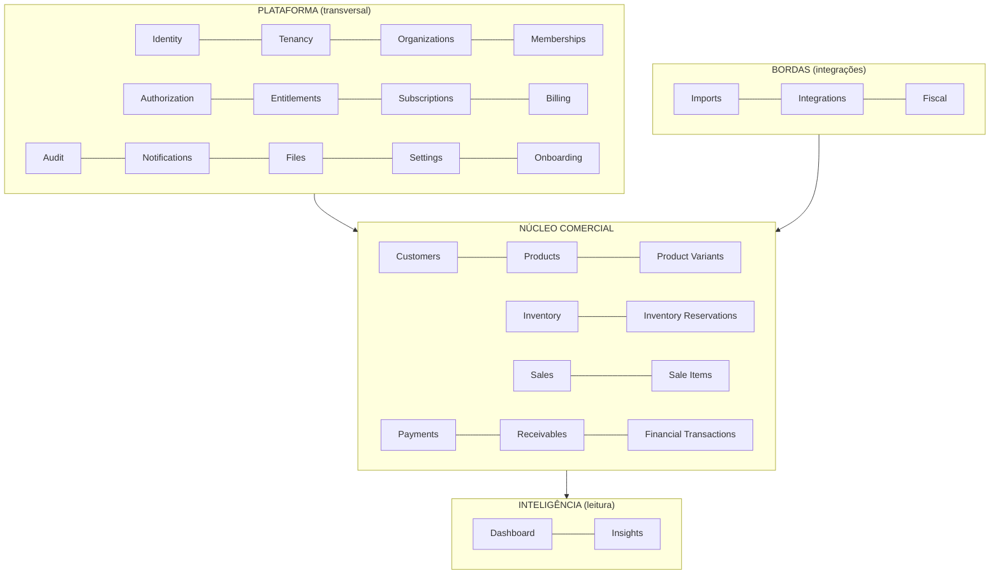

# Rescript — Fronteiras dos Módulos (Bounded Contexts)

> Responsabilidades e limites de cada módulo técnico. **Não** modela colunas — estabelece o que cada domínio possui, faz e não pode fazer.
> Status: Design de arquitetura (pré-implementação). Dependências detalhadas em `DependencyMap.md`.

---

## 1. Organização em Camadas

Os domínios se agrupam em quatro camadas lógicas (dentro do mesmo monólito modular — AP1):

**Regra macro de dependência:** Núcleo depende de Plataforma; Inteligência depende de Núcleo (só leitura); Bordas dependem de Núcleo via contratos. O Núcleo **nunca** depende de Inteligência nem de Bordas.

---

## 2. Ficha padrão

Cada módulo é descrito por: **Responsabilidade · Entidades · Dados · Operações · Eventos produzidos · Eventos consumidos · Dependências permitidas · Dependências proibidas · Invariantes · Riscos · Fronteiras.**

---

## 3. Camada Plataforma

### 3.1. Identity
- **Responsabilidade:** identidade da pessoa (autenticação delegada ao Supabase Auth) e o vínculo com o usuário interno do domínio.
- **Entidades:** User (espelho local da identidade), credenciais (no provedor).
- **Dados:** id do usuário, e-mail, status; **não** guarda papéis nem organização.
- **Operações:** criar conta, login, recuperação, vincular identidade externa.
- **Eventos produzidos:** `UserRegistered`.
- **Eventos consumidos:** —
- **Dependências permitidas:** Supabase Auth (via `packages/auth`).
- **Dependências proibidas:** qualquer domínio de negócio (Sales, Inventory...).
- **Invariantes:** um e-mail = uma identidade; papéis nunca moram aqui.
- **Riscos:** acoplamento ao provedor (mitigado por camada `auth`).
- **Fronteiras:** autoriza "quem é"; não decide "o que pode".

### 3.2. Tenancy
- **Responsabilidade:** conceito de isolamento; o contexto de organização ativa da sessão.
- **Entidades:** contexto de tenant (derivado), não uma tabela de negócio.
- **Operações:** resolver organização ativa; trocar organização ativa.
- **Eventos:** —
- **Dependências permitidas:** Organizations, Memberships.
- **Proibidas:** domínios de núcleo diretamente.
- **Invariantes:** toda operação de negócio ocorre sob exatamente uma organização.
- **Riscos:** troca de organização mal isolada → vazamento. Ver `MultiTenancy.md`.

### 3.3. Organizations
- **Responsabilidade:** a empresa cliente (tenant).
- **Entidades:** Organization; futuramente Unit/Filial.
- **Dados:** dados cadastrais da empresa, status (ativa/suspensa), configurações-âncora.
- **Operações:** criar organização, suspender, cancelar, transferir propriedade.
- **Eventos produzidos:** `OrganizationCreated`, `OrganizationSuspended`, `OwnershipTransferred`.
- **Dependências permitidas:** —
- **Proibidas:** núcleo comercial.
- **Invariantes:** organização sempre tem um proprietário; suspensão bloqueia operação sem apagar dados.
- **Fronteiras:** dona do `organization_id` que todos referenciam.

### 3.4. Memberships
- **Responsabilidade:** relação usuário↔organização, com papéis e status.
- **Entidades:** Membership, Invite.
- **Dados:** user_id, organization_id, papéis, status (ativo, convidado, removido).
- **Operações:** convidar, aceitar, remover, alterar papéis.
- **Eventos produzidos:** `MemberInvited`, `MemberJoined`, `MemberRemoved`, `MemberRoleChanged`.
- **Dependências permitidas:** Organizations, Identity, Authorization.
- **Invariantes:** papel só existe no contexto de uma membership; remover membro revoga acesso imediatamente.
- **Riscos:** escalada de privilégio via alteração de papel — ação sensível e auditada.

### 3.5. Authorization
- **Responsabilidade:** decidir o que um membership pode fazer (papéis → permissões). Ver `Authorization.md`.
- **Entidades:** Role, Permission, (futuro) Custom Role.
- **Operações:** avaliar permissão, atribuir papéis.
- **Eventos consumidos:** `MemberRoleChanged`.
- **Dependências permitidas:** Memberships.
- **Proibidas:** lógica de plano/limite (isso é Entitlements).
- **Invariantes:** default-deny; segregação de funções respeitada.

### 3.6. Entitlements
- **Responsabilidade:** o que o **plano** libera (limites, módulos, flags). Separado de Authorization. Ver `Entitlements.md`.
- **Entidades:** Plan, Entitlement, FeatureFlag, Limit.
- **Operações:** verificar direito de uso, checar limite, resolver flags.
- **Eventos consumidos:** `SubscriptionChanged`.
- **Dependências permitidas:** Subscriptions.
- **Invariantes:** entitlement nunca se confunde com permissão; limites checados de forma centralizada.

### 3.7. Subscriptions & 3.8. Billing
- **Responsabilidade:** Subscriptions = estado da assinatura da organização; Billing = cobrança via gateway externo.
- **Entidades:** Subscription, Invoice (espelho), PaymentMethod (no gateway).
- **Operações:** assinar, trocar plano, suspender por inadimplência, cancelar.
- **Eventos produzidos:** `SubscriptionCreated`, `SubscriptionChanged`, `SubscriptionCanceled`, `PaymentFailed`.
- **Dependências permitidas:** gateway de billing (via adapter).
- **Proibidas:** núcleo comercial. Billing (assinatura do SaaS) **é distinto** do Financeiro do cliente (recebíveis das vendas dele) — nunca confundir.
- **Invariantes:** inadimplência do SaaS suspende acesso, não apaga dados.

### 3.9. Onboarding
- **Responsabilidade:** conduzir a empresa até a primeira operação completa (`Activation.md`).
- **Entidades:** OnboardingChecklist, progress.
- **Operações:** avançar etapa, oferecer dados de demo/importação.
- **Eventos consumidos:** `SaleConfirmed` (marca "primeira venda"), `ImportCompleted`.
- **Dependências permitidas:** leitura de estado de vários módulos.
- **Invariantes:** dados de demo nunca se misturam com dados reais (`DataTrust.md`).

### 3.10. Audit
- **Responsabilidade:** trilha imutável de ações sensíveis. Ver `AuditArchitecture.md`.
- **Entidades:** AuditEntry.
- **Operações:** registrar (append-only).
- **Eventos consumidos:** todos os eventos sensíveis.
- **Invariantes:** append-only; nunca editado; distinto de logs técnicos e de histórico de domínio.

### 3.11. Notifications · 3.12. Files · 3.13. Settings
- **Notifications:** entrega de alertas in-app (e, no futuro, canais externos). Consome eventos e insights. Não decide regra de negócio.
- **Files:** abstração de armazenamento (Supabase Storage) para XML/PDF fiscais, importações, anexos — sempre por `organization_id` e URLs assinadas.
- **Settings:** preferências da organização (moeda BRL, políticas como estoque negativo). Bons padrões; configuração é exceção (P9).

---

## 4. Camada Núcleo Comercial

### 4.1. Customers
- **Responsabilidade:** cadastro e histórico de clientes.
- **Entidades:** Customer.
- **Operações:** criar, editar, inativar, buscar; ver histórico.
- **Eventos produzidos:** `CustomerCreated`, `CustomerUpdated`, `CustomerDeactivated`.
- **Dependências permitidas:** Plataforma (tenant/authz).
- **Proibidas:** Sales/Inventory (são eles que referenciam Customer).
- **Invariantes:** documento único por organização quando informado; cliente com histórico é inativado, não apagado (AP16).

### 4.2. Products & 4.3. Product Variants
- **Responsabilidade:** catálogo. Product é o item conceitual; Variant é a unidade vendável que carrega estoque.
- **Entidades:** Product, ProductVariant.
- **Operações:** criar/editar/inativar; definir preço, custo, SKU, unidade; gerenciar variantes.
- **Eventos produzidos:** `ProductCreated`, `ProductUpdated`, `PriceChanged`.
- **Invariantes:** SKU único por organização; produto com vendas é inativado, não apagado; preço/custo ≥ 0.
- **Fronteiras:** define o "que" se vende; não conhece saldo (isso é Inventory).

### 4.4. Inventory & 4.5. Inventory Reservations
- **Responsabilidade:** saldo por **variante** via ledger físico + reservas distintas. Ver `InventoryArchitecture.md`.
- **Entidades:** InventoryItem, InventoryMovement (ledger físico), Reservation (compromisso), StockBalance (derivado).
- **Operações:** entrada/saída/ajuste/devolução/estorno; reservar/liberar/consumir; consultar físico/reservado/disponível; custo médio.
- **Eventos produzidos:** `InventoryMoved`, `InventoryReserved`, `InventoryReleased`, `ReservationConsumed`, `LowStockDetected`.
- **Eventos consumidos:** fases da Sale (pedido/confirmação/cancelamento) via serviços.
- **Invariantes:** movimento ≠ reserva; físico reconstruível; custeio médio ponderado; estoque na variante.
- **Riscos:** concorrência — locks por variante.

### 4.6. Sales & 4.7. Sale Items
- **Responsabilidade:** ciclo comercial completo no MVP (rascunho, orçamento, pedido, confirmação, cancelamento) num único agregado **Sale** — **sem Order separado** (FD-03 / ADR-0018).
- **Entidades:** Sale, SaleItem.
- **Operações:** criar/editar fases pré-confirmação; reservar (via Inventory); **confirmar venda**; cancelar.
- **Eventos produzidos:** `SaleCreated`, `SaleQuoted`, `SaleOrdered`, `SaleConfirmed`, `SaleCancelled`, …
- **Dependências permitidas:** Customers, Products/Variants, Inventory, Receivables/Payments (via serviços de domínio — Sale não edita ledgers alheios).
- **Invariantes:** total calculado; desconto sob política; confirmação atômica (consome reserva + saída + recebível); confirmada imutável.

### 4.9. Payments & 4.10. Receivables & 4.11. Financial Transactions
- **Responsabilidade:** direitos de recebimento, parcelas, pagamentos e o razão financeiro. Ver `FinancialArchitecture.md`.
- **Entidades:** Receivable, Installment, Payment, FinancialTransaction (ledger financeiro).
- **Operações:** gerar recebível (a partir da venda), registrar pagamento (total/parcial), estornar; projetar caixa.
- **Eventos produzidos:** `ReceivableCreated`, `PaymentRegistered`, `PaymentReversed`, `ReceivableOverdue`.
- **Eventos consumidos:** `SaleConfirmed`, `SaleCancelled`.
- **Invariantes:** "pago" não é booleano — é estado derivado de pagamentos; sem duplicidade de recebimento; caixa reconstruível dos lançamentos.

---

## 5. Camada Inteligência (somente leitura)

### 5.1. Dashboard (Central de Decisão)
- **Responsabilidade:** compor a Home inteligente. Ver `DecisionCenterArchitecture.md`.
- **Entidades:** nenhuma própria (consome leituras/agregações).
- **Operações:** montar blocos (Hoje, Requer atenção, Próximos dias, Oportunidades, Visão geral).
- **Dependências permitidas:** leitura de Insights, Sales, Inventory, Financial (views/agregações).
- **Proibidas:** **escrever** em qualquer domínio de núcleo.
- **Invariantes:** nunca é fonte de verdade; respeita permissões e tenant.

### 5.2. Insights
- **Responsabilidade:** gerar conclusões determinísticas. Ver `InsightArchitecture.md`, `InsightCatalog.md`.
- **Entidades:** Insight, InsightRule (config), InsightFeedback.
- **Operações:** avaliar regras, gerar/expirar/deduplicar insights, registrar dispensa/ação.
- **Eventos produzidos:** `InsightGenerated`.
- **Eventos consumidos:** eventos de núcleo (para recomputar) e agendamentos.
- **Dependências permitidas:** **leitura** do núcleo.
- **Proibidas:** **escrever** no núcleo; inventar dados (IP1).
- **Invariantes:** todo insight é rastreável (regra, registros, período, tipo).

---

## 6. Camada Bordas (integrações)

### 6.1. Imports
- **Responsabilidade:** importar clientes, produtos, estoque inicial, recebíveis. Ver `ImportArchitecture.md`.
- **Entidades:** ImportJob, ImportRow, mapping.
- **Operações:** upload, mapear colunas, validar, preview, aplicar (parcial), auditar.
- **Eventos produzidos:** `ImportCompleted`, `ImportFailed`.
- **Invariantes:** idempotência; nunca corromper dados existentes; dados importados marcados quanto à origem.

### 6.2. Integrations
- **Responsabilidade:** conectores externos (marketplaces, pagamentos, logística, WhatsApp futuro). Ver `MessagingArchitecture.md`.
- **Entidades:** IntegrationConnection, Credential (segredo), IntegrationEvent.
- **Invariantes:** segredos isolados; toda entrada externa validada; por `organization_id`.

### 6.3. Fiscal
- **Responsabilidade:** solicitar emissão e acompanhar documentos via provedor externo. Ver `FiscalIntegration.md`.
- **Entidades:** FiscalDocument, FiscalRequest, provider adapter.
- **Operações:** solicitar emissão, acompanhar status, armazenar XML/PDF, cancelar.
- **Eventos produzidos:** `FiscalDocumentIssued`, `FiscalDocumentRejected`.
- **Eventos consumidos:** `SaleConfirmed` (opcionalmente, para oferecer emissão).
- **Invariantes:** Rescript detém dados comerciais; provedor detém complexidade tributária; nunca preso a um único provedor (adapter).

---

## 7. Regra de Ouro das Fronteiras

1. **Comunicação entre módulos só por contratos** (interfaces de aplicação) e **eventos** — nunca por acesso direto a tabelas de outro módulo.
2. **Entidades compartilhadas têm um dono único** (ex.: Customer pertence a Customers; Sales referencia por id).
3. **A Inteligência e as Bordas leem o Núcleo; não escrevem nele** (exceto Fiscal/Imports por meio dos serviços de aplicação do próprio núcleo, com suas invariantes).
4. **Billing (SaaS) ≠ Financeiro (cliente).** Nunca misturar a cobrança da assinatura com os recebíveis das vendas do cliente.
