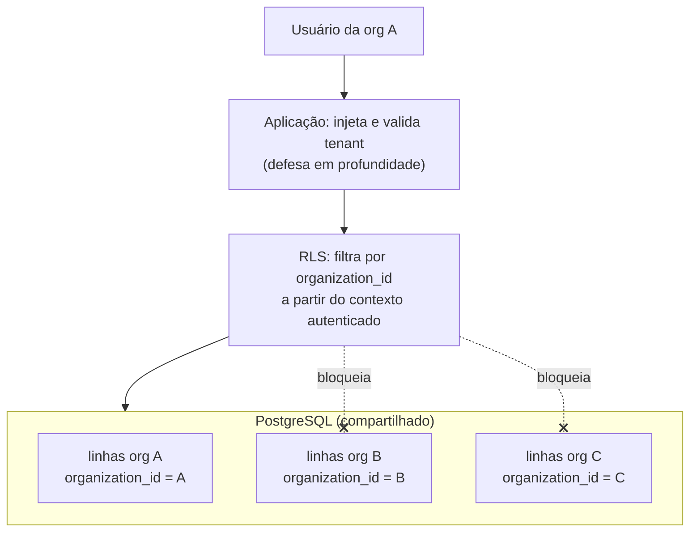
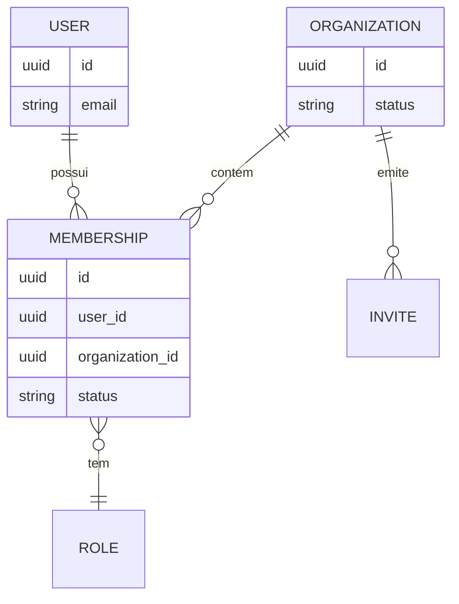

# Rescript — Estratégia Multi-Tenant

> Como isolamos dados de milhares de empresas na mesma base de código e banco, com segurança em profundidade.
> Status: Design de arquitetura (pré-implementação). Decisão formal em `adr/0003-multi-tenancy.md`.

---

## 1. Modelo de Tenancy Escolhido

**Banco compartilhado, schema compartilhado, isolamento lógico por `organization_id` + Row Level Security (RLS).**

- Todas as tabelas de negócio carregam `organization_id`.
- RLS no PostgreSQL garante que cada consulta só enxergue linhas da(s) organização(ões) do usuário.
- A camada de aplicação **também** impõe o tenant (defesa em profundidade — AP10), nunca confiando só na RLS.

**Por que este modelo:** é o que melhor equilibra simplicidade operacional, custo e escala para dezenas de milhares de tenants (AP7). Isolamento físico (schema/DB por tenant) fica reservado para contas muito grandes no futuro, sem exigir reescrita (`Scalability.md`).

---

## 2. Entidades do Modelo

- **User:** identidade única da pessoa (Supabase Auth + espelho local). Não carrega organização.
- **Organization:** o tenant.
- **Membership:** vínculo `user ↔ organization` com papéis e status. **É onde o acesso vive.**
- **Invite:** convite pendente para uma organização.
- **Organização ativa:** a organização do contexto da sessão atual.

> Uma pessoa pode ter várias memberships (participar de várias empresas); uma empresa tem vários membros.

---

## 3. Relações e Cenários Suportados

| Cenário | Como é tratado |
|---|---|
| Pessoa em várias empresas | Múltiplas memberships; troca de organização ativa |
| Empresa com vários usuários | Múltiplas memberships na mesma organização |
| Convites | Invite → aceitação cria Membership |
| Troca de empresa ativa | Muda o contexto de tenant da sessão (reautoriza claims) |
| Papéis e permissões | Por membership (`Authorization.md`) |
| Filiais futuras | Unit dentro de Organization (não no MVP; modelo não impede) |
| Usuário interno da plataforma | Identidade separada; acesso a tenants só via suporte controlado |
| Suporte técnico controlado | Acesso temporário, explícito, com escopo e **auditado** (ver §7) |
| Remoção de membro | Membership → status removido; acesso revogado imediatamente |
| Transferência de propriedade | Ação sensível, auditada; garante sempre haver 1 proprietário |
| Suspensão da empresa | Organization.status = suspensa; bloqueia operação sem apagar dados |
| Cancelamento de assinatura | Acesso restrito conforme política; dados retidos por janela (`Privacy.md`) |
| Retenção de dados | Política de retenção/descarte definida em `Privacy.md` |

---

## 4. Contexto de Organização Ativa (o ponto sensível)

O maior risco de multi-tenancy com "usuário em várias empresas" é o **contexto de organização ativa**. Estratégia:

1. A organização ativa é resolvida **no servidor** a cada requisição, a partir da sessão + membership válida — **nunca** confiando apenas em um valor enviado pelo cliente.
2. A RLS deriva o tenant permitido das **memberships reais** do usuário (via função SQL segura), não de um header arbitrário.
3. Trocar de organização exige revalidar que o usuário tem membership ativa naquela organização.
4. Requisições que declaram um `organization_id` são **validadas** contra as memberships do usuário; divergência = negado + alerta de segurança.

> Regra: o cliente **sugere** a organização ativa; o servidor **decide** com base em memberships. Isso neutraliza a manipulação de `organization_id`.

---

## 5. Claims de Autenticação vs. Verdade no Banco

- Claims JWT (Supabase Auth) podem carregar `user_id` e, opcionalmente, um hint de organização ativa.
- **A fonte de verdade de acesso é a tabela de memberships**, não o claim. Claims são otimização/conveniência; toda decisão sensível reconsulta memberships (evita privilégio "preso" em token antigo — AP11).
- Papéis/permissões **não** são cravados imutavelmente no token de longa duração; mudanças de papel refletem rapidamente (revalidação).

---

## 6. RLS como camada obrigatória (não única)

- **Toda** tabela de negócio tem `organization_id NOT NULL` e política RLS que restringe por memberships do usuário autenticado.
- Funções SQL sensíveis são `SECURITY DEFINER` **com cuidado** (search_path fixo, sem confiar em input) ou `SECURITY INVOKER` quando possível.
- A aplicação injeta `organization_id` em toda escrita e valida em toda leitura — **RLS é a rede de segurança, não a única trava** (AP10).
- **Testes de isolamento são obrigatórios** e bloqueiam deploy (`TestingStrategy.md`).

---

## 7. Suporte Técnico Controlado (acesso interno)

- Usuários internos **não** têm acesso implícito a dados de tenants.
- Acesso de suporte é **explícito, temporário, com escopo mínimo e auditado** (quem, qual org, quando, por quê, por quanto tempo).
- Preferência por concessão do próprio cliente ("permitir suporte por 24h") quando aplicável.
- Todo acesso de suporte gera entrada de auditoria e, idealmente, é distinguível nos logs.

---

## 8. Matriz de Ameaças × Defesas

| # | Ameaça | Vetor | Defesas (em profundidade) |
|---|---|---|---|
| 1 | **Acesso cruzado entre empresas** | Consulta sem filtro de tenant | RLS por `organization_id` + filtro na aplicação + testes de isolamento |
| 2 | **Alteração manual de `organization_id`** | Cliente forja o id na requisição | Servidor deriva/valida org via memberships; ignora id não autorizado; alerta |
| 3 | **Escalada de privilégio** | Forjar papel/permissão | Papéis no banco (não no cliente); revalidação; auditoria de mudança de papel |
| 4 | **Enumeração de registros** | IDs sequenciais adivinháveis | IDs opacos (UUID); RLS bloqueia mesmo com id válido de outro tenant; rate limiting |
| 5 | **Vazamento por Storage** | URL de arquivo de outro tenant | Caminhos por `organization_id` + políticas de bucket + URLs assinadas curtas |
| 6 | **Vazamento por funções SQL** | `SECURITY DEFINER` mal feita | search_path fixo; validação de input; revisão; preferir INVOKER |
| 7 | **Vazamento por relatórios/insights** | Agregação cruzando tenants | Insights/queries sempre com `organization_id`; views por tenant; testes |
| 8 | **Vazamento por jobs assíncronos** | Worker roda sem contexto de tenant | Todo job carrega `organization_id`; worker aplica o mesmo filtro; sem "modo admin" implícito |
| 9 | **Token antigo com privilégio revogado** | Papel mudou, token não | Revalidação de memberships em ações sensíveis; tokens de curta duração |
| 10 | **Convite abusado** | Convite reutilizado/forjado | Convites de uso único, expiráveis, escopados a uma organização/papel; auditados |
| 11 | **Suporte interno abusivo** | Acesso amplo do time | Menor privilégio + acesso temporário + auditoria + consentimento quando possível |
| 12 | **Suspensão contornada** | Operar empresa suspensa | Checagem de status da organização em toda operação de escrita |

---

## 9. Invariantes Multi-Tenant

1. Todo dado de negócio tem `organization_id NOT NULL`.
2. Nenhuma operação de negócio ocorre sem um tenant resolvido no servidor.
3. Acesso é sempre a interseção de: memberships do usuário ∩ organização ativa ∩ permissões ∩ status ativo da organização.
4. RLS nunca é a única defesa; a aplicação valida o tenant independentemente.
5. Jobs, insights, exports e arquivos herdam o mesmo isolamento das requisições online.

---

## 10. Decisões que exigem atenção na modelagem (adiadas)

- Formato de derivação de tenant na RLS (função SQL específica) — modelagem detalhada.
- Estratégia de custom claims vs. reconsulta (equilíbrio performance × segurança).
- Momento de introduzir isolamento físico para grandes contas (`Scalability.md`).

> A decisão estrutural (RLS + `organization_id` + defesa em profundidade) está tomada e é de **baixo arrependimento**; os detalhes acima são de implementação e não bloqueiam esta fase.

---

## 11. Nota de implementação (primeira migration)

Implementado em `supabase/migrations/20260725010000_organizations_memberships.sql`:

- Tabelas `organization` + `membership`
- Helpers RLS `is_org_member` / `is_org_owner`
- RPC `create_organization` (bootstrap atômico)
- Preferência de org ativa no client, validada contra membership

Detalhes operacionais: `docs/development/OrganizationsSetup.md`.
