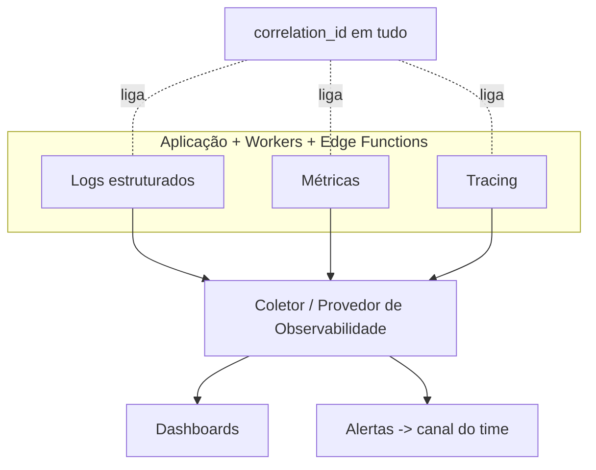

# Rescript — Observabilidade

> Enxergar o sistema em produção: logs estruturados, métricas, tracing, alertas — sem vazar dados sensíveis.
> Status: Design de arquitetura (pré-implementação). Decisão em `adr/0015-observability.md`.

---

## 1. Os Três Pilares + Alertas

- **Logs estruturados** (JSON): nível, mensagem, `correlation_id`, `organization_id` (quando seguro), módulo, sem PII desnecessária.
- **Métricas:** técnicas (latência, erros, throughput, saúde de jobs/fila) e de negócio (vendas confirmadas, importações, insights gerados).
- **Tracing:** requisições ponta a ponta, incluindo transação de venda, jobs e chamadas a integrações.
- **Alertas:** disparados por limiares (erro, fila crescendo, dead-letter, falha de webhook).

---

## 2. Correlação (o fio condutor)

- Todo request/job/evento carrega um **`correlation_id`** propagado por toda a cadeia (API → domínio → banco → outbox → worker → integração).
- O mesmo id aparece em logs, tracing e **audit log** (`AuditArchitecture.md`), permitindo reconstruir qualquer incidente.

---

## 3. O que monitorar (mínimo)

| Categoria | Sinais |
|---|---|
| **Erros** | Taxa de erro por endpoint/operação; exceções não tratadas |
| **Performance** | Latência p50/p95/p99; queries lentas; locks de estoque |
| **Transações críticas** | Sucesso/falha de confirmar venda, registrar pagamento |
| **Jobs** | Backlog da fila, tempo de processamento, falhas |
| **Outbox** | Eventos pendentes, atraso de publicação, dead-letter |
| **Webhooks** | Recebidos, rejeitados (assinatura), reprocessados |
| **Integrações** | Latência/erros do provedor fiscal, billing, mensageria |
| **Segurança** | Tentativas de acesso cruzado, 403 anômalos, rate limit atingido |
| **Negócio** | Ativação, vendas, importações, insights, inadimplência |

---

## 4. Segurança nos Logs (não vazar dados)

- **Nunca** logar: senhas, tokens, certificados, segredos, dados de pagamento completos, dados pessoais além do necessário.
- Preferir **ids** a valores; mascarar/redigir campos sensíveis.
- `organization_id` pode ser logado para diagnóstico; conteúdo de negócio, não.
- Logs de erro de integrações não devem vazar segredos do provedor.
- Alinhado a `Privacy.md` (minimização) e `Security.md`.

---

## 5. Ambientes

| Ambiente | Uso | Observabilidade |
|---|---|---|
| **Local** | Desenvolvimento | Logs verbosos legíveis; sem provedor externo |
| **Preview** (por PR) | Validação de feature | Logs estruturados; dados sintéticos |
| **Staging** (recomendado) | Homologação com dados realistas anonimizados | Igual a produção, isolado |
| **Production** | Clientes reais | Completo: logs+métricas+tracing+alertas, retenção definida |

> **Recomendação:** manter um **staging** semelhante a produção para validar migrations, RLS e integrações antes do deploy — barato e evita incidentes (`DeploymentStrategy.md`).

---

## 6. Alertas e Resposta a Incidentes

- Alertas acionáveis (com contexto e `correlation_id`), não ruído.
- Severidade: crítico (paginar) × aviso (revisar).
- **Auditoria de incidentes:** todo incidente relevante gera um registro pós-morte (o que houve, impacto, causa, correção) — cultura de aprendizado, não de culpa.
- Integração com dead-letter (`DomainEvents.md`) e com falhas de integração (`FiscalIntegration.md`).

---

## 7. Escolha de Provedor

- A stack não fixa um provedor de observabilidade (lacuna notada em `TechnologyEvaluation.md`).
- **Recomendação:** começar com uma solução gerenciada de logs/erros/métricas de baixo custo, integrável a Vercel/Supabase; abstrair o SDK atrás de `packages/observability` para evitar lock-in. Decisão detalhada em ADR-0015.

---

## 8. Invariantes

1. Todo request/job/evento tem `correlation_id` propagado.
2. Logs são estruturados e **livres de dados sensíveis desnecessários**.
3. Transações críticas, jobs, outbox e integrações são **monitorados** com alertas.
4. Ambientes são distintos e isolados; produção nunca compartilha dados com preview.
5. Observabilidade é operacional e **não substitui** audit log nem histórico de domínio.
