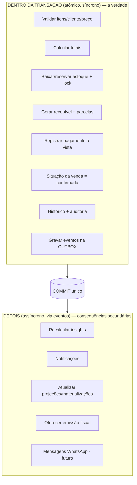

# Rescript — Transação de Venda (Confirmar Venda)

> A operação crítica do produto. Onde a camada **Automatizar** se prova: uma ação, todas as consequências, de forma atômica e confiável.
> Status: Alinhado a FD-02/03/05, ADR-0007 / 0017 / 0018 / 0019. Termo oficial: **Confirmar Venda** → estado **Confirmada**.

---

## 1. Por que esta é a operação mais importante

"Confirmar venda" é onde estoque, financeiro, histórico e inteligência convergem. Se ela falhar pela metade — baixa o estoque mas não gera o recebível, ou gera o recebível duas vezes — a confiança nos dados (`DataTrust.md`), que é a base de tudo, quebra. Por isso ela é **atômica, idempotente, auditável, segura, recuperável e resistente a falhas parciais e cliques duplos** (AP13, AP14, AP20).

---

## 2. O que a confirmação faz

Ao confirmar uma venda, o sistema pode:

1. Validar itens (existem, ativos, pertencem ao tenant).
2. Validar cliente.
3. Validar preços (recalcular do lado do servidor — nunca confiar no cliente).
4. Calcular totais (itens, descontos, total).
5. Validar política de desconto / autorização (FD-05).
6. **Consumir reservas ativas** e **baixar estoque** (saídas no ledger, com custo médio gravado) — com lock (`InventoryArchitecture.md`). Reserva ≠ saída.
7. Gerar recebível e parcelas (`FinancialArchitecture.md`) — sem juros/multa no MVP.
8. Registrar pagamento imediato, se houver (à vista).
9. Atualizar a situação da Sale para **Confirmada** (origem pode ser Rascunho, Orçamento ou Pedido — sem agregado Order).
10. Criar histórico de domínio + entrada de auditoria.
11. Registrar eventos de domínio (via outbox, na mesma transação).
12. (Depois) atualizar projeções, insights e oferecer fiscal.

---

## 3. A Linha Divisória: Dentro × Depois da Transação

Este é o ponto conceitual central. Nem tudo pode caber na transação; nem tudo pode ficar de fora.



### 3.1. DENTRO da transação (síncrono, tudo-ou-nada)
O que **define a correção** da venda e não pode divergir:
- Validações que impedem venda inválida.
- **Baixa/reserva de estoque** (com lock por variante).
- **Geração do recebível e parcelas.**
- **Registro do pagamento à vista** (se houver).
- **Mudança de situação** da venda.
- **Histórico + auditoria.**
- **Gravação dos eventos na outbox** (mesma transação — garante que o evento existe se, e somente se, a venda existe).

> Regra: **estoque e financeiro da venda nunca podem depender de um job posterior.** Se não couberem na transação, a venda não está confirmada.

### 3.2. DEPOIS da confirmação (assíncrono, via eventos)
O que é **consequência secundária** e tolera consistência eventual:
- Recomputar insights (`InsightArchitecture.md`).
- Notificações in-app.
- Atualizar materializações/projeções de dashboard (o dado-fonte já está correto; o cache atualiza logo depois).
- Oferecer emissão fiscal (`FiscalIntegration.md`).
- Mensagens externas (WhatsApp — futuro).

### 3.3. O que **nunca** pode depender de job posterior
- Baixa de estoque.
- Geração de recebível.
- Registro de pagamento.
- Situação da venda.
- Auditoria da confirmação.

> Se o worker de assíncronos parar, a operação diária continua **100% correta**; só os efeitos secundários atrasam (degradação graciosa — `FailureModes.md`).

---

## 4. Atomicidade

Tudo do §3.1 ocorre em **uma única transação de banco**. Se qualquer passo falhar, ocorre **rollback total**: nada de estoque baixado sem recebível, nada de recebível sem baixa. O PostgreSQL garante isso (AP12/AP13).

---

## 5. Idempotência (cliques duplos, retries)

- A requisição de confirmação carrega uma **chave de idempotência** (gerada pelo cliente por tentativa de confirmação).
- No servidor, a chave é registrada de forma única (constraint no banco).
- Se a mesma chave chegar de novo (clique duplo, retry de rede, reenvio), o servidor **retorna o resultado da primeira execução** sem re-executar efeitos.

```mermaid
sequenceDiagram
    participant U as Usuário (2 cliques)
    participant API
    participant DB as PostgreSQL
    U->>API: confirmar (idem-key K)
    API->>DB: BEGIN; inserir idem-key K (unique)
    DB-->>API: ok (primeira vez)
    API->>DB: baixa estoque + recebível + ... ; COMMIT
    API-->>U: venda #123 confirmada
    U->>API: confirmar (idem-key K) [2o clique]
    API->>DB: inserir idem-key K -> conflito
    API-->>U: venda #123 (mesmo resultado, sem duplicar)
```

> Resultado: **nenhuma venda confirmada duas vezes, nenhuma baixa duplicada, nenhum recebimento duplicado** (invariantes de `InventoryArchitecture.md` e `FinancialArchitecture.md`).

---

## 6. Concorrência

- Estoque: lock por variante dentro da transação (`InventoryArchitecture.md` §5).
- Duas confirmações da **mesma** venda: a idempotência + a transição de estado ("rascunho → confirmada" só ocorre uma vez) impedem efeito duplo.

---

## 7. Segurança e Autorização

- Autorização (`sales.confirm`) + tenant validados **antes** de abrir a transação (`Authorization.md`).
- Preços e totais **recalculados no servidor** (cliente não é fonte de verdade de valor).
- Entitlement/limite de vendas verificado (`Entitlements.md`).

---

## 8. Recuperabilidade e Falhas Parciais

| Falha | Resultado |
|---|---|
| Banco cai no meio | Rollback automático; venda não confirmada; usuário pode repetir com a mesma idem-key |
| Timeout de rede após commit | Cliente repete; idempotência retorna o resultado já gravado |
| Worker de assíncronos cai | Venda correta; efeitos secundários processam quando o worker volta (outbox) |
| Cliente clica 2x | Segunda é absorvida pela idempotência |
| Estoque insuficiente | Conforme política (bloqueia ou alerta); transação decide antes do commit |

(Matriz completa em `FailureModes.md`.)

---

## 9. Pseudocódigo Conceitual (ilustrativo, não implementação)

```
confirmSale(input, idemKey):
  authorize('sales.confirm'); assertTenant(); assertEntitlement('sale')
  return withTransaction(tx =>
    if exists(idemKey): return previousResult(idemKey)   // idempotência
    registerIdemKey(idemKey)                              // unique constraint

    items   = validateItems(input, tx)
    customer= validateCustomer(input, tx)
    totals  = computeTotals(items)                        // servidor calcula

    assertDiscountAuthorized(input, tx)                   // FD-05
    lockVariants(items, tx)                               // FOR UPDATE
    consumeReservationsAndStockOut(items, tx)             // reserva → saída (≠ movimento de reserva)

    receivable = createReceivable(totals, input.terms, tx) // sem juros MVP
    if input.immediatePayment:
        registerPayment(receivable, input.payment, tx)    // ledger financeiro

    sale = markConfirmed(input, totals, tx)
    writeHistoryAndAudit(sale, tx)
    enqueueOutbox([SaleConfirmed, InventoryMoved, ReceivableCreated,
                   PaymentRegistered?], tx)                // mesma transação
    return sale
  )
  // COMMIT -> outbox publisher entrega eventos -> insights/notificações/fiscal
```

---

## 10. Eventos Produzidos

`SaleConfirmed`, `InventoryMoved` (por item), `ReceivableCreated`, `PaymentRegistered` (se à vista). Gravados na **outbox dentro da transação** e publicados após o commit (`DomainEvents.md`).

---

## 11. Cancelamento (operação inversa)

Cancelar uma venda confirmada é **também** transacional e **compensatório** (nunca destrutivo):
- Gera movimentos de **estorno** de estoque (não apaga as saídas).
- **Cancela recebíveis** não pagos; recebimentos já feitos exigem **estorno explícito** (`FinancialArchitecture.md`).
- Registra histórico + auditoria + eventos (`SaleCancelled`, `InventoryReleased`/estorno, `PaymentReversed` se aplicável).

---

## 12. Decisões fixadas vs. adiadas

- **Fixado (ADR-0007):** atomicidade total do §3.1; idempotência por chave; outbox na mesma transação; linha divisória síncrono/assíncrono.
- **Adiado (modelagem):** formato da chave de idempotência, granularidade dos locks, estrutura das tabelas.

> Esta operação é **cara de corrigir depois** se malfeita; por isso seu contrato é fixado agora.
