# Rescript — Sales Domain Design

> Referência oficial do domínio de Vendas. Define fronteiras, agregados, eventos, máquina de estados, regras e integrações **antes** de qualquer implementação.
> Status: **Design de domínio (pré-implementação).** Nenhuma tabela, migration, rota ou componente foi criado nesta sprint.
> Alinhado a: ADR-0004 (authorization), ADR-0005 (inventory ledger), ADR-0006 (financial model), ADR-0007 (sale atomicity), ADR-0009 (outbox), ADR-0017 (reservation), ADR-0018 (Sale único), ADR-0019 (discount policy), FD-02/03/04/05, FDC-04/05/06/08/12/13/14/17/19.
> Aprovação necessária antes da implementação.

---

## 0. Como ler este documento

O Rescript tem **duas camadas de verdade** hoje, e este documento existe para reconciliá-las:

| Camada | Onde vive | Natureza |
|---|---|---|
| **Design aspiracional** | `docs/domain/`, `docs/database/`, `docs/architecture/`, `adr/` | Modelo alvo completo: variantes, reservas, custo médio, multi-local, recebíveis, outbox |
| **Plataforma implementada** | `apps/web/src/modules/`, `supabase/migrations/` (4 migrations) | Catálogo flat, estoque por produto, sem reserva, sem financeiro, sem auditoria persistida |

O design aspiracional **não é descartado** — ele é o destino. Este documento define **o que Sales pode ser construído sobre a plataforma que existe**, o que precisa ser criado antes, e em qual ordem. Onde este documento diverge de um doc anterior, a divergência é explícita e justificada (§17).

> Princípio da sprint: **nenhuma decisão adiada por conveniência.** Toda pergunta aberta vira decisão, pré-requisito ou risco registrado.

---

## 1. Objetivo do domínio Sales

Sales é o domínio que representa **a intenção comercial da organização e sua efetivação**: da conversa inicial com o cliente até o compromisso irreversível que move estoque e origina dinheiro a receber.

É o coração do produto porque é o único domínio que:

- **Converte** cadastro (Customers, Products) em operação real;
- **Consome** estoque (Inventory) de forma comprometida e irreversível;
- **Origina** o financeiro (Finance) — recebíveis não nascem sozinhos;
- **Alimenta** relatórios, insights e automações com o fato mais valioso do sistema: *uma venda aconteceu*.

### 1.1. O que Sales garante

1. Toda venda confirmada tem **total calculado pelo sistema**, nunca digitado.
2. Toda venda confirmada tem **efeito de estoque e financeiro atômico** — ou nenhum efeito.
3. Toda venda confirmada é **imutável**; correções são compensações, não edições.
4. Todo histórico comercial é **reconstruível** a partir de snapshots, independentemente de mudanças no cadastro.
5. Nenhuma venda é confirmada **duas vezes**, mesmo com clique duplo, retry de rede ou reprocessamento.

### 1.2. O que Sales explicitamente não é

Sales **não** é um módulo de fulfillment, nem de logística, nem de faturamento fiscal, nem de CRM. Ele registra o compromisso comercial e delega consequências.

---

## 2. Limites do domínio (Bounded Context)

### 2.1. Mapa de contextos

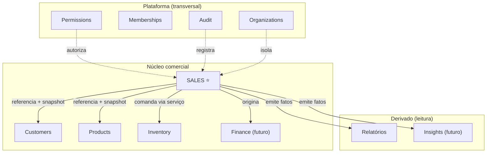

### 2.2. Responsabilidades

| Sales **é** responsável por | Sales **não** é responsável por |
|---|---|
| Ciclo de vida do documento comercial (rascunho → confirmada) | Manter saldo de estoque (é do Inventory) |
| Composição de itens, preços e descontos da venda | Definir preço de catálogo (é do Products) |
| Cálculo de subtotal, desconto e total | Calcular saldo devedor (é do Finance) |
| Congelar snapshots comerciais | Validar CPF/CNPJ (é do Customers) |
| Orquestrar a confirmação atômica | Executar a escrita no ledger de estoque (comanda, não escreve) |
| Autorização de desconto | Definir papéis e permissões (é de Permissions) |
| Emitir eventos de domínio | Consumir eventos (é dos consumidores) |

### 2.3. Regra de fronteira dura

> **Sale nunca escreve diretamente no ledger de outro agregado.**
> Sale **pede** ao Inventory que registre uma saída, e **pede** ao Finance que crie um recebível — via serviço de domínio, dentro da mesma transação. Sale não faz `INSERT` em `inventory_movement`.

Isso preserva as invariantes de cada agregado no dono delas (ADR-0018, `docs/domain/Aggregates.md` §4).

### 2.4. Dependências permitidas

| De → Para | Permitido? | Forma |
|---|---|---|
| Sales → Customers | ✅ | Leitura por id + snapshot |
| Sales → Products | ✅ | Leitura por id + snapshot |
| Sales → Inventory | ✅ | Comando via `StockAllocationService` |
| Sales → Finance | ✅ | Comando via `ReceivableCreationService` |
| Inventory → Sales | ❌ | Inventory não conhece venda; recebe `reference_type='sale'` como dado opaco |
| Finance → Sales | ❌ | Receivable guarda `origin_type/origin_id`, não navega para o domínio Sales |
| Customers → Sales | ❌ | — |
| Products → Sales | ❌ | — |

---

## 3. Entidades principais

### 3.1. Catálogo

| Entidade | Tipo | Identidade | Papel |
|---|---|---|---|
| **Sale** | Aggregate Root ⭐ | `id` (uuid) + `sale_number` (humano, sequencial por org) | Documento comercial em qualquer fase |
| **SaleItem** | Entidade (interna ao agregado) | `(sale_id, line_no)` | Linha da venda com snapshot de produto e preço |
| **SaleDiscount** | Entidade (interna) | `id` | Desconto aplicado no cabeçalho ou na linha, com motivo |
| **DiscountAuthorization** | Entidade (interna) | `id` | Autorização de desconto acima do teto |
| **SaleStatusHistory** | Entidade (interna, append-only) | `id` | Histórico de domínio das transições |

### 3.2. Sale — campos lógicos

| Campo | Notas |
|---|---|
| `id`, `organization_id` | Tenant obrigatório (G1) |
| `sale_number` | Sequencial por organização; único; humano; nunca reutilizado |
| `status` | Máquina oficial (§9) |
| `customer_id` | **Nullable** — venda avulsa permitida |
| `customer_snapshot_*` | `name`, `document`, `person_type`, `city` — congelado (§10.4) |
| `seller_user_id` | Quem criou/conduz a venda |
| `currency` | Da organização (BRL no MVP — FD-07) |
| `quote_valid_until` | Só para fase Orçamento |
| `payment_intent` | `cash` \| `term` — intenção; efeito real só com Finance (§12) |
| `subtotal`, `discount_total`, `total` | **Derivados persistidos**; recalculados a cada mutação e congelados na confirmação |
| `notes` | Observação livre |
| `version` | Optimistic lock pré-confirmação |
| `idempotency_key` | Só na confirmação (§10.7) |
| `confirmed_at`, `canceled_at`, `cancel_reason` | Timestamps de transição |
| `channel` | `ui` \| `import` \| `api` — origem do registro |
| `created_*`, `updated_*` | Auditoria de linha |

### 3.3. SaleItem — campos lógicos

| Campo | Notas |
|---|---|
| `sale_id`, `line_no` | Ordem estável e visível ao usuário |
| `product_id` | Referência (nullable após arquivamento? **não** — referência preservada) |
| `product_name_snapshot`, `sku_snapshot`, `unit_snapshot` | Congelados na inclusão |
| `quantity` | `Quantity` — > 0 |
| `unit_price` | `Money` — congelado na inclusão (FDC-14) |
| `list_price` | Preço de tabela vigente na inclusão, para medir desconto |
| `line_discount_type`, `line_discount_value` | `percent` \| `amount` |
| `line_total` | Derivado: `quantity × unit_price − desconto de linha` |
| `tracks_inventory_at_confirm` | Snapshot booleano — se a baixa se aplica a esta linha |

> **`tracks_inventory_at_confirm`** existe para suportar, no futuro, itens que não movimentam estoque (serviço, frete) sem alterar o contrato da confirmação.

### 3.4. O que **não** é entidade do Sales

- **Reservation** — pertence ao agregado InventoryItem (ADR-0017). Sale é apenas a `source`.
- **Receivable / Installment / Payment** — pertencem ao Finance (ADR-0006). Sale é apenas a `origin`.
- **InventoryMovement** — pertence ao Inventory. Sale é apenas a `reference`.
- **Order** — **não existe** (ADR-0018). "Pedido" é um estado da Sale.

---

## 4. Aggregate Root

### 4.1. Decisão

> **Sale é o único Aggregate Root do domínio.** Orçamento e Pedido são **fases** (estados) da mesma Sale, com a mesma identidade `Sale.id` do início ao fim.

Confirma ADR-0018 / FD-03 / FDC-A01.

### 4.2. Fronteira do agregado

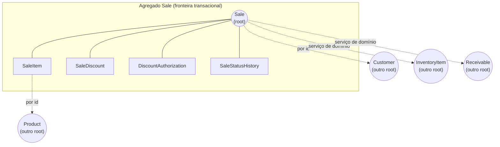

### 4.3. Regras do agregado

1. **`SaleItem` só existe através da raiz.** Não há caso de uso "editar item"; há "editar venda", que valida o agregado inteiro.
2. **Totais são responsabilidade da raiz.** Nenhuma camada externa escreve `total`.
3. **A raiz protege a máquina de estados.** Toda transição passa por um método da raiz que valida a origem.
4. **Referências entre agregados são por id**, nunca por objeto embutido.
5. **Uma transação altera um agregado** — exceto Confirmar e Cancelar, que coordenam vários via serviço de domínio com consistência forte (justificado em §11).

### 4.4. Por que Sale não vira god-object

O risco real de "Sale único" é a raiz absorver fulfillment, financeiro e estoque. Três travas:

| Trava | Efeito |
|---|---|
| Inventory e Finance permanecem agregados separados | Sale não conhece saldo nem saldo devedor |
| Regras de fase encapsuladas em política, não em `if` espalhado | `SalePhasePolicy` decide o que é editável |
| Gatilho de extração documentado (§15.6) | Order sai da Sale quando (e só quando) fulfillment aparecer |

---

## 5. Value Objects

### 5.1. VOs usados pelo domínio Sales

| VO | Composição | Regras | Origem |
|---|---|---|---|
| **Money** | `amount` decimal exato + `currency` | Operações só entre mesma moeda; sem float; ≥ 0 para preço | `docs/domain/ValueObjects.md` §3.1 |
| **Quantity** | `value` decimal + `unit` + `precision` | `> 0` em venda; precisão por unidade (FDC-09) | §3.2 |
| **Percentage** | proporção única, sem ambiguidade | 0–100 em desconto; aplicar a `Money` retorna `Money` | §3.4 |
| **DiscountLine** | tipo (`percent` \| `amount`) + valor + motivo | Não pode tornar total negativo | §4 |
| **SaleNumber** | prefixo opcional + sequencial por org | Único por organização; imutável; nunca reutilizado | Novo (§5.3) |
| **PaymentIntent** | `cash` \| `term` (+ plano futuro) | Intenção comercial; não é estado financeiro | Novo (§5.3) |
| **CustomerSnapshot** | nome, documento, tipo, cidade | Imutável pós-confirmação | `SaleSnapshots.md` |
| **ProductSnapshot** | nome, SKU, unidade | Imutável pós-confirmação | `SaleSnapshots.md` |
| **InstallmentPlan** | nº parcelas + intervalo | Fase Finance | `ValueObjects.md` §4 |

### 5.2. Estado atual no código

`packages/domain/src/index.ts` contém apenas stubs:

```
Money = { amount: number; currency: 'BRL' }
Quantity = { amount: number; unit: string; precision: number }
SALE_STATUSES = [...]
```

`Money.amount` como `number` (float binário em JS) **viola G4/FDC-01**. Isso é um pré-requisito de correção antes de Sales (§16.2).

### 5.3. VOs novos que este design introduz

**`SaleNumber`** — o número humano da venda é um conceito de negócio, não um detalhe de banco. Encapsula: formato, escopo (por organização), imutabilidade e a regra de que **um número queimado nunca volta** (uma venda descartada não devolve o número). Gerado no momento da criação, não na confirmação — o usuário precisa referenciar o documento antes de confirmá-lo.

**`PaymentIntent`** — separa "como o cliente pretende pagar" (decisão comercial, existe desde o rascunho) de "qual é a situação financeira" (derivada de pagamentos reais, existe só após confirmação). Sem essa separação, o time é tentado a colocar um booleano `pago` na Sale — exatamente o que ADR-0006 proíbe.

---

## 6. Domain Events

### 6.1. Catálogo oficial do domínio Sales

| Evento | Emitido em | Payload mínimo | Consumidores previstos |
|---|---|---|---|
| `SaleCreated` | Criação | saleId, saleNumber, customerId?, actor | Histórico, Onboarding |
| `SaleItemsChanged` | Mutação de itens | saleId, totais recalculados | Histórico |
| `SaleQuoted` | → Orçamento | saleId, validUntil | Notificações (futuro) |
| `SaleOrdered` | → Pedido | saleId, itens | Inventory (reserva, Fase 2) |
| `SaleReopened` | Orçamento → Rascunho | saleId | Histórico |
| `SaleDiscarded` | Rascunho → Descartada | saleId, motivo? | Histórico |
| `SaleQuoteRejected` | Orçamento → Recusado | saleId, motivo? | Insights (futuro) |
| `SaleQuoteExpired` | Orçamento → Expirado | saleId | Insights (futuro) |
| `SaleOrderCanceled` | Pedido → PedidoCancelado | saleId, motivo | Inventory (liberação) |
| **`SaleConfirmed`** ⭐ | → Confirmada | saleId, total, itens, customerId?, confirmedAt | Insights, Notificações, Fiscal, Relatórios, Finance |
| **`SaleCanceled`** ⭐ | Confirmada → Cancelada | saleId, motivo, actor | Insights, Finance, Relatórios |
| `SaleDiscountAuthorized` | Autorização concedida | saleId, percentual, autorizador | Auditoria, Insights de margem |
| `SaleDiscountDenied` | Autorização negada | saleId, solicitante | Auditoria |

### 6.2. Eventos que Sales **provoca** em outros domínios

Emitidos pelos donos dos respectivos agregados, na mesma transação da confirmação:

| Evento | Dono | Quando |
|---|---|---|
| `InventoryReserved` | Inventory | Pedido (Fase 2) |
| `InventoryReleased` | Inventory | Cancelamento pré-confirmação / expiração |
| `InventoryMoved` | Inventory | Confirmação (saída) e cancelamento (estorno) |
| `ReceivableCreated` | Finance | Confirmação a prazo |
| `PaymentRegistered` | Finance | Confirmação à vista |
| `ReceivableCanceled` | Finance | Cancelamento de venda não paga |

### 6.3. Regras dos eventos

1. Nome no **passado** — descrevem fato consumado, nunca ordem.
2. **Imutáveis.** Corrigir um fato é emitir outro fato.
3. Todo evento carrega `organization_id`, `id` único, timestamp, ator e `correlation_id`.
4. Gravados na **outbox, dentro da transação** que os originou (ADR-0009) — evento existe se, e somente se, o dado existe.
5. Consumidores são **idempotentes**; reprocessar não duplica efeito.
6. **Nenhuma operação crítica depende do processamento assíncrono** (ADR-0007 §3.3).

### 6.4. Decisão sobre outbox nesta fase

Não existe consumidor assíncrono implementado (sem Insights, sem Notificações, sem Fiscal). Um publisher hoje não teria o que entregar.

> **Decisão:** a tabela `outbox_event` é criada junto com a confirmação (custo baixo, escrita na mesma transação, garante que nenhum fato se perde). O **worker publisher fica adiado** até existir o primeiro consumidor real.

Isso honra ADR-0009 (o fato nunca se perde) sem construir infraestrutura sem uso. O risco de "outbox que só cresce" é mitigado com política de retenção definida junto com o publisher.

---

## 7. Casos de uso

### 7.1. Comandos (escrita)

| Caso de uso | Permissão | Pré-condição | Efeito |
|---|---|---|---|
| `createSale` | `sales.create` | Org ativa | Sale em Rascunho + `SaleNumber` |
| `updateSaleHeader` | `sales.edit` | Status editável | Cliente, notas, intenção de pagamento |
| `addSaleItem` | `sales.edit` | Status editável; produto ativo | Item + snapshot + freeze de preço |
| `updateSaleItem` | `sales.edit` | Status editável | Qtd/preço/desconto de linha; recalcula totais |
| `removeSaleItem` | `sales.edit` | Status editável | Remove linha; recalcula |
| `applySaleDiscount` | `sales.discount` | Dentro do teto ou autorizado | Desconto de cabeçalho |
| `requestDiscountAuthorization` | `sales.discount` | Acima do teto | Autorização pendente |
| `decideDiscountAuthorization` | `sales.discount.authorize` | Pendente; autorizador ≠ solicitante | Aprova/nega |
| `issueQuote` | `sales.edit` | Itens válidos | → Orçamento + validade |
| `promoteToOrder` | `sales.edit` | Itens válidos | → Pedido (+ reserva na Fase 2) |
| `reopenQuote` | `sales.edit` | Orçamento ativo | → Rascunho |
| `rejectQuote` | `sales.edit` | Orçamento ativo | → OrçamentoRecusado (terminal) |
| `discardSale` | `sales.edit` | Rascunho | → Descartada (terminal) |
| `cancelOrder` | `sales.cancel` | Pedido | → PedidoCancelado (terminal) |
| **`confirmSale`** ⭐ | `sales.confirm` | §10.6 | → Confirmada, atômica e idempotente |
| **`cancelSale`** ⭐ | `sales.cancel` | Confirmada; pagamento líquido = 0 | → Cancelada com compensação |
| `registerSaleReturn` | `sales.return` \| `inventory.return` | Confirmada; qtd ≤ líquida | Movimento `return` no estoque |
| `expireQuotes` (sistema) | — | Validade vencida | → OrçamentoExpirado em lote |

### 7.2. Consultas (leitura)

| Consulta | Permissão | Notas |
|---|---|---|
| `listSales` | `sales.read` | Cursor; filtros por status, cliente, período, vendedor |
| `getSale` | `sales.read` | Agregado completo com itens e histórico |
| `getSaleTotals` | `sales.read` | Recalculado no servidor, nunca no cliente |
| `listSalesByCustomer` | `sales.read` | Timeline do cliente |
| `checkStockAvailability` | `sales.read` + `inventory.read` | Pré-visualização antes de confirmar |
| `previewDiscountImpact` | `sales.discount` | Impacto na margem (quando houver custo) |

### 7.3. Assinatura padrão

Segue exatamente o padrão já usado em Customers / Products / Inventory — dependências injetadas, sem singleton, sem acesso direto ao Supabase:

```
confirmSale(deps: {
  repository: SaleRepository
  inventory: StockAllocationPort
  finance?: ReceivableCreationPort      // opcional até a Fase 3
  can: (key: PermissionKey) => boolean
  organizationId: string
  userId: string
  saleId: string
  idempotencyKey: string
  audit?: SaleAuditPort
}): Promise<Sale>
```

Coerente com `listStock`, `createCustomer`, `registerEntry`. **Nenhuma novidade estrutural** — o time já conhece o formato.

---

## 8. Fluxo completo do pedido

### 8.1. Fluxo comercial ponta a ponta

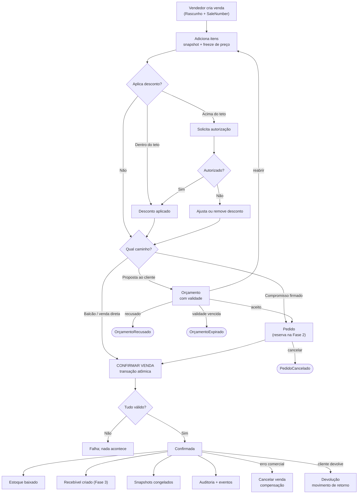

### 8.2. Anatomia da confirmação

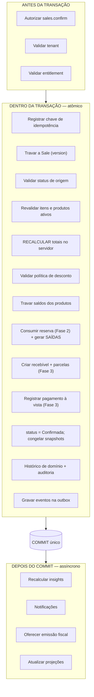

**A linha divisória (ADR-0007 §3.3) — nunca depende de job posterior:** baixa de estoque, geração de recebível, registro de pagamento, situação da venda, auditoria da confirmação.

---

## 9. Máquina de estados

### 9.1. Estados oficiais

| Estado | Significado de negócio | Editável? | Estoque | Financeiro | Terminal? |
|---|---|---|---|---|---|
| **Rascunho** | Em construção; sem compromisso | ✅ total | — | — | Não |
| **Orçamento** | Proposta formal ao cliente, com validade | ⚠️ limitada | — (FDC-12) | — | Não |
| **Pedido** | Compromisso firmado, pré-confirmação | ⚠️ limitada | Reserva (Fase 2) | — | Não |
| **Confirmada** | Venda efetivada | ❌ | **Saída** | **Recebível** | Quase¹ |
| **Cancelada** | Venda anulada após confirmação | ❌ | Estorno | Cancelamento/estorno | ✅ |
| **Descartada** | Rascunho abandonado | ❌ | Libera reserva | — | ✅ |
| **OrçamentoRecusado** | Cliente recusou | ❌ | Libera reserva | — | ✅ |
| **OrçamentoExpirado** | Validade esgotada | ❌ | Libera reserva | — | ✅ |
| **PedidoCancelado** | Pedido anulado antes de confirmar | ❌ | Libera reserva | — | ✅ |

¹ Confirmada só sai para Cancelada. É terminal para efeitos práticos de edição.

> **Edição limitada** em Orçamento/Pedido significa: notas e dados de contato sim; itens, preços e descontos **não** sem reabrir para Rascunho. Um orçamento que muda de valor silenciosamente destrói a confiança do cliente.

### 9.2. Diagrama

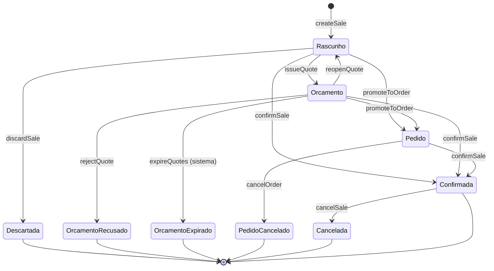

### 9.3. Transições permitidas — contrato completo

| # | Transição | Comando | Ator (permissão) | Pré-condições | Efeitos | Evento | Idempotência |
|---|---|---|---|---|---|---|---|
| T1 | → Rascunho | `createSale` | `sales.create` | Org ativa; entitlement | Cria Sale + número | `SaleCreated` | Chave opcional |
| T2 | Rascunho → Descartada | `discardSale` | `sales.edit` | Status = Rascunho | Terminal; libera reserva | `SaleDiscarded` | Gate de status |
| T3 | Rascunho → Orçamento | `issueQuote` | `sales.edit` | ≥1 item; totais válidos | Define validade | `SaleQuoted` | Gate de status |
| T4 | Orçamento → Rascunho | `reopenQuote` | `sales.edit` | Orçamento ativo | Volta a editável; libera reserva | `SaleReopened` | Gate de status |
| T5 | Orçamento → Recusado | `rejectQuote` | `sales.edit` | Orçamento ativo | Terminal; libera reserva | `SaleQuoteRejected` | Gate de status |
| T6 | Orçamento → Expirado | `expireQuotes` | sistema | `now ≥ quote_valid_until` | Terminal; libera reserva | `SaleQuoteExpired` | Job idempotente |
| T7 | Rascunho/Orçamento → Pedido | `promoteToOrder` | `sales.edit` | Itens válidos; política de estoque | Reserva (Fase 2) | `SaleOrdered` | Gate de status |
| T8 | Pedido → PedidoCancelado | `cancelOrder` | `sales.cancel` | Status = Pedido | Terminal; libera reserva | `SaleOrderCanceled` | Gate de status |
| **T9** | *→ Confirmada | `confirmSale` | `sales.confirm` | §10.6 completo | Estoque + financeiro + freeze | `SaleConfirmed` | **`idempotency_key` + `request_hash`** |
| **T10** | Confirmada → Cancelada | `cancelSale` | `sales.cancel` | Confirmada; **pagamento líquido = 0**; motivo | Estorno de estoque; cancela recebíveis | `SaleCanceled` | Gate de status |

### 9.4. Transições proibidas — e por quê

| Transição proibida | Justificativa |
|---|---|
| **Confirmada → Rascunho / Orçamento / Pedido** | Confirmada teve efeito real em estoque e financeiro. "Voltar" exigiria desfazer efeitos silenciosamente — viola G2 (histórico não se destrói) e S4. O caminho é Cancelar e criar nova venda. |
| **Cancelada → qualquer coisa** | Não existe "descancelar". O cancelamento já gerou compensações; reverter geraria compensação da compensação, tornando o histórico ilegível. |
| **Descartada / Recusado / Expirado / PedidoCancelado → qualquer coisa** | Estados terminais pré-confirmação. Reabrir um documento morto confunde o histórico comercial e o número da venda. Nova intenção = nova Sale. |
| **Pedido → Orçamento** | Regressão de compromisso. Um pedido firmado não volta a ser proposta; se o cliente renegocia, reabre-se para Rascunho (que já é permitido a partir de Orçamento) ou cria-se nova venda. |
| **Pedido → Rascunho** | Um pedido tem reserva de estoque e compromisso comunicado. Permitir edição livre reintroduz o problema que o estado Pedido existe para resolver. Caminho: `cancelOrder` + nova venda. |
| **Orçamento → Descartada** | Descartar é para rascunho nunca comunicado. Orçamento já foi apresentado ao cliente — o desfecho honesto é Recusado ou Expirado. |
| **Confirmada → Confirmada** | Absorvida pela idempotência: retorna o resultado da primeira execução sem novo efeito. |
| **Rascunho → Cancelada** | `Cancelada` é reservado para pós-confirmação (tem compensação). Rascunho usa `Descartada`. Estados com nomes distintos porque o significado de negócio é distinto. |
| **Qualquer → Confirmada sem itens** | Venda vazia não é venda. |
| **PedidoExpirado** | Estado inexistente por decisão (FDC-17). A reserva expira; o Pedido permanece. A confirmação revalida disponibilidade. |

### 9.5. Princípio das transições

> Toda transição inválida deve ser **impossível**, não apenas "não oferecida na UI". A validação vive no caso de uso (servidor); a UI apenas reflete o que o domínio permite.

---

## 10. Regras de negócio

### 10.1. Composição e cálculo

| # | Regra |
|---|---|
| RN-S01 | O total é **sempre calculado pelo sistema**. Não existe campo de total editável (S1). |
| RN-S02 | `line_total = quantity × unit_price − desconto de linha`. |
| RN-S03 | `subtotal = Σ line_total`. `total = subtotal − desconto de cabeçalho`. |
| RN-S04 | `quantity > 0`, respeitando a precisão da unidade (FDC-09). |
| RN-S05 | `unit_price ≥ 0`. Preço zero é permitido (brinde) e **exige motivo**. |
| RN-S06 | Desconto **nunca** torna o total negativo. |
| RN-S07 | Arredondamento monetário: half-up, escala 2 (BRL), aplicado no total da linha e no total do documento — nunca acumulando erro entre etapas (FDC-01/09). |
| RN-S08 | Uma venda só é confirmável com **pelo menos um item**. |
| RN-S09 | O mesmo produto pode aparecer em **múltiplas linhas** (lotes de preço distintos). A validação de estoque soma as linhas do mesmo produto. |

### 10.2. Produto e cliente

| # | Regra |
|---|---|
| RN-S10 | Só produtos **ativos** podem ser adicionados. Produto arquivado após a inclusão **não invalida** a linha existente, mas **bloqueia a confirmação** com mensagem explícita. |
| RN-S11 | O cliente é **opcional** (venda avulsa/balcão). |
| RN-S12 | Quando `payment_intent = term` (a prazo), o cliente passa a ser **obrigatório** — não se concede crédito ao anônimo. |
| RN-S13 | Cliente arquivado não pode ser vinculado a nova venda; vendas existentes permanecem íntegras. |

### 10.3. Numeração

| # | Regra |
|---|---|
| RN-S14 | `sale_number` é gerado na **criação**, sequencial por organização, único, e **nunca reutilizado** — inclusive para vendas descartadas. |
| RN-S15 | Lacunas na numeração são **esperadas e aceitáveis**; sequência contínua obrigaria reuso ou renumeração, ambos piores. |

### 10.4. Snapshots

| # | Regra |
|---|---|
| RN-S16 | Ao adicionar um item, congelam-se `product_name`, `sku`, `unit`, `unit_price` e `list_price`. |
| RN-S17 | Antes da confirmação, o usuário pode **"Atualizar do catálogo"** — ação manual e explícita (FDC-14). Nunca automática. |
| RN-S18 | Na confirmação, **todos** os snapshots (item e cliente) são congelados definitivamente. |
| RN-S19 | Relatórios históricos leem o **snapshot**, nunca o cadastro atual. |
| RN-S20 | `snapshot_schema_version` acompanha os snapshots, para evolução sem reinterpretação errada de dados antigos. |

### 10.5. Descontos

| # | Regra |
|---|---|
| RN-S21 | Desconto pode ser aplicado na **linha** e no **cabeçalho**; ambos registrados separadamente. |
| RN-S22 | Acima do teto da organização, exige `DiscountAuthorization` **aprovada** (ADR-0019). |
| RN-S23 | **Auto-autorização proibida** por padrão: `authorized_by ≠ requested_by` (FDC-13). |
| RN-S24 | Existe um **teto absoluto** que nem o autorizador ultrapassa. |
| RN-S25 | Acima do limiar configurado, **motivo é obrigatório**. |
| RN-S26 | Desconto é **imutável após a confirmação**. |
| RN-S27 | Seeds propostos: `max_sem_autorização = 5%`, `max_absoluto = 50%`, `allow_self_authorization = false`. |

### 10.6. Pré-condições de confirmação (checklist normativo)

Todas devem passar; qualquer falha aborta sem efeito colateral:

1. Permissão `sales.confirm` no tenant ativo;
2. Organização ativa e entitlement disponível;
3. Status de origem ∈ {Rascunho, Orçamento, Pedido};
4. ≥ 1 item;
5. Todos os produtos das linhas **ativos**;
6. Quantidades e preços válidos;
7. Totais recalculados **no servidor** batem com a estrutura do agregado;
8. Descontos dentro da política ou com autorização aprovada;
9. Cliente presente se `payment_intent = term`;
10. **Estoque suficiente** por produto (política da organização — §11.4);
11. `version` corresponde à esperada (optimistic lock);
12. `idempotency_key` presente e `request_hash` coerente (FDC-08).

### 10.7. Idempotência e concorrência

| # | Regra |
|---|---|
| RN-S28 | A confirmação exige **chave de idempotência** gerada pelo cliente por tentativa. |
| RN-S29 | Chave repetida retorna o **resultado da primeira execução**, sem re-executar efeitos. |
| RN-S30 | Chave repetida com `request_hash` divergente é **rejeitada** — indica reuso indevido, não retry (FDC-08). |
| RN-S31 | Mutação pré-confirmação usa **optimistic lock** via `version`; conflito retorna erro de concorrência com recarga. |
| RN-S32 | A transação de confirmação trava os saldos dos produtos envolvidos em **ordem determinística** (por `product_id`) para evitar deadlock entre confirmações simultâneas. |

### 10.8. Imutabilidade

| # | Regra |
|---|---|
| RN-S33 | Venda confirmada **não é editada**. Nem valor, nem itens, nem cliente, nem data (S4). |
| RN-S34 | Correção comercial = Cancelar + nova venda. Correção de estoque = movimento compensatório. |
| RN-S35 | `SaleStatusHistory` é **append-only**: registra origem, destino, ator, timestamp e motivo. |

---

## 11. Integração com Inventory

### 11.1. Contrato

Sales **não** conhece saldo nem escreve no ledger. Ele expressa intenção através de um port:

```
StockAllocationPort {
  checkAvailability(organizationId, lines): AvailabilityResult
  reserveForSale(organizationId, saleId, lines): Reservation      // Fase 2
  releaseForSale(organizationId, saleId): void                    // Fase 2
  consumeAndExitForSale(organizationId, saleId, lines, tx): Movement[]
  reverseForSale(organizationId, saleId, lines, tx): Movement[]
}
```

A implementação vive no Inventory. Sales depende da **interface**, não da tabela.

### 11.2. Sequência da confirmação

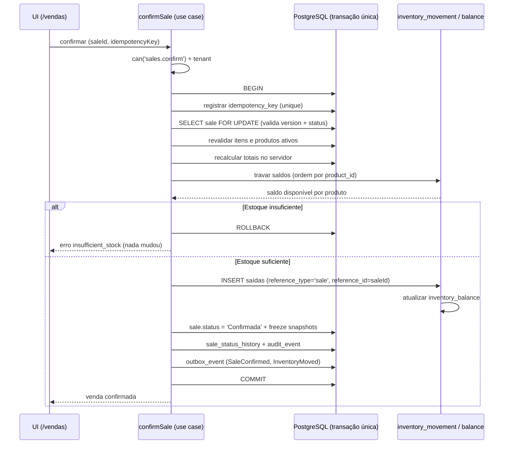

### 11.3. Quando o estoque é tocado

| Momento | Reserva | Baixa física |
|---|---|---|
| Rascunho | ❌ | ❌ |
| Orçamento | ❌ (FDC-12: `quote_reserves = false`) | ❌ |
| Pedido | ✅ **Fase 2** | ❌ |
| **Confirmação** | Consome a reserva | ✅ **saída no ledger** |
| Cancelamento pré-confirmação | Libera | ❌ (não houve) |
| Cancelamento pós-confirmação | — | ✅ **estorno** (novo movimento, não delete) |
| Devolução | — | ✅ **retorno** (novo movimento) |

> **Reserva ≠ saída** (I4 / ADR-0017). Reserva altera *disponível*; saída altera *físico*. Confundi-las corrompe o significado do ledger.

### 11.4. Estoque insuficiente

A plataforma implementada **proíbe saldo negativo** — garantido na RPC e por `CHECK quantity >= 0` em `inventory_balance`. Isso é mais restritivo do que RN-34/FDC-10 (`allow_with_alert`).

> **Decisão para Sales:** manter o comportamento `block` da plataforma atual. A confirmação **falha** com erro claro e acionável quando falta saldo. A política configurável `allow_with_alert` é postergada para depois de Sales — flexibilizar estoque negativo antes de ter vendas gerando movimento é otimizar um problema que ainda não existe.

Mensagem esperada ao usuário: identificar o produto, o disponível e o solicitado — nunca um `insufficient_stock` cru.

### 11.5. Reaproveitamento do que existe

| Recurso existente | Uso em Sales | Ajuste necessário |
|---|---|---|
| `inventory_movement.reference_type` / `reference_id` | Liga o movimento à venda | Nenhum — colunas já existem |
| `register_inventory_movement(p_reference_type, p_reference_id)` | Já aceita a origem | Nenhum na assinatura |
| `inventory_movement_delta` | Fórmula oficial de sinal | Estender para `return` e `reversal` |
| `inventory_balance` + lock | Serialização por produto | Nenhum |
| Triggers de imutabilidade | Protegem o ledger | Nenhum |

### 11.6. Por que uma nova função de confirmação é necessária

`register_inventory_movement` registra **um movimento por chamada**. Uma venda com 5 itens exigiria 5 chamadas — 5 transações independentes. Uma falha na terceira deixaria estoque baixado sem venda confirmada: exatamente o estado parcial que ADR-0007 proíbe.

> **Decisão:** criar `confirm_sale(...)` como função `SECURITY DEFINER` que executa toda a confirmação em **uma transação**, reutilizando `inventory_movement_delta` e escrevendo no ledger com `reference_type = 'sale'`. `register_inventory_movement` permanece intacta para movimentações manuais.

### 11.7. Tipos de movimento a acrescentar

O `CHECK` atual aceita `entry`, `exit`, `adjustment_in`, `adjustment_out`. Sales exige dois novos:

| Tipo | Sinal | Uso |
|---|---|---|
| `return` | `+quantity` | Devolução de item de venda confirmada (FDC-06) |
| `reversal` | `+quantity` | Estorno por cancelamento de venda |

Ambos precisam entrar no `CHECK`, no `inventory_movement_delta` e no `movementDelta` do app — **na mesma migration**, para que banco e aplicação nunca discordem do sinal.

> Usar `adjustment_in` para devolução seria mais rápido e **errado**: destruiria a capacidade de distinguir "ajuste de inventário" de "cliente devolveu mercadoria" em qualquer relatório futuro.

---

## 12. Integração futura com Finance

### 12.1. Fronteira conceitual

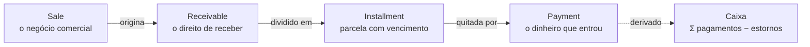

Quatro conceitos **distintos** (ADR-0006). Colapsá-los em um booleano `pago` na Sale torna impossível representar pagamento parcial, múltiplos pagamentos e estorno.

### 12.2. Sequência da confirmação com Finance

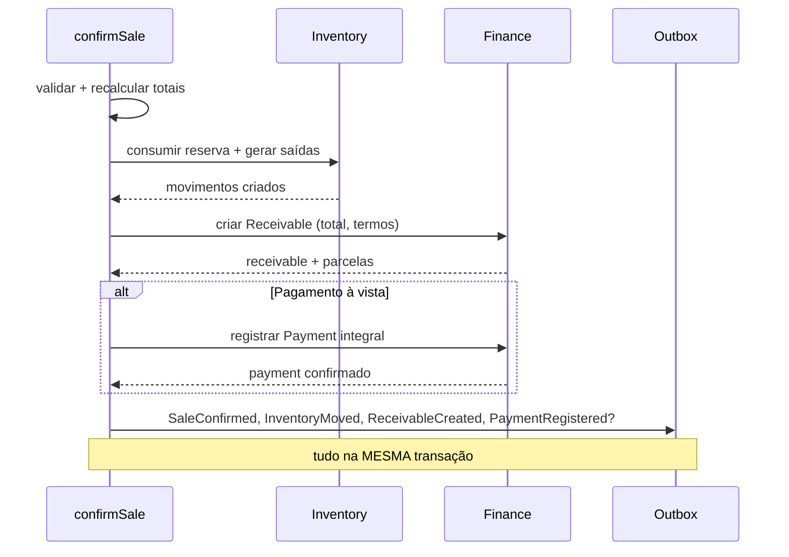

### 12.3. Regras da fronteira

| # | Regra |
|---|---|
| RN-F01 | O recebível nasce **exclusivamente** na confirmação da venda — nunca antes, nunca por job. |
| RN-F02 | Sale **não** armazena situação de pagamento. "Pago" é derivado do Finance (R1). |
| RN-F03 | Venda à vista gera Receivable **e** Payment na mesma transação. Não existe "venda sem recebível". |
| RN-F04 | Cancelar venda com pagamento líquido > 0 é **bloqueado** até o estorno total (FDC-04). |
| RN-F05 | Cancelar venda não paga cancela os recebíveis em aberto; nunca os apaga (R8). |
| RN-F06 | Sem juros e multa no MVP (FD-04). |
| RN-F07 | Devolução de mercadoria e devolução de dinheiro são **operações separadas** (FDC-06). |

### 12.4. Contrato reservado

```
ReceivableCreationPort {
  createForSale(organizationId, saleId, total, terms, tx): Receivable
  registerImmediatePayment(receivableId, payment, tx): Payment
  cancelForSale(organizationId, saleId, tx): void
  getNetPaidAmount(organizationId, saleId): Money
}
```

`getNetPaidAmount` é a única leitura que Sales faz do Finance, e existe para uma finalidade: validar a pré-condição de cancelamento (RN-F04).

### 12.5. Vendas confirmadas antes do Finance existir

Se a Fase 2 (confirmação com estoque) entrar em produção antes da Fase 3 (Finance), vendas confirmadas nesse período **não terão recebível**. Retroagir depois é caro e ambíguo.

Três opções avaliadas:

| Opção | Avaliação |
|---|---|
| **A. Não liberar confirmação sem Finance** | Seguro, mas atrasa muito o valor entregue |
| **B. Confirmar só à vista, sem recebível** | Aparentemente simples, mas cria vendas "quitadas" sem lastro no financeiro futuro |
| **C. Confirmar registrando `payment_intent` + backfill na Fase 3** ✅ | Entrega valor cedo; migration de backfill gera recebíveis a partir das vendas confirmadas, usando `payment_intent` e `total` já persistidos |

> **Decisão: (C)**, com duas condições obrigatórias: (1) `payment_intent` e `total` são persistidos desde a Fase 2; (2) a migration de backfill é escrita **junto com** a Fase 3, não improvisada depois.

Este é o risco arquitetural mais concreto do roadmap (§14, R-03).

---

## 13. Estratégia de auditoria

### 13.1. Quatro conceitos que não se confundem

| Conceito | Registra | Existe hoje? |
|---|---|---|
| **Audit log** | Quem fez a ação sensível e por quê | ❌ Só ports noop |
| **Histórico de domínio** | Evolução de estado da entidade (`sale_status_history`) | ❌ A criar |
| **Eventos de domínio** | Fatos para consumo interno (outbox) | ❌ A criar |
| **Logs técnicos** | Erros e latência | ⚠️ Parcial |

### 13.2. Estado atual

Customers, Products e Inventory já possuem `application/audit.ts` com portas definidas e implementação **noop** ("full audit log table is a future migration"). A permissão `audit.view` existe e está atribuída a `owner`/`admin`. **Falta apenas a tabela.**

> **Decisão:** `audit_event` é criada como **pré-requisito da Fase 1 de Sales**, e os ports noop existentes passam a gravar nela. Confirmar uma venda sem trilha de auditoria é inaceitável para um produto que vende confiança nos dados.

### 13.3. Eventos que exigem auditoria obrigatória

| Ação | Motivo |
|---|---|
| **Confirmação de venda** | Move estoque e dinheiro; irreversível |
| **Cancelamento de venda confirmada** | Compensa efeitos reais; exige motivo |
| **Cancelamento de pedido** | Libera compromisso de estoque |
| **Aplicação de desconto acima do teto** | Impacto direto em margem |
| **Autorização / negação de desconto** | Responsabilização de quem autorizou |
| **Preço zerado em linha** | Vetor clássico de fraude |
| **Alteração de cliente após emissão de orçamento** | Muda a quem o compromisso se dirige |
| **Devolução de item** | Retorna mercadoria ao estoque |
| **Estorno de pagamento** | Movimenta dinheiro para trás |
| **Confirmação com estoque negativo** (se a política mudar) | Exceção deliberada à regra |

### 13.4. Conteúdo de cada entrada

`organization_id` · ator · ação (`sale.confirmed`) · tipo e id da entidade · estado anterior · estado posterior · motivo · `correlation_id` · timestamp.

### 13.5. Propriedades

| Propriedade | Como é garantida |
|---|---|
| **Append-only** | Sem policy de UPDATE/DELETE; triggers de bloqueio — mesmo padrão de `inventory_movement` |
| **Atômica com a ação crítica** | Auditoria da confirmação grava na **mesma transação** (A1/A3) |
| **Isolada por tenant** | `organization_id` + RLS via `is_org_member` |
| **Consultável** | Restrita a `audit.view` |
| **Minimizada** | Registra ids, não dados pessoais completos (LGPD) |

### 13.6. Histórico de domínio ≠ auditoria

`sale_status_history` é **parte do modelo de negócio**: alimenta a timeline que o usuário vê na tela da venda. `audit_event` é **trilha de responsabilização**, restrita e de retenção longa. Os dois existem, com propósitos diferentes — e a mesma confirmação escreve nos dois.

---

## 14. Estratégia de permissões

### 14.1. Chaves já existentes

O catálogo em `packages/permissions/src/keys.ts` **já contém** todas as chaves de Sales. Nenhuma invenção necessária:

```
sales.read · sales.create · sales.edit · sales.confirm · sales.cancel
sales.discount · sales.discount.authorize
```

### 14.2. Matriz papel × permissão (estado atual do código)

| Papel | read | create | edit | confirm | cancel | discount | discount.authorize |
|---|---|---|---|---|---|---|---|
| **owner** | ✅ | ✅ | ✅ | ✅ | ✅ | ✅ | ✅ |
| **admin** | ✅ | ✅ | ✅ | ✅ | ✅ | ✅ | ✅ |
| **manager** | ✅ | ✅ | ✅ | ✅ | ✅ | ✅ | ❌ |
| **seller** | ✅ | ✅ | ✅ | ✅ | ❌ | ✅ | ❌ |
| **inventory** | ❌ | ❌ | ❌ | ❌ | ❌ | ❌ | ❌ |
| **finance** | ✅ | ❌ | ❌ | ❌ | ❌ | ❌ | ❌ |
| **viewer** | ✅ | ❌ | ❌ | ❌ | ❌ | ❌ | ❌ |

Leituras diretas da matriz, que respondem perguntas de negócio:

- **Vendedor confirma, mas não cancela.** Confirmar é o trabalho dele; cancelar afeta estoque e financeiro já efetivados e sobe um nível.
- **`discount.authorize` é exclusivo de owner/admin.** Nem manager autoriza desconto acima do teto — coerente com FDC-13 (`allow_self_authorization = false`).
- **Finance vê vendas, não as opera.** Leitura para conciliação.
- **Inventory não vê vendas.** Opera estoque, não comércio.

### 14.3. Chave nova necessária

| Chave | Motivo |
|---|---|
| `sales.return` | Devolução (FDC-06) é operação distinta de cancelar. Papéis sugeridos: owner, admin, manager. |

Alternativa considerada: reusar `inventory.return`. Rejeitada porque a devolução nasce de um evento comercial (o cliente devolveu), não de uma decisão de estoque — e quem opera estoque não deve, sozinho, alterar a realidade de uma venda.

### 14.4. Camadas de defesa

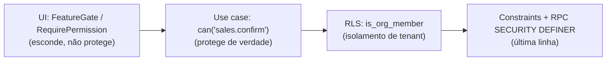

> A UI **nunca** é camada de segurança. Cada caso de uso valida `can(...)` independentemente. Exatamente o padrão já usado por Customers, Products e Inventory.

### 14.5. RLS das tabelas de Sales

| Tabela | SELECT | INSERT | UPDATE | DELETE |
|---|---|---|---|---|
| `sale` | `is_org_member` | `is_org_member` + `created_by = auth.uid()` | `is_org_member` + `updated_by = auth.uid()` | ❌ sem policy |
| `sale_item` | `is_org_member` (via sale) | idem | idem | ❌ (remoção lógica na edição) |
| `sale_status_history` | `is_org_member` | somente via função | ❌ trigger | ❌ trigger |
| `sale_discount` | `is_org_member` | `is_org_member` | ❌ pós-confirmação | ❌ |
| `discount_authorization` | `is_org_member` | `is_org_member` | só o decisor | ❌ |
| `audit_event` | `is_org_member` + `audit.view` na app | somente via função | ❌ trigger | ❌ trigger |

Mesmo padrão de `customer` / `product`: RLS garante **tenant**, aplicação garante **permissão granular** (ADR-0004).

### 14.6. Regra de ouro

> **Confirmação e cancelamento nunca passam por policy de UPDATE direto.** Ambos executam em função `SECURITY DEFINER`, do mesmo modo que `register_inventory_movement`. O cliente não tem caminho para escrever `status = 'Confirmada'` sem passar pelo domínio.

---

## 15. Event Storming

### 15.1. Fluxo oficial

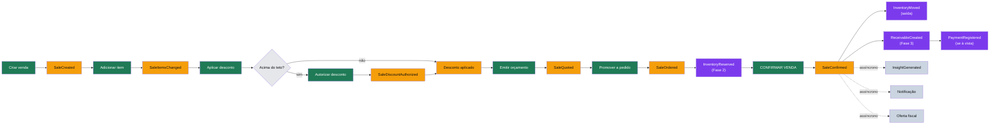

Legenda: **verde** = comando · **laranja** = evento do Sales · **roxo** = evento de outro domínio · **cinza claro** = política · **cinza** = consequência assíncrona.

### 15.2. Fluxo alternativo — cancelamento

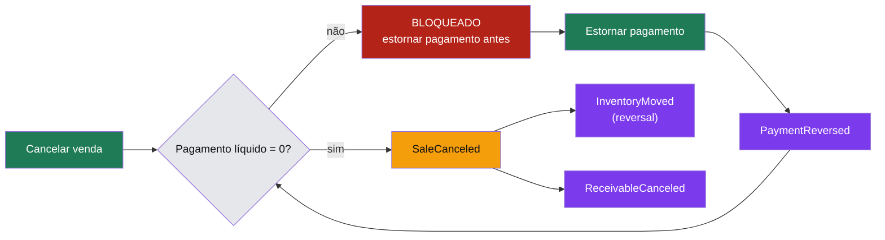

### 15.3. Fluxo alternativo — devolução

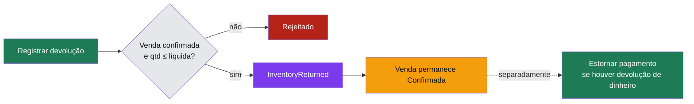

> Devolução **não** muda o status da venda. Uma venda com devolução parcial continua Confirmada — porque ela realmente aconteceu. O efeito é no estoque e, separadamente, no dinheiro.

### 15.4. Hot spots identificados no storming

| Hot spot | Tensão | Resolução |
|---|---|---|
| Confirmar direto do Rascunho | Pula orçamento/pedido | ✅ Permitido — venda de balcão é o caso mais comum |
| Pedido sem reserva (Fase 1) | Risco de oversell entre pedido e confirmação | Aceito temporariamente; confirmação revalida saldo e falha se faltar (§14, R-02) |
| Orçamento expirado com estoque reservado | Reserva órfã | Job de expiração libera; Pedido permanece (FDC-17) |
| Confirmação sem Finance | Venda sem recebível | Backfill planejado (§12.5) |
| Devolução total | Tentação de "cancelar" a venda | ❌ Rejeitado — devolução ≠ cancelamento; a venda aconteceu |

---

## 16. Modelo DDD consolidado

### 16.1. Diagrama de entidades

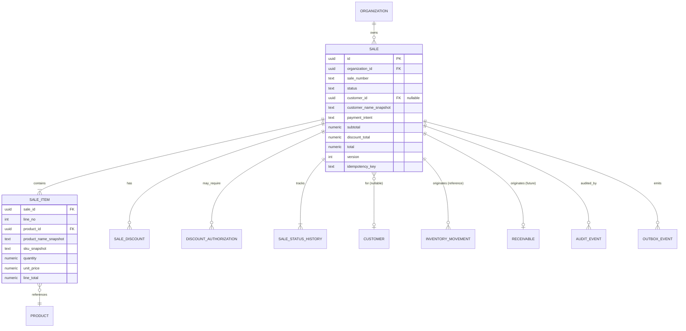

### 16.2. Classificação DDD

| Elemento | Classificação | Justificativa |
|---|---|---|
| `Sale` | **Aggregate Root** | Tem identidade, ciclo de vida e protege invariantes |
| `SaleItem` | **Entidade** (interna) | Tem identidade dentro do agregado; não existe sozinha |
| `SaleDiscount` | **Entidade** (interna) | Tem identidade; precisa ser rastreada individualmente |
| `DiscountAuthorization` | **Entidade** (interna) | Ciclo próprio (pendente → aprovada/negada) |
| `SaleStatusHistory` | **Entidade** (interna, imutável) | Registro de fato |
| `Money`, `Quantity`, `Percentage` | **Value Object** | Valor + regras, sem identidade |
| `SaleNumber`, `PaymentIntent` | **Value Object** | Valor com regras de formação |
| `CustomerSnapshot`, `ProductSnapshot` | **Value Object** | Imutáveis por definição |
| `SaleConfirmationService` | **Domain Service** | Coordena Sale + Inventory + Finance; não pertence a nenhum |
| `SaleCancellationService` | **Domain Service** | Compensação coordenada |
| `PricingService` | **Domain Service** | Cálculo de totais que envolve política |
| `DiscountAuthorizationService` | **Domain Service** | Política da org + permissão + agregado |
| `SalePhasePolicy` | **Policy** | O que é editável em cada fase |
| `SaleRepository` | **Port** | Persistência abstraída |
| `StockAllocationPort`, `ReceivableCreationPort` | **Port** | Contratos anticorrupção com outros contextos |

### 16.3. Como evitar modelo anêmico

O antipadrão típico neste tipo de sistema: `Sale` vira um record de dados e toda a lógica migra para um `SaleService` de 800 linhas.

Cinco travas concretas:

| Trava | Aplicação |
|---|---|
| **Estado válido por construção** | Não existe `new Sale()` vazia. Criar exige org, vendedor e número. |
| **Transições são métodos, não setters** | `sale.confirm(...)` valida a origem. **Não existe** `sale.status = x`. |
| **Cálculo mora na raiz** | `sale.recalculateTotals()` é o único caminho para os totais. |
| **Invariantes rejeitam na hora** | Adicionar item com `quantity ≤ 0` lança na construção do `Quantity`, não numa validação separada. |
| **VOs se auto-validam** | `Money` negativo em preço não é construível. |

O que **fica** no serviço de aplicação: permissão, transação, orquestração entre agregados, I/O. O que **fica** no domínio: toda regra que descreve o negócio.

### 16.4. Estrutura de pastas proposta

Idêntica à de Inventory e Customers — nenhum padrão novo:

```
apps/web/src/modules/sales/
├── domain/
│   ├── types.ts              # Sale, SaleItem, ports, queries
│   ├── state-machine.ts      # transições permitidas (tabela pura)
│   ├── pricing.ts            # cálculo de totais e descontos
│   ├── validation.ts         # FieldErrors puros
│   └── *.test.ts
├── application/
│   ├── create-sale.ts
│   ├── update-sale.ts
│   ├── add-sale-item.ts
│   ├── issue-quote.ts
│   ├── promote-to-order.ts
│   ├── confirm-sale.ts       # ⭐ o caso de uso crítico
│   ├── cancel-sale.ts
│   ├── register-return.ts
│   ├── list-sales.ts
│   ├── get-sale.ts
│   ├── errors.ts
│   └── audit.ts
├── infrastructure/
│   ├── supabase-sale-repository.ts
│   └── mappers.ts
├── ui/
│   ├── sale-form.tsx
│   ├── sale-items-editor.tsx
│   └── use-sale-actions.ts
└── index.ts
```

---

## 17. Respostas definitivas

As quinze perguntas da sprint, respondidas sem ambiguidade.

### 17.1. O que é um Pedido?

**"Pedido" é um estado da entidade Sale** — não uma entidade separada (ADR-0018). Representa o compromisso comercial firmado com o cliente, ainda **antes** da efetivação: as partes concordaram, mas o estoque não saiu e o dinheiro não foi cobrado. A mesma `Sale.id` atravessa Rascunho, Orçamento, Pedido e Confirmada.

### 17.2. Quando ele nasce?

A **Sale** nasce no comando `createSale`, no estado **Rascunho**, com `sale_number` já atribuído. O **estado Pedido** nasce em `promoteToOrder`, a partir de Rascunho ou Orçamento. Não existe criação direta em Pedido — todo documento comercial começa como rascunho, mesmo que a UI faça a promoção no mesmo gesto.

### 17.3. Quando pode ser editado?

| Estado | Itens/preços/descontos | Cabeçalho (notas, contato) |
|---|---|---|
| Rascunho | ✅ | ✅ |
| Orçamento | ❌ (reabrir para Rascunho) | ✅ |
| Pedido | ❌ | ✅ |
| Confirmada e terminais | ❌ | ❌ |

### 17.4. Quando deixa de ser editável?

Definitivamente na **confirmação**. A partir de `Confirmada`, nada muda — nem valor, nem itens, nem cliente, nem data (S4/RN-S33). Antes disso, a editabilidade é progressivamente restrita conforme o compromisso aumenta.

### 17.5. Quem pode aprovar?

Não existe "aprovar venda" como etapa separada no MVP — a aprovação **é** a confirmação. Quem confirma: **owner, admin, manager e seller** (`sales.confirm`).

Existe uma aprovação distinta: **autorização de desconto** acima do teto, exclusiva de **owner e admin** (`sales.discount.authorize`), com auto-autorização proibida.

### 17.6. Quem pode cancelar?

| Operação | Permissão | Papéis |
|---|---|---|
| Descartar rascunho | `sales.edit` | owner, admin, manager, seller |
| Recusar orçamento | `sales.edit` | owner, admin, manager, seller |
| Cancelar pedido | `sales.cancel` | owner, admin, manager |
| **Cancelar venda confirmada** | `sales.cancel` + motivo + pagamento líquido = 0 | owner, admin, manager |

**Vendedor não cancela venda confirmada.** Ele cria e confirma; desfazer efeitos reais exige um nível acima.

### 17.7. O estoque é reservado ou baixado?

**Ambos, em momentos diferentes** — e nunca confundidos:

- **Reserva** (Pedido, Fase 2): compromete o *disponível*, não altera o *físico*. Não gera movimento no ledger.
- **Baixa** (Confirmação): gera **saída** no ledger, altera o *físico*, consome a reserva.

Na **Fase 1**, não há reserva: a validação e a baixa acontecem juntas na confirmação. Isso é uma limitação assumida (§14, R-02), não um erro de modelagem.

### 17.8. Em qual momento?

| Momento | Efeito no estoque |
|---|---|
| Rascunho | Nenhum |
| Orçamento | Nenhum (FDC-12) |
| Pedido | Reserva (Fase 2) |
| **Confirmação** | **Saída no ledger** — sempre, sem exceção |
| Cancelamento pré-confirmação | Libera reserva |
| Cancelamento pós-confirmação | Movimento de estorno |
| Devolução | Movimento de retorno |

### 17.9. O pedido guarda snapshot dos produtos?

**Sim, obrigatoriamente.** Cada `SaleItem` congela `product_name`, `sku`, `unit`, `unit_price` e `list_price` no momento da inclusão, além de manter `product_id` para navegação e analytics.

Sem isso, renomear um produto reescreveria a história de todas as vendas passadas — e um relatório de seis meses atrás mostraria dados que nunca foram vendidos daquela forma.

### 17.10. O preço é copiado do produto?

**Sim — congelado na inclusão do item** (FDC-14), com sincronização apenas **manual e explícita** ("Atualizar do catálogo") antes da confirmação.

**Ressalva crítica:** a tabela `product` implementada **não tem campo de preço**. Hoje não existe de onde copiar. Isso é um pré-requisito bloqueante (§16.1, P-01): ou o catálogo ganha `list_price`, ou o preço é digitado a cada linha — e digitar preço em toda venda é retrabalho que o cliente percebe imediatamente.

### 17.11. O cliente pode ser alterado depois?

**Antes da confirmação: sim.** Trocar o cliente atualiza também o snapshot.

**Depois da confirmação: não.** O cliente faz parte do fato consumado.

Alterar o cliente de um orçamento **já emitido** é permitido, mas **auditado** — é uma mudança de destinatário do compromisso.

### 17.12. Como funcionam descontos?

- Dois níveis: **linha** e **cabeçalho**, registrados separadamente.
- Dois formatos: **percentual** ou **valor absoluto**.
- **Teto sem autorização** definido pela organização (seed: 5%).
- Acima do teto: `DiscountAuthorization` aprovada por quem tem `sales.discount.authorize`.
- **Teto absoluto** que ninguém ultrapassa (seed: 50%).
- **Auto-autorização proibida.**
- **Motivo obrigatório** acima do limiar.
- Desconto **nunca** torna o total negativo.
- **Imutável após a confirmação.**
- Todo desconto sensível gera entrada de auditoria.

### 17.13. Como funciona devolução?

**Devolução de mercadoria e devolução de dinheiro são operações separadas** (FDC-06):

1. **Mercadoria:** `InventoryMovement` do tipo `return`, ligado à venda por `reference_id`, com quantidade ≤ quantidade líquida já vendida.
2. **Dinheiro:** `ReversePayment`, operação independente do Finance.

**A venda permanece Confirmada.** Não existe entidade `Refund`, nem crédito de cliente, nem troca no MVP. Devolução total **não** é cancelamento: a venda aconteceu, e depois parte dela voltou — apagar isso destruiria o histórico.

### 17.14. Quando nasce o financeiro?

**Exclusivamente na confirmação da venda**, dentro da mesma transação atômica. Nunca antes (rascunho, orçamento e pedido não têm efeito financeiro), nunca por job posterior (ADR-0007 §3.3).

Venda à vista gera `Receivable` **e** `Payment` na mesma transação. Não existe venda confirmada sem recebível — pagar à vista é um recebível imediatamente quitado, não a ausência de recebível.

### 17.15. Quais eventos precisam ser auditados?

Confirmação de venda · cancelamento de venda confirmada · cancelamento de pedido · desconto acima do teto · autorização/negação de desconto · preço zerado em linha · alteração de cliente após emissão de orçamento · devolução de item · estorno de pagamento · confirmação com exceção de política de estoque.

Detalhamento em §13.3.

---

## 18. Divergências assumidas em relação a docs anteriores

Toda divergência é deliberada e justificada. O doc anterior **não é revogado** — permanece como destino.

| # | Doc anterior | Divergência | Justificativa |
|---|---|---|---|
| D-01 | `SaleModel.md`, `Aggregates.md` — estoque na **variante** | Sales opera sobre **Product** | O catálogo implementado é flat; não existem variantes. Introduzi-las junto com Sales duplicaria o risco de duas migrations estruturais simultâneas. |
| D-02 | ADR-0017 — reserva no MVP | Reserva vai para a **Fase 2** | `inventory_balance` não tem coluna `reserved`; FDC-19 já prevê confirmação sem reservation row. Entregar confirmação antes de reserva encurta o caminho até valor real. |
| D-03 | `SaleModel.md` — `SaleAdjustment`, multi-local, custo médio | Fora de escopo | Nenhum existe na plataforma. Modelar agora seria projetar contra um sistema imaginário. |
| D-04 | RN-34 / FDC-10 — negativo `allow_with_alert` | Mantido **`block`** | A plataforma proíbe negativo em dois níveis (RPC + CHECK). Relaxar isso é decisão de estoque, não de vendas. |
| D-05 | `DomainEvents.md` — outbox desde o início | Tabela sim, **publisher adiado** | Sem consumidor assíncrono implementado, o worker não teria o que entregar. O fato não se perde. |
| D-06 | `SaleSnapshots.md` — `unit_cost_applied` no movimento | Fora de escopo | Não há custo médio no ledger implementado. Margem entra quando o custeio entrar. |

---

## 19. Riscos arquiteturais identificados

| # | Risco | Prob. | Impacto | Mitigação |
|---|---|---|---|---|
| **R-01** | **Produto sem preço.** Não há de onde copiar; o time pode improvisar preço digitado e nunca voltar atrás | **Alta** | **Alto** | Decidir `product.list_price` **antes** da Fase 1 (P-01) |
| **R-02** | **Oversell entre Pedido e Confirmação** na Fase 1 (sem reserva) | Média | Médio | Confirmação revalida saldo e falha; comunicar a limitação; priorizar Fase 2 |
| **R-03** | **Vendas confirmadas sem recebível** se Fase 2 preceder Fase 3 | **Alta** | **Alto** | `payment_intent` + `total` persistidos desde a Fase 2; migration de backfill escrita junto com a Fase 3 (§12.5) |
| **R-04** | **`Money` como `number`** em `packages/domain` — erro de centavo silencioso | **Alta** | **Alto** | Substituir por decimal exato antes de qualquer cálculo monetário (P-02) |
| **R-05** | **Confirmação em múltiplas chamadas** de `register_inventory_movement` gerando estado parcial | Média | **Crítico** | Função `confirm_sale` única em `SECURITY DEFINER` (P-03) |
| **R-06** | **Deadlock** entre confirmações simultâneas com produtos em comum | Média | Médio | Travar saldos em ordem determinística por `product_id` (RN-S32) |
| **R-07** | **Confirmação sem auditoria** — a operação mais sensível sem trilha | **Alta** | **Alto** | `audit_event` como pré-requisito da Fase 1 (P-04) |
| **R-08** | **Sale vira god-object** absorvendo fulfillment e financeiro | Média | Alto | Ports explícitos; gatilhos de extração documentados; revisão a cada fase |
| **R-09** | **Divergência de sinal** entre `inventory_movement_delta` (SQL) e `movementDelta` (TS) ao adicionar `return`/`reversal` | Média | Alto | Mesma migration para ambos + teste de paridade |
| **R-10** | **Transação longa** com muitos itens segurando locks | Baixa | Médio | Limite de itens por venda; medir p95; revisar se contenção aparecer |
| **R-11** | **Numeração concorrente** gerando `sale_number` duplicado | Média | Médio | Sequence por organização + unique constraint; lacunas aceitas (RN-S15) |
| **R-12** | **Snapshot incompleto** descoberto tarde (ex.: falta cidade do cliente na nota) | Média | Médio | `snapshot_schema_version` desde o início |
| **R-13** | **Escopo da Fase 1 inflar** com orçamento, pedido e desconto de uma vez | **Alta** | Médio | Fases com corte rígido; Fase 1 = rascunho → confirmada, sem orçamento |

---

## 20. Roadmap do módulo

### 20.1. Pré-requisitos (bloqueantes, antes da Fase 1)

| # | Pré-requisito | Por quê |
|---|---|---|
| **P-01** | Decidir e implementar **preço no catálogo** (`product.list_price`, nullable) | Sem preço não há venda; digitar sempre é retrabalho visível |
| **P-02** | Corrigir **`Money`** para decimal exato em `packages/domain` | Float em dinheiro é erro silencioso e caro |
| **P-03** | Especificar a função **`confirm_sale`** (`SECURITY DEFINER`) | Atomicidade multi-item é inegociável |
| **P-04** | Criar **`audit_event`** e ligar os ports noop existentes | Confirmar venda sem trilha é inaceitável |
| **P-05** | Estender `inventory_movement` com **`return`** e **`reversal`** (CHECK + delta SQL + delta TS) | Semântica de estoque não pode ser improvisada |
| **P-06** | Definir convenções numéricas: `numeric(18,6)` para quantidade, `numeric(14,2)` para dinheiro | Evita divergência entre tabelas |
| **P-07** | **Aprovação formal dos FDC** que este documento assume (04, 05, 06, 08, 12, 13, 14, 17, 19) | Hoje todos estão como PROPOSTA |

### 20.2. Fases

```mermaid
gantt
    title Roadmap Sales
    dateFormat X
    axisFormat %s
    section Pré
    Pré-requisitos P-01..P-07    :p, 0, 1
    section Fase 1
    Sale + itens + rascunho      :f1, after p, 1
    section Fase 2
    Confirmação atômica + estoque :f2, after f1, 1
    section Fase 3
    Finance + recebíveis          :f3, after f2, 1
    section Fase 4
    Orçamento + Pedido + reserva  :f4, after f3, 1
    section Fase 5
    Devolução + eventos + insights :f5, after f4, 1
```

#### Fase 1 — Fundação comercial
Sale (Rascunho), SaleItem com snapshot, cálculo de totais no servidor, numeração por organização, listagem e detalhe, descarte. **Sem** confirmação, orçamento, pedido ou desconto.
**Entrega:** o usuário monta uma venda e vê o total correto.

#### Fase 2 — Confirmação atômica ⭐
`confirm_sale` em transação única, baixa de estoque, idempotência com `request_hash`, optimistic lock, `sale_status_history`, auditoria, cancelamento com estorno, outbox (sem publisher).
**Entrega:** a venda move estoque de verdade. É a fase mais crítica do módulo inteiro.

#### Fase 3 — Financeiro
Receivable, Installment, Payment, confirmação gerando recebível, bloqueio de cancelamento com pagamento, **backfill das vendas da Fase 2**.
**Entrega:** a venda origina dinheiro a receber.

#### Fase 4 — Ciclo comercial completo
Orçamento com validade, Pedido, reserva de estoque (coluna `reserved` + disponível derivado), job de expiração, política de desconto com autorização.
**Entrega:** o ciclo B2B completo.

#### Fase 5 — Consequências
Devolução (`return`), publisher da outbox, insights de venda, relatórios, oferta fiscal.
**Entrega:** a venda alimenta a inteligência do produto.

### 20.3. Corte rígido de escopo

Cada fase **fecha** antes da próxima começar, com gates verdes (typecheck, lint, build, testes) e testes de domínio da fase. O maior risco do módulo não é técnico — é tentar entregar as cinco fases como uma só (R-13).

---

## 21. Recomendações antes do início do desenvolvimento

### 21.1. Decisões que exigem voto do fundador

| # | Decisão | Recomendação |
|---|---|---|
| 1 | **Preço no catálogo** (`product.list_price`) vs. preço sempre digitado | **Preço no catálogo, nullable.** Digitar em toda venda é fricção que o usuário sente na primeira semana |
| 2 | **Fase 2 antes da Fase 3** (venda move estoque antes de existir financeiro) | **Sim**, com backfill contratado desde já. O valor de "meu estoque baixa sozinho" é imediato |
| 3 | **Fase 1 sem orçamento e sem pedido** | **Sim.** Venda de balcão é o caso dominante; orçamento é B2B e pode esperar |
| 4 | **Estoque negativo continua bloqueado** | **Sim.** Relaxar é decisão do domínio de estoque, não de vendas |
| 5 | **Aprovação em bloco dos FDC** listados em P-07 | **Sim.** Todos já têm recomendação "Sim" no `FounderDecisionClosure.md` |
| 6 | **`sales.return` como chave nova** | **Sim.** Devolução é evento comercial, não decisão de estoque |

### 21.2. Recomendações técnicas

1. **Escrever a máquina de estados como tabela pura** (`domain/state-machine.ts`), testada isoladamente, antes de qualquer caso de uso. É o artefato mais barato de acertar e o mais caro de corrigir.
2. **Testar a confirmação antes de escrevê-la.** Cenários obrigatórios: clique duplo, estoque insuficiente, produto arquivado no meio, confirmações concorrentes do mesmo produto, chave repetida com hash divergente, rollback por falha no financeiro.
3. **Não criar UI antes da Fase 1 fechar no domínio.** A tela de vendas atual usa mocks; substituí-la cedo cria pressão para atalhos no domínio.
4. **Um teste de paridade SQL ↔ TS** para o sinal dos movimentos, executado no CI. R-09 é silencioso e destrutivo.
5. **Medir a transação de confirmação desde o primeiro dia** (duração, contenção de lock), para que R-06 e R-10 apareçam como dado, não como incidente.
6. **Congelar o contrato dos ports** (`StockAllocationPort`, `ReceivableCreationPort`) antes de implementá-los. É o que impede Sales de crescer para dentro do Inventory.

### 21.3. Sinais de que a arquitetura está sendo violada

Revisar imediatamente se aparecer:

- `INSERT INTO inventory_movement` fora do Inventory;
- Campo `pago` ou `status_pagamento` na tabela `sale`;
- Total calculado no cliente e enviado ao servidor;
- Transição de status via `UPDATE` direto sem passar pela função;
- `if (role === 'manager')` em vez de `can('sales.cancel')`;
- Venda confirmada sendo editada "só esse campinho";
- Novo estado adicionado à máquina sem entrada na tabela de transições.

### 21.4. Definição de pronto para esta sprint

- [x] Arquitetura documentada e revisada contra a plataforma implementada
- [x] Divergências em relação aos docs anteriores explicitadas e justificadas
- [x] Riscos identificados com mitigação
- [x] Pré-requisitos bloqueantes listados
- [ ] **Aprovação do fundador nas seis decisões de §21.1**
- [ ] Aprovação em bloco dos FDC (P-07)

> A implementação do módulo Sales **não começa** sem os dois itens pendentes acima.
