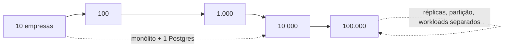

# Rescript — Escalabilidade

> Como a arquitetura evolui de 10 a 100.000 empresas **sem superdimensionar** a primeira versão. Microserviços só com motivo mensurável.
> Status: Design de arquitetura (pré-implementação).

---

## 1. Princípio

Dimensionar para o **estágio atual + o próximo**, não para o futuro distante (AP7). A arquitetura (monólito modular + PostgreSQL + fronteiras por contrato/evento) já suporta ordens de magnitude de crescimento **antes** de exigir mudanças estruturais. Cada estágio abaixo diz o que **permanece igual**, o que **vira gargalo**, o que **monitorar** e **quando agir**.

---

## 2. Estágio: 10 empresas (validação)

- **Igual:** monólito modular; um PostgreSQL; deploy simples; fila em tabela + `pg_cron`.
- **Gargalos:** nenhum técnico — o gargalo é **product-market fit**, não infra.
- **Monitorar:** correção dos dados, ativação, bugs.
- **Ação:** **não fazer nada de escala.** Focar em produto e confiança. Qualquer infra de escala aqui é desperdício.

## 3. Estágio: 100 empresas (tração inicial)

- **Igual:** tudo. Um Postgres aguenta com folga.
- **Gargalos:** eventuais queries não indexadas; jobs mal escritos.
- **Monitorar:** latência p95, queries lentas, tamanho da fila/outbox, saúde do worker.
- **Ação:** índices adequados; observabilidade ativa (`Observability.md`). Ainda **sem** filas externas nem réplicas.

## 4. Estágio: 1.000 empresas (crescimento)

- **Igual:** monólito; PostgreSQL como fonte de verdade; RLS.
- **Gargalos possíveis:** leituras pesadas de dashboard/insights concorrendo com escrita; recomputações de insights; storage crescendo.
- **Monitorar:** carga de leitura vs. escrita; tempo de recomputação de insights; custo Vercel/Supabase.
- **Ação (quando os sinais aparecerem):**
  - Materialized views para dashboards/insights (`InsightArchitecture.md`).
  - Ajustar cadência de jobs; processar insights por evento em vez de varredura.
  - **Réplica de leitura** se leitura começar a impactar escrita — primeiro grande passo de escala.

## 5. Estágio: 10.000 empresas (escala)

- **Igual:** o modelo de dados e as fronteiras. Ainda um monólito.
- **Gargalos:** volume de escrita no ledger; contenção em tabelas quentes; processamento assíncrono; storage de documentos.
- **Monitorar:** throughput de escrita, contenção de locks de estoque, backlog de outbox/jobs, p99.
- **Ação:**
  - **Réplicas de leitura** para relatórios/insights (separar workload de leitura).
  - **Worker(s) dedicados** para outbox/importação/insights, separados do request path (mesmo código, processo próprio).
  - **Particionamento** de tabelas de alto volume (ledger de estoque/financeiro, audit) por tempo e/ou por tenant.
  - Avaliar **fila gerenciada externa** se a fila em Postgres virar gargalo (`TechnologyEvaluation.md` §7).

## 6. Estágio: 100.000 empresas (grande escala)

- **Igual:** o domínio, as invariantes, os contratos. **Não** reescrevemos o núcleo.
- **Gargalos:** um único Postgres pode não bastar para toda a escrita; grandes tenants (efeito "vizinho barulhento").
- **Monitorar:** saturação do primário; tenants outliers; custo por tenant.
- **Ação (só com motivo mensurável):**
  - **Isolamento físico para grandes contas** (schema/DB dedicado por tenant enterprise) — o modelo `organization_id` já permite migrar um tenant sem refazer o domínio (`MultiTenancy.md`).
  - **Sharding por tenant** (particionar tenants entre bancos) se necessário.
  - **Extrair serviços** apenas onde houver **motivo operacional/organizacional mensurável**: ex.: Insights vira serviço próprio se seu perfil de carga/deploy divergir muito do núcleo — a comunicação já é por evento/contrato (`DependencyMap.md`), então a extração é viável sem reescrita.

---

## 7. Tabela-Resumo de Gatilhos

| Sinal medido | Ação | Estágio típico |
|---|---|---|
| Queries lentas | Índices, otimização | 100+ |
| Leitura impacta escrita | Réplica de leitura | 1.000–10.000 |
| Dashboards lentos | Materialized views | 1.000+ |
| Backlog de jobs/outbox | Worker dedicado | 10.000 |
| Tabelas quentes enormes | Particionamento | 10.000+ |
| Fila Postgres saturada | Fila gerenciada externa | 10.000+ |
| Primário saturado | Sharding / isolamento físico | 100.000 |
| Carga/deploy de um módulo diverge | Extrair serviço | 100.000 |

---

## 8. Quando NÃO fazer nada

- Antes de 100 empresas: **nenhuma** ação de escala.
- Sem métrica que comprove o gargalo: **não** otimizar por intuição.
- Microserviços: **só** com motivo operacional ou organizacional **mensurável** (times independentes, cargas radicalmente distintas) — nunca por estética (AP5).

---

## 9. Por que o núcleo não precisa ser reescrito

As decisões caras (ledger de estoque/financeiro, `organization_id`+RLS, outbox, fronteiras por contrato/evento) foram tomadas para **escalar por adição**, não por reescrita:
- Ledgers particionam bem.
- `organization_id` permite sharding/isolamento por tenant.
- Outbox/eventos permitem extrair consumidores.
- Fronteiras por contrato permitem extrair módulos.

> A escala é um problema de **operação e infra**, resolvido incrementalmente — não um problema de **modelo**, que já está certo.

---

## 10. Invariantes

1. Não construir para escala inexistente (AP7).
2. Toda ação de escala é disparada por **métrica**, não por medo.
3. Microserviço exige motivo **mensurável**.
4. O modelo de dados e as invariantes **não mudam** com a escala.
