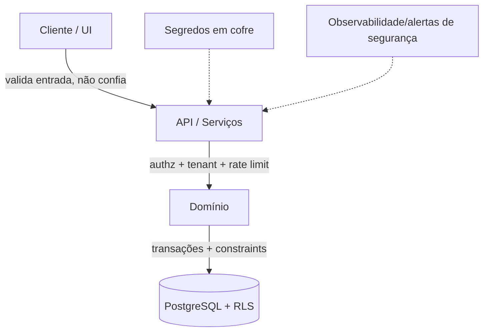

# Rescript — Segurança de Aplicação

> Defesa em profundidade. Segurança por padrão (AP9), menor privilégio (AP11), integridade garantida pelo banco (AP12).
> Status: Design de arquitetura (pré-implementação). Orientação técnica; validação jurídica de LGPD em `Privacy.md`.

---

## 1. Filosofia: Defesa em Profundidade

Nenhuma camada é a única defesa. Isolamento de tenant é reforçado em UI → aplicação → RLS → constraints. Autorização é checada em aplicação e reforçada no banco. Segredos ficam fora do código. O caminho fácil é o caminho seguro.

---

## 2. Matriz de Ameaças × Defesas (aplicação)

| Ameaça | Defesa |
|---|---|
| **Isolamento multi-tenant** | RLS + `organization_id` + validação na aplicação + testes (`MultiTenancy.md`) |
| **SQL injection** | Queries parametrizadas/ORM seguro; nunca concatenar SQL; funções SQL com search_path fixo |
| **XSS** | Escapar saída; React já mitiga; CSP; sanitizar conteúdo rico |
| **CSRF** | Tokens/SameSite; verificação de origem em mutações |
| **SSRF** | Validar/allowlist URLs de saída (webhooks, integrações); sem buscar URLs arbitrárias do usuário |
| **Enumeração de registros** | IDs opacos (UUID); RLS bloqueia mesmo com id válido; respostas uniformes |
| **Abuso de API / brute force** | Rate limiting por usuário/IP/org; backoff; captcha onde couber |
| **Escalada de privilégio** | Papéis no banco; revalidação; auditoria (`Authorization.md`) |
| **Vazamento por Storage** | Buckets por tenant; URLs assinadas curtas; sem caminhos adivinháveis |
| **Webhooks forjados** | Verificação de assinatura; idempotência; allowlist de origem |
| **Sequestro de sessão** | Tokens curtos; rotação; HTTPS; revogação em logout/troca de papel |
| **Convites abusados** | Uso único, expiráveis, escopados, auditados |
| **Suporte interno abusivo** | Menor privilégio + acesso temporário + consentimento + auditoria (`MultiTenancy.md`) |
| **Segredos vazados** | Cofre de segredos; nunca em código/logs; rotação |
| **Dependências vulneráveis** | Varredura de dependências no CI; atualizações |

---

## 3. Autenticação e Sessões

- Autenticação via Supabase Auth; e-mail/senha + recuperação segura.
- **Recuperação de conta:** links de uso único, expiráveis; não revelar existência de conta (anti-enumeração).
- **MFA (futuro):** previsto; o modelo de identidade não deve impedi-lo.
- Sessões: tokens de curta duração, HTTPS obrigatório, revogação em logout/mudança sensível.
- Mudança de papel/permissão reflete rápido (sem privilégio preso em token — `MultiTenancy.md` §5).

---

## 4. Segredos e Certificados

- Segredos (chaves de API, credenciais de provedores, certificados fiscais) em **cofre de segredos**, nunca no repositório nem em variáveis expostas ao cliente.
- **Acesso mínimo e auditado**; rotação periódica.
- Certificados fiscais: preferir custódia no provedor fiscal quando possível (`FiscalIntegration.md`).
- Separação de segredos por ambiente (local/preview/staging/prod — `DeploymentStrategy.md`).

---

## 5. Uploads e Exportações

- **Uploads:** validar tipo/tamanho; armazenar isolado por tenant; varredura quando aplicável; URLs assinadas; expiração (`ImportArchitecture.md`).
- **Exportações:** respeitam permissões e tenant; auditar exportações de dados sensíveis; rate limit; evitar exfiltração em massa.

---

## 6. Rate Limiting e Abuso

- Limites por usuário, IP e organização em endpoints sensíveis (login, importação, APIs públicas futuras).
- Proteção contra automação abusiva; alertas de segurança em padrões anômalos (`Observability.md`).

---

## 7. Integridade e Banco como Defesa

- Constraints, chaves estrangeiras, unicidade e checks garantem que dados inválidos **não entram** (AP12), mesmo se a aplicação falhar.
- Transações garantem que operações críticas não deixam estado parcial (`SaleTransaction.md`).
- Funções `SECURITY DEFINER` usadas com parcimônia, search_path fixo, sem confiar em input.

---

## 8. Backups e Recuperação

- **Backups automáticos** do PostgreSQL (gerenciados pelo Supabase) + verificação periódica de restauração.
- **Point-in-time recovery** conforme plano de infraestrutura.
- Backups **criptografados** e com acesso restrito.
- Testar restauração é parte da estratégia (backup não testado não é backup).
- Retenção de backups alinhada a `Privacy.md`.

---

## 9. CI/CD Seguro

- Varredura de dependências e secrets no CI (`DeploymentStrategy.md`).
- Testes de RLS/isolamento **bloqueiam** deploy (`TestingStrategy.md`).
- Princípio de menor privilégio nas credenciais de deploy.
- Revisão de código para mudanças sensíveis (auth, RLS, financeiro, estoque).

---

## 10. Invariantes de Segurança

1. **Default-deny** em acesso e autorização.
2. Isolamento de tenant reforçado em **múltiplas camadas** (RLS não é a única).
3. Segredos **nunca** em código/logs; sempre em cofre.
4. Toda entrada externa (usuário, webhook, import) é **validada e não confiável**.
5. Ações sensíveis são **auditadas** (`AuditArchitecture.md`).
6. Segurança é verificada **no servidor**; a UI nunca é defesa.
7. Backups criptografados, testados e retidos conforme política.

> Este documento é **orientação técnica**. Requisitos legais (LGPD) são tratados em `Privacy.md` e devem ser validados juridicamente.
