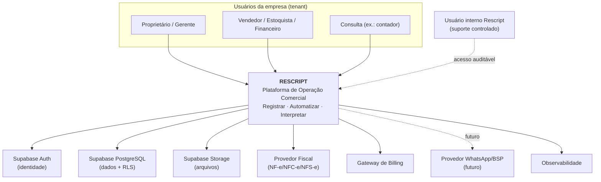

# Rescript — Contexto do Sistema

> Visão de mais alto nível (C4 nível 1): o que o Rescript é, quem o usa e com quais sistemas externos ele conversa.
> Status: Design de arquitetura (pré-implementação).

---

## 1. Definição do Sistema

O **Rescript** é uma **Plataforma de Operação Comercial** SaaS, multi-tenant, entregue como aplicação web responsiva. Ele opera em três camadas:

1. **Registrar** — clientes, produtos, estoque, vendas, recebimentos, movimentações, histórico.
2. **Automatizar** — uma ação dispara suas consequências de forma atômica.
3. **Interpretar** — gera conclusões (insights) confiáveis, explicáveis e rastreáveis.

**Obsessão:** simplicidade. **Tese central:** *"organiza a operação comercial e mostra ao dono o que precisa da atenção dele, antes que o problema aconteça."*

---

## 2. Fronteira do Sistema

O que está **dentro** da fronteira do Rescript (responsabilidade nossa):
- Registro e integridade dos dados comerciais.
- Automação das consequências das operações.
- Interpretação determinística (insights) e Central de Decisão.
- Multi-tenancy, autorização, auditoria, entitlements.

O que está **fora** (delegado a sistemas externos especializados):
- Emissão fiscal (provedor fiscal especializado).
- Envio de mensagens (WhatsApp/BSP — futuro).
- Cobrança/pagamento da assinatura (gateway de billing).
- Autenticação de baixo nível (provedor de identidade — Supabase Auth).
- Infraestrutura de banco, storage e execução (Supabase, Vercel).

---

## 3. Atores (usuários)

| Ator | Descrição | Necessidade principal |
|---|---|---|
| **Proprietário (dono)** | Decisor e pagador; persona Ricardo | Clareza e conclusões acionáveis |
| **Administrador** | Gerencia usuários e configurações | Controle da conta |
| **Gerente** | Supervisiona operação | Visão + operação |
| **Vendedor** | Registra vendas; persona Aline | Rapidez e simplicidade |
| **Estoquista** | Movimenta estoque | Operação de estoque confiável |
| **Financeiro** | Contas a receber/pagar | Consistência financeira |
| **Consulta** | Somente leitura (ex.: contador) | Relatórios/números confiáveis |
| **Usuário interno da plataforma** | Time Rescript (suporte controlado) | Suporte auditável, menor privilégio |

> Papéis são o ponto de partida, não um limite permanente (ver `Authorization.md`).

---

## 4. Sistemas Externos

| Sistema externo | Papel | Documento |
|---|---|---|
| **Supabase (PostgreSQL, Auth, Storage, Edge Functions)** | Banco, identidade, arquivos, execução server-side | `TechnologyEvaluation.md` |
| **Vercel** | Hospedagem da aplicação web (SSR/edge) | `DeploymentStrategy.md` |
| **GitHub** | Versionamento e CI/CD | `DeploymentStrategy.md` |
| **Provedor Fiscal** (ex.: focos de NF-e/NFC-e/NFS-e) | Emissão fiscal e comunicação com SEFAZ/prefeituras | `FiscalIntegration.md` |
| **Gateway de Billing/Assinaturas** | Cobrança recorrente da assinatura | `Entitlements.md` |
| **Provedor de Mensageria/WhatsApp (BSP)** — futuro | Envio de mensagens | `MessagingArchitecture.md` |
| **Provedor de Observabilidade** | Logs/métricas/erros/tracing | `Observability.md` |

---

## 5. Diagrama de Contexto (C4 — Nível 1)

---

## 6. Qualidades Arquiteturais Prioritárias (atributos de qualidade)

Em ordem de prioridade (guiam trade-offs):

1. **Integridade/consistência** (estoque e financeiro sempre corretos) — inegociável.
2. **Segurança e isolamento multi-tenant** — inegociável.
3. **Auditabilidade e rastreabilidade** — base da confiança e da inteligência.
4. **Simplicidade operacional e de código** — proporcional ao time atual.
5. **Evolutibilidade** (crescer sem reescrever).
6. **Experiência do desenvolvedor** (velocidade sustentável).
7. **Performance percebida** (operação diária instantânea).
8. **Custo** (proporcional à escala real).

> Quando dois atributos conflitam, o de maior prioridade vence. Ex.: nunca sacrificamos integridade (1) por performance (7).

---

## 7. Restrições

- **Time pequeno inicialmente** → arquitetura proporcional; evitar sobre-engenharia.
- **Brasil primeiro** → BRL, português, fiscal brasileiro (via integração), LGPD.
- **Web responsivo no MVP** → sem app nativo (mas mobile-first na operação).
- **Sem microserviços prematuros** → monólito modular.
- **Simplicidade externa** pode exigir **complexidade interna bem organizada** (aceitável quando encapsulada).

---

## 8. Premissas

- O beachhead inicial (distribuidoras/atacado 3–20 pessoas) é **hipótese**, não regra codificada.
- O domínio é modelado de forma **genérica** para atender varejo especializado, autopeças, materiais, pet/agro etc.
- A confiança nos dados (`DataTrust.md`) é pré-condição da inteligência.
- A stack proposta é o ponto de partida, sujeita à avaliação crítica em `TechnologyEvaluation.md`.
