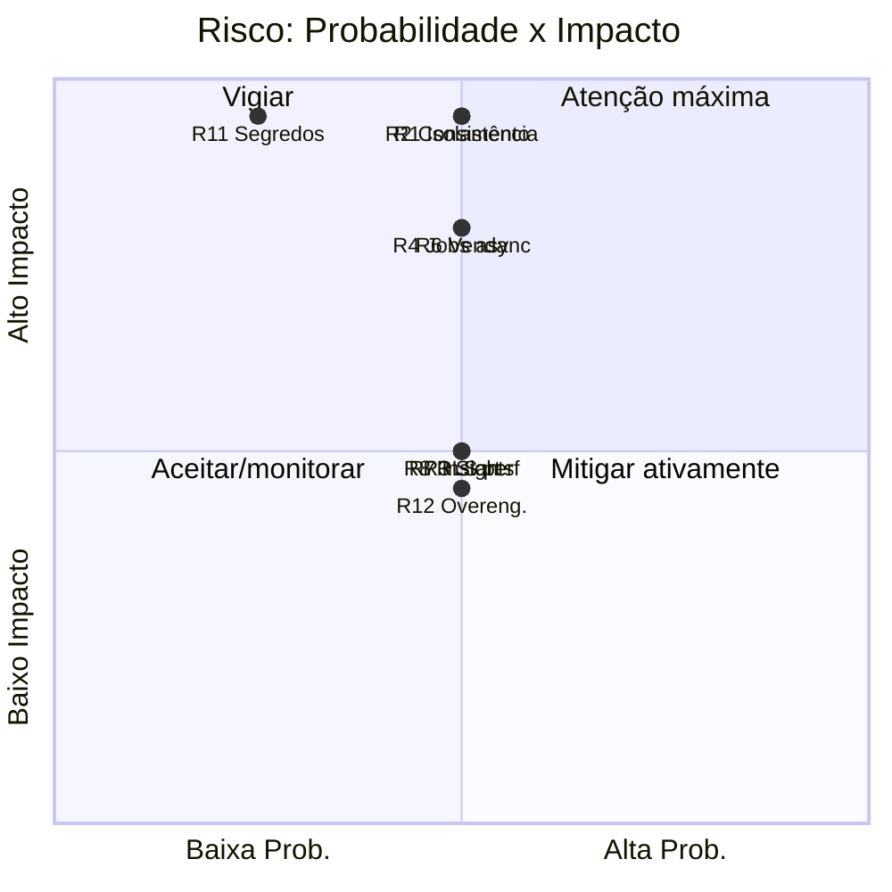

# Rescript — Riscos Técnicos

> Riscos técnicos conhecidos, sua severidade, mitigação e gatilho de reavaliação. Registro vivo.
> Status: Design de arquitetura (pré-implementação).

---

## 1. Como ler

- **Prob.** = probabilidade (baixa/média/alta). **Impacto** = severidade se ocorrer.
- **Exposição** = combinação (prioridade de atenção).
- Cada risco tem **mitigação** e um **gatilho de reavaliação**.

---

## 2. Registro de Riscos

### R1 — Vazamento entre tenants (isolamento)
- **Prob.** Média · **Impacto** Crítico · **Exposição** Alta
- **Descrição:** política RLS malfeita, query sem filtro, ou storage exposto → dados de um cliente vazam para outro. É o pior cenário possível.
- **Mitigação:** defesa em profundidade (RLS + aplicação); testes de isolamento bloqueando deploy (`TestingStrategy.md`); IDs opacos; buckets por tenant; revisão obrigatória de mudanças de RLS.
- **Gatilho:** qualquer novo objeto de banco/endpoint sensível; auditoria periódica de políticas.

### R2 — Inconsistência de estoque/financeiro
- **Prob.** Média · **Impacto** Crítico · **Exposição** Alta
- **Descrição:** baixa duplicada, recebimento duplicado, saldo divergente → quebra a confiança nos dados, que é a tese do produto.
- **Mitigação:** ledgers reconstruíveis; atomicidade; idempotência; locks; reconciliação; testes dos cenários críticos.
- **Gatilho:** divergência detectada em reconciliação; nova operação que afete ledgers.

### R3 — Maturidade do TanStack Start
- **Prob.** Média · **Impacto** Médio · **Exposição** Média
- **Descrição:** framework jovem; breaking changes ou descontinuação.
- **Mitigação:** domínio isolado do framework (`RepositoryStrategy.md`); troca por Next.js viável a custo de borda.
- **Gatilho:** sinais de instabilidade do projeto upstream; breaking change grande.

### R4 — Lacuna de jobs assíncronos
- **Prob.** Média · **Impacto** Alto · **Exposição** Alta
- **Descrição:** sem worker/fila confiável, outbox/importação/insights ficam frágeis (`TechnologyEvaluation.md` §7).
- **Mitigação:** fila em PostgreSQL + `pg_cron` + worker desde o início; caminho para fila gerenciada quando escalar.
- **Gatilho:** backlog crescente; limites de Edge Functions atingidos.

### R5 — Lock-in de fornecedor (especialmente Supabase Auth)
- **Prob.** Baixa · **Impacto** Médio · **Exposição** Média
- **Descrição:** dependência profunda de Supabase/Vercel dificulta migração.
- **Mitigação:** dados em Postgres padrão (exportável); `packages/auth`/`files` isolam provedores; evitar features exclusivas de Vercel.
- **Gatilho:** mudança de preço/política do fornecedor; necessidade de migrar.

### R6 — Complexidade da transação de venda
- **Prob.** Média · **Impacto** Alto · **Exposição** Alta
- **Descrição:** a operação mais complexa; erro aqui contamina tudo.
- **Mitigação:** contrato fixado (`SaleTransaction.md`); testes exaustivos; linha síncrono/assíncrono clara; encapsulamento (AP19).
- **Gatilho:** cada mudança na confirmação/cancelamento.

### R7 — Fadiga de alertas / insights ruins
- **Prob.** Média · **Impacto** Médio · **Exposição** Média
- **Descrição:** insights demais/errados destroem a confiança na camada Interpretar.
- **Mitigação:** determinismo; rastreabilidade; relevância; dedup/expiração; feedback (`InsightArchitecture.md`); começar conservador.
- **Gatilho:** feedback negativo recorrente; taxa de dispensa alta.

### R8 — Performance de RLS/queries em escala
- **Prob.** Média · **Impacto** Médio · **Exposição** Média
- **Descrição:** políticas RLS e agregações pesadas degradam com volume.
- **Mitigação:** índices; materialized views; réplicas de leitura; particionamento (`Scalability.md`).
- **Gatilho:** p95 acima do alvo; queries lentas.

### R9 — Migrations destrutivas / downtime
- **Prob.** Baixa · **Impacto** Alto · **Exposição** Média
- **Descrição:** migration ruim corrompe dados ou derruba produção.
- **Mitigação:** expand/contract; staging; testes de RLS; revisão; backups/PITR (`DeploymentStrategy.md`).
- **Gatilho:** toda migration destrutiva.

### R10 — Conflito LGPD × integridade de histórico
- **Prob.** Média · **Impacto** Médio · **Exposição** Média
- **Descrição:** eliminação de dados vs. não destruir histórico financeiro.
- **Mitigação:** anonimização preservando ledgers; janela de retenção; validação jurídica (`Privacy.md`).
- **Gatilho:** pedido de titular; mudança regulatória.

### R11 — Segredos/certificados expostos
- **Prob.** Baixa · **Impacto** Crítico · **Exposição** Média
- **Descrição:** vazamento de segredos ou certificado fiscal.
- **Mitigação:** cofre; sem segredo em código/logs; scan no CI; rotação; custódia do certificado no provedor (`Security.md`, `FiscalIntegration.md`).
- **Gatilho:** onboarding de novo provedor; incidente.

### R12 — Overengineering / velocidade do time
- **Prob.** Média · **Impacto** Médio · **Exposição** Média
- **Descrição:** abstrações/infra prematuras drenam o time pequeno (viola AP6/AP7).
- **Mitigação:** proporcionalidade; regra da 3ª repetição; monorepo mínimo; sem microserviços.
- **Gatilho:** revisões de arquitetura; sensação de "estamos construindo para ninguém".

### R13 — Custo de fornecedores com escala
- **Prob.** Média · **Impacto** Médio · **Exposição** Média
- **Descrição:** Vercel/Supabase/observabilidade encarecem com tráfego.
- **Mitigação:** monitorar custo por tenant; otimizar; portabilidade preserva alternativas.
- **Gatilho:** custo por tenant fora da meta.

---

## 3. Mapa de Exposição (priorização)

---

## 4. Top 4 Riscos a Vigiar Continuamente

1. **R1 — Isolamento entre tenants** (vazamento é fatal para um SaaS B2B).
2. **R2 — Consistência de estoque/financeiro** (é a tese do produto).
3. **R6 — Transação de venda** (concentra a complexidade crítica).
4. **R4 — Jobs assíncronos** (habilita outbox/insights/importação de forma confiável).

> Todos os quatro já têm mitigação arquitetural definida nesta documentação e são cobertos por testes obrigatórios (`TestingStrategy.md` §4).
