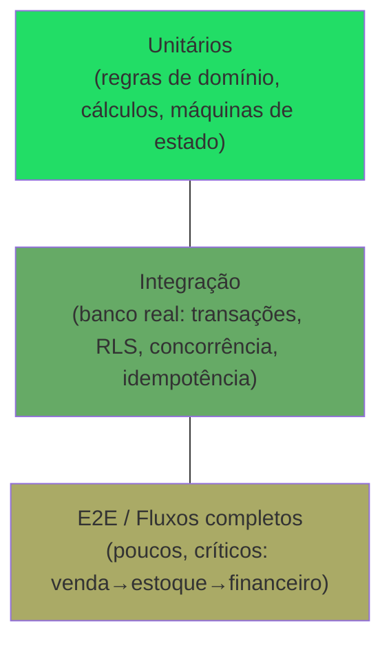

# Rescript — Estratégia de Testes

> O que garante que estoque e financeiro nunca erram e que tenants nunca vazam. Testes são a rede de segurança da confiança nos dados.
> Status: Design de arquitetura (pré-implementação). Decisão em `adr/0014-testing.md`.

---

## 1. Filosofia

Testes proporcionais ao **risco**, não à moda. O Rescript concentra risco em: **consistência transacional, isolamento multi-tenant, autorização/RLS e cálculos financeiros/estoque**. É aí que a cobertura é inegociável. UI tem testes mais leves.

---

## 2. A Pirâmide (adaptada ao Rescript)

> Diferença importante: no Rescript, a camada de **integração com banco real** é mais gorda que o usual — porque transações, RLS e concorrência **só se testam de verdade contra o PostgreSQL**, não com mocks.

---

## 3. Camadas e o que cobrem

| Camada | Alvo | Ferramenta-conceito |
|---|---|---|
| **Unitários** | Regras de domínio, cálculos (totais, custo médio, saldos, desconto), máquinas de estado (venda, parcela, reserva) | Test runner TS |
| **Integração (DB real)** | Transação de venda, ledger, RLS, idempotência, concorrência, constraints | Postgres de teste |
| **Contrato** | Interfaces de adapters (fiscal, mensageria, billing) | Mocks de contrato |
| **E2E** | Fluxos ponta a ponta pela UI | Runner de browser |
| **Segurança** | Isolamento de tenant, escalada de privilégio | Suíte dedicada |

---

## 4. Cenários que NUNCA podem ficar sem teste automatizado

Estes são **bloqueadores de deploy** (`DeploymentStrategy.md`):

### Consistência transacional
1. Confirmar venda baixa estoque **e** gera recebível **atomicamente**.
2. Falha no meio da confirmação → **rollback total** (nada parcial).
3. **Idempotência:** confirmar a mesma venda 2x (clique duplo) não duplica estoque/recebível.
4. Cancelamento gera **compensação** (estorno de estoque, cancelamento de recebível) sem apagar histórico.

### Estoque
5. Saldo reconstruído do ledger bate com o materializado.
6. **Concorrência:** dois vendedores no último item → só um vende (ou alerta), sem saldo corrompido.
7. Reserva ≠ saída; expiração de reserva libera saldo.

### Financeiro
8. Pagamento parcial → parcela "parcialmente paga"; soma correta.
9. **Sem duplicidade de recebimento** (idempotência de pagamento).
10. Estorno recalcula situação sem apagar o pagamento original.
11. Dinheiro nunca em float (precisão).

### Multi-tenant e autorização
12. **Isolamento:** usuário da org A **nunca** lê/escreve dados da org B (RLS + aplicação).
13. Manipular `organization_id` na requisição é rejeitado.
14. `organization_id` forjado + id válido de outro tenant → bloqueado pela RLS.
15. Permissão negada bloqueia ação sensível (default-deny).
16. Mudança de papel reflete em nova checagem.

### Assíncrono e integrações
17. Outbox: evento e dado são atômicos; publisher é idempotente; falha vai a dead-letter.
18. Webhook (fiscal/mensageria) fora de ordem e repetido é tratado (idempotência).

### Importação e insights
19. Importação valida, faz preview e não corrompe dados; rollback funciona.
20. Insight só é gerado com dados suficientes; é rastreável; deduplica e expira.

---

## 5. Testes de RLS (destaque)

- Suíte dedicada roda **contra o PostgreSQL real** com políticas RLS ativas.
- Para cada tabela sensível: tentar acesso cruzado deve **falhar**; acesso legítimo deve **passar**.
- Novos objetos de banco **exigem** teste de isolamento antes do merge (regra de CI).

---

## 6. Testes de Concorrência

- Simular execuções paralelas (venda do mesmo item, pagamento simultâneo) para validar locks e idempotência.
- Detectar condições de corrida antes da produção — barato agora, caríssimo depois.

---

## 7. Dados de Teste e Ambientes

- Fixtures determinísticas; factory por domínio.
- Banco de teste efêmero (recriado por execução) para integração.
- Staging com dados anonimizados para validação final (`Observability.md`).

---

## 8. No CI (bloqueio de merge/deploy)

Lint + type-check + unitários + integração (com DB) + **testes de RLS/isolamento** + testes dos cenários do §4. Falha em qualquer um **impede** o deploy (`DeploymentStrategy.md`).

---

## 9. O que NÃO super-testar

- Não perseguir 100% de cobertura por vaidade.
- UI trivial e detalhes de layout: testes leves.
- O esforço segue o risco: um cálculo financeiro vale 10x um componente decorativo.

---

## 10. Invariantes

1. Os cenários do §4 **sempre** têm testes automatizados.
2. Testes de RLS rodam contra Postgres real e bloqueiam deploy.
3. Concorrência e idempotência são testadas explicitamente.
4. Cobertura segue o **risco**, não a moda.
