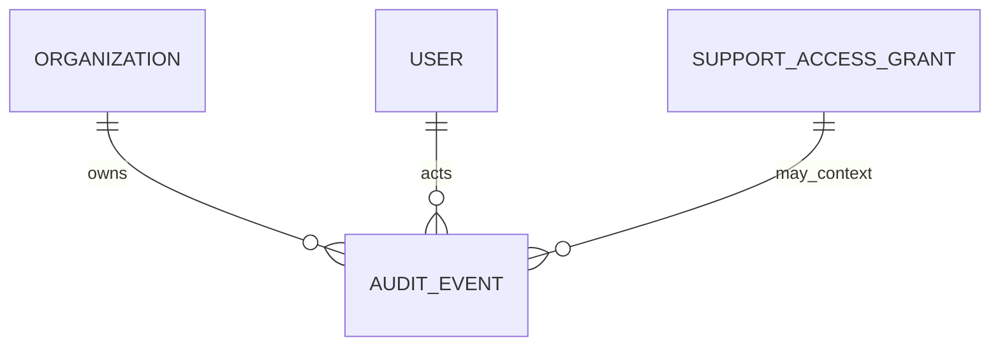

# Modelo Lógico — Auditoria

---

## 1. Diferenciação

| Tipo | Uso |
|---|---|
| **AuditEvent** | Quem fez o quê (compliance/segurança) |
| **SaleStatusHistory / ledgers** | Histórico de domínio |
| **DomainEvent/Outbox** | Integração assíncrona |
| **Logs técnicos** | Observabilidade (fora do DB de negócio ou retidos curto) |

---

## 2. AuditEvent (append-only)

| Campo | |
|---|---|
| id, organization_id | nullable só para eventos platform |
| actor_user_id, actor_type | user\|system\|support |
| action | sales.confirm, payment.reverse, … |
| entity_type, entity_id | |
| before_state, after_state | JSON redacted / diff |
| reason | |
| source_ip, user_agent | quando permitido |
| correlation_id, request_id | |
| occurred_at | |
| support_grant_id | se suporte |

**Imutável.** Sem UPDATE/DELETE.

---

## 3. Minimização
- Não copiar segredos, tokens, payloads fiscais completos desnecessários
- Preferir ids + campos essenciais
- PII: mascarar quando possível

---

## 4. Diagrama

## 5. Índices
- (org, occurred_at)
- (org, entity_type, entity_id)
- (org, actor_user_id, occurred_at)
- (correlation_id)
