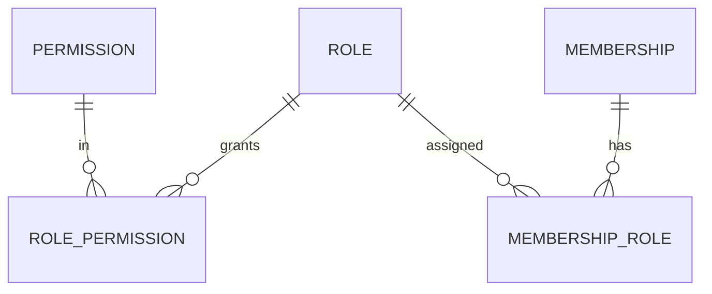

# Modelo Lógico — Autorização

> Separado de Entitlements (plano) e de Feature Flags.

---

## 1. Conceitos

| Conceito | Pergunta |
|---|---|
| Autenticação | Quem é? (User) |
| Autorização | O que pode fazer nesta org? (Permission via Role) |
| Entitlement | O plano da org libera? |
| Feature flag | Está ligado tecnicamente? |

Ação ocorre só se **AuthN ∧ Membership ativa ∧ Permission ∧ Entitlement ∧ Org operável**.

---

## 2. Estruturas

### Permission
- key (`sales.confirm`, `sales.discount`, `sales.discount.authorize`, `inventory.adjust`, …)
- module, description
- Catálogo da plataforma (não por org)

### Role
- **System Role:** presets (Owner, Admin, Manager, Seller, Stockist, Finance, Viewer) — códigos estáveis
- **Custom Role (futuro):** organization_id + name; MVP pode só system roles
- Nunca checar `if role == Seller` no domínio — sempre permission key

### RolePermission
- role_id, permission_key
- Fonte do conjunto de permissões do papel

### MembershipRole
- membership_id, role_id
- Um membership pode ter N roles (MVP: tipicamente 1)

### AuthorizationChangeLog (ou via AuditEvent)
- Mudanças de papel/permissão — ação sensível

---

## 3. Diagrama

---

## 4. Permissões relevantes (MVP)

`sales.create`, `sales.edit`, `sales.confirm`, `sales.cancel`, `sales.discount`, `sales.discount.authorize`, `customers.*`, `products.*`, `inventory.move`, `inventory.adjust`, `payments.register`, `payments.reverse`, `members.invite`, `members.manage_roles`, `org.settings`, `imports.run`, `insights.view`, `audit.view` (restrito).

---

## 5. Invariantes
1. Default-deny.
2. Owner sempre pode transferir ownership / gerir billing (conjunto mínimo).
3. Remover membership revoga imediatamente.
4. Custom roles futuros recombinam Permission — sem mudar código.
5. Desconto: FD-05 — política org + permissions, não nome de papel.
