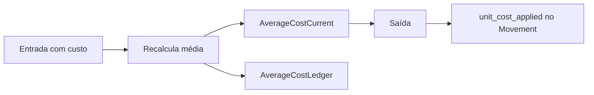
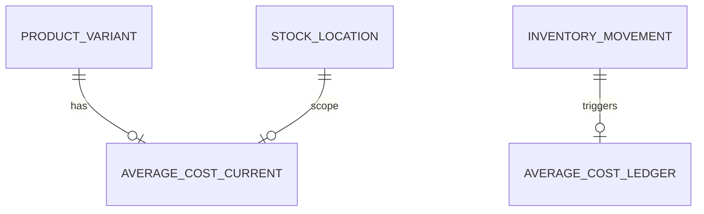

# Modelo Lógico — Custo Médio Ponderado (FD-01)

---

## 1. Escopo do custo médio

| Opção | Descrição | Recomendação |
|---|---|---|
| **A. Por (org, variant)** | Ignora local | Simples |
| **B. Por (org, location, variant)** | Média por depósito | Alinha a multi-local |

**Recomendação:** **B** se StockLocation existe desde o MVP (mesmo com 1 local) — evita migração dolorosa. **Questão aberta OQ-09** — não declarar aprovado.

---

## 2. AverageCostCurrent (materializado)

Chave: `(organization_id, location_id, variant_id)`  
Campos: qty_basis, unit_cost (Money), updated_at, last_movement_id

---

## 3. AverageCostLedger (FT — histórico do cálculo)

Append-only a cada entrada que altera custo (e opcionalmente registro de leitura na saída):

| Campo | Uso |
|---|---|
| movement_id | InventoryMovement que disparou |
| qty_before, cost_before | |
| qty_in, cost_in | entrada |
| qty_after, cost_after | nova média |
| formula_version | |

Saídas **não** recalculam média; gravam `unit_cost_applied` no InventoryMovement (imutável).

---

## 4. Fórmula

```
novo_custo = (qty_on_hand × custo_médio + qty_entrada × custo_entrada)
             / (qty_on_hand + qty_entrada)
```

Casos especiais (FD-01):
- Entrada sem custo → não altera média; qty sobe.
- on_hand ≤ 0 antes da entrada → política: média = custo da entrada (recomendação; documentar).
- Devolução → entrada com custo da saída original quando rastreável.
- Estorno de saída → recompõe qty; média: **não reeditar histórico**; seguir regra de compensação (recomendação: estorno não recalcula média retroativa; ajuste explícito se necessário).
- Correção → movimentos compensatórios, nunca UPDATE no custo aplicado da saída.

---

## 5. Diagramas





---

## 6. Invariantes
- Custo aplicado na saída imutável
- PEPS não existe
- Média reconstruível a partir de movimentos + ledger de custo
