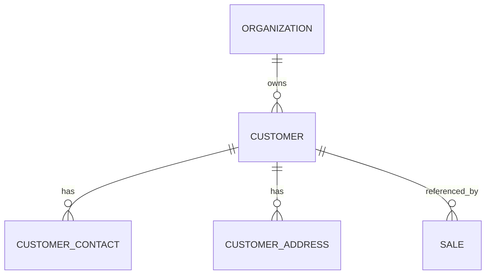

# Modelo Lógico — Clientes

---

## 1. Customer

| Aspecto | Definição |
|---|---|
| Agregado | Customer |
| Tenant | organization_id |
| FT | sim |
| Escopo | MVP |

**Campos lógicos:** id, organization_id, type (PF|PJ|unknown), legal_name, trade_name, document (Document VO nullable), document_type, status (active|inactive), notes, source (manual|import|api), external_id, created_*, updated_*, archived_*.

**Não no MVP (fronteira):** limite de crédito, IE/IM completos obrigatórios, scoring.

---

## 2. Dependentes

### CustomerContact
- kind (email|phone|whatsapp|other), value, is_primary, label
- Email/Phone **não** únicos globalmente na org (podem repetir)

### CustomerAddress
- kind (main|billing|shipping|other), Address VO, is_primary_for_kind
- Snapshot na Sale quando relevante (`SaleSnapshots.md`)

---

## 3. Unicidade

| Regra | Comportamento |
|---|---|
| Document informado | Único por organization_id (alerta/bloqueio de duplicata) |
| Document vazio | Permitido (cadastro rápido / import incompleto) |
| Mesmo document em orgs diferentes | Permitido |
| Email/telefone | Não únicos por padrão |

---

## 4. Diagrama

---

## 5. Ciclo / exclusão
- Inativar: status=inactive
- Com histórico de vendas: **nunca** exclusão física
- LGPD: anonimização (nome/documento/contatos) preservando Sale snapshots e FKs

---

## 6. Índices conceituais
- (organization_id, document) unique where document not null
- (organization_id, legal_name) search
- (organization_id, external_id)
- (organization_id, status)
