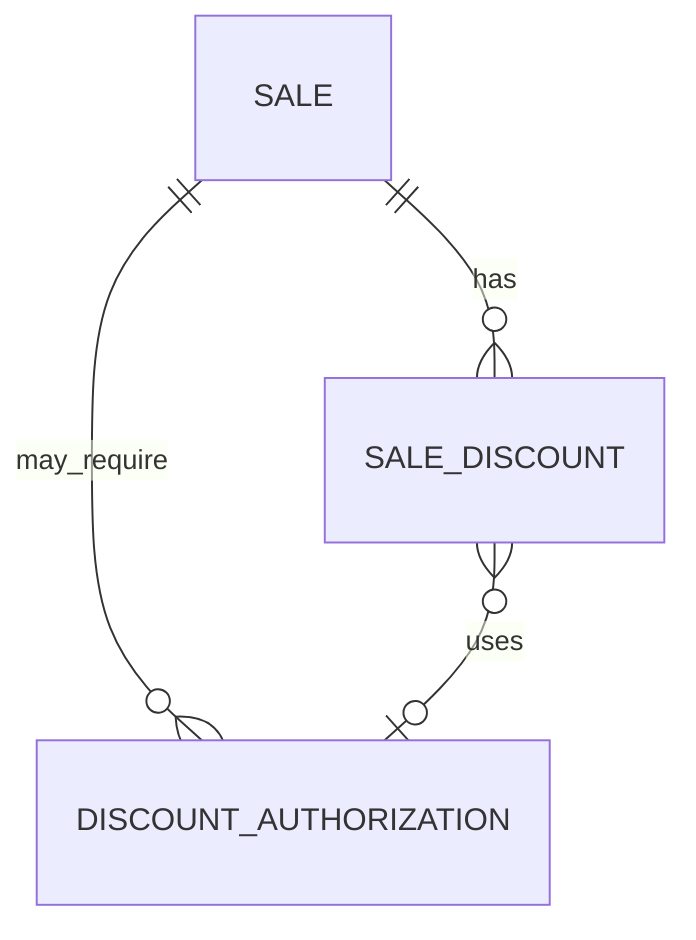

# Modelo Lógico — Descontos (FD-05)

---

## 1. DiscountPolicy (OrganizationPolicy / tipada)

| Campo | Notas |
|---|---|
| max_percent_without_authorization | OQ-04 (padrão aberto) |
| max_percent_absolute | teto duro |
| require_reason_above | threshold |
| allow_self_authorization | bool (recomendação: false) |

Checagem por permissions: `sales.discount`, `sales.discount.authorize` — **não** por nome de papel.

---

## 2. SaleDiscount

- sale_id / sale_item_id (header vs linha)
- type: percent | amount
- percent_value / amount_value
- reason
- requested_by
- authorization_id nullable
- applied_at
- margin_impact_estimate (Money/Percentage) — calculado

---

## 3. DiscountAuthorization

- sale_id
- requested_by, authorized_by
- requested_percent/amount, approved_*
- status: pending\|approved\|denied\|expired
- permission_key_used
- reason
- created_at, decided_at

---

## 4. Impedir

| Abuso | Defesa |
|---|---|
| Auto-autorização proibida | allow_self_authorization + authorized_by ≠ requested_by |
| Acima do máximo absoluto | constraint domínio + check |
| Alterar desconto pós-Confirmada | máquina de estado |
| Manipular total manualmente | total só calculado (PricingService) |
| Soma itens ≠ header | invariante de cálculo na confirmação |

---

## 5. Diagrama

---

## 6. Auditoria
Descontos sensíveis e autorizações → AuditEvent obrigatório.
