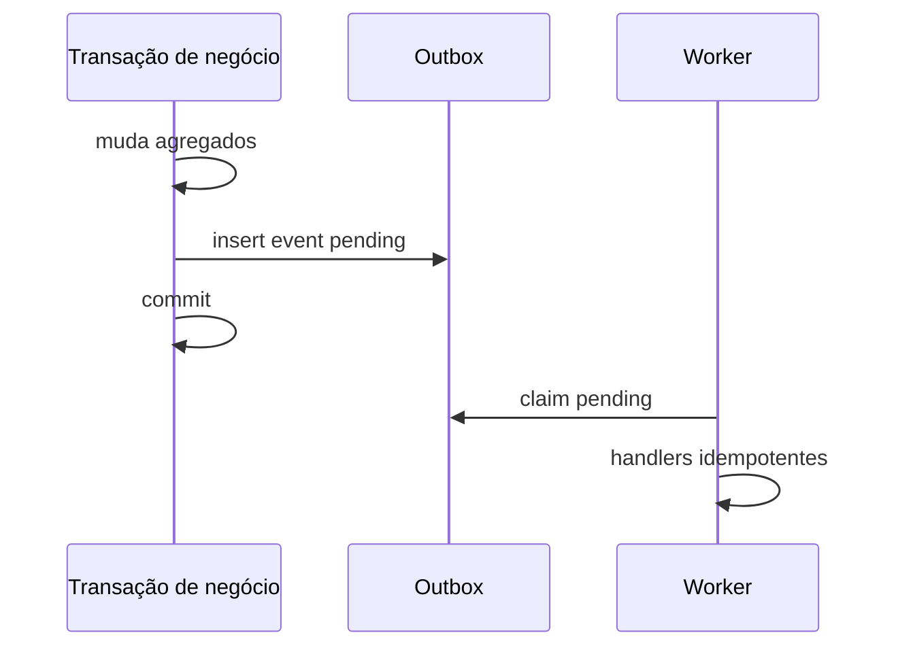

# Modelo Lógico — Eventos de Domínio

---

## 1. Critérios: quando persistir?

| Tipo | Persistência |
|---|---|
| Evento só em memória | Raro; testes / dentro da mesma request sem side effects externos |
| **Outbox** | Efeitos assíncronos que não podem se perder (insights, notificações, fiscal offer) |
| AuditEvent | Ação sensível (paralelo, não substitui outbox) |
| Integração | Outbox → webhook/provider |

Nem toda ação precisa de outbox: leituras e edits de rascunho tipicamente não.

---

## 2. DomainEvent (conceitual) / payload no Outbox

Campos: event_id, event_type, organization_id, aggregate_type, aggregate_id, aggregate_version, occurred_at, recorded_at, actor_id, correlation_id, causation_id, payload (versionado), payload_version

---

## 3. Eventos MVP relevantes
SaleQuoted, SaleOrdered, SaleConfirmed, SaleCancelled, InventoryMoved, InventoryReserved, InventoryReleased, ReservationConsumed, ReceivableCreated, PaymentRegistered, PaymentReversed, InsightGenerated, ImportCompleted, Member* …

---

## 4. Diagrama

