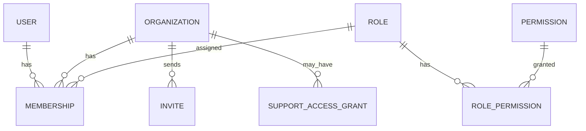
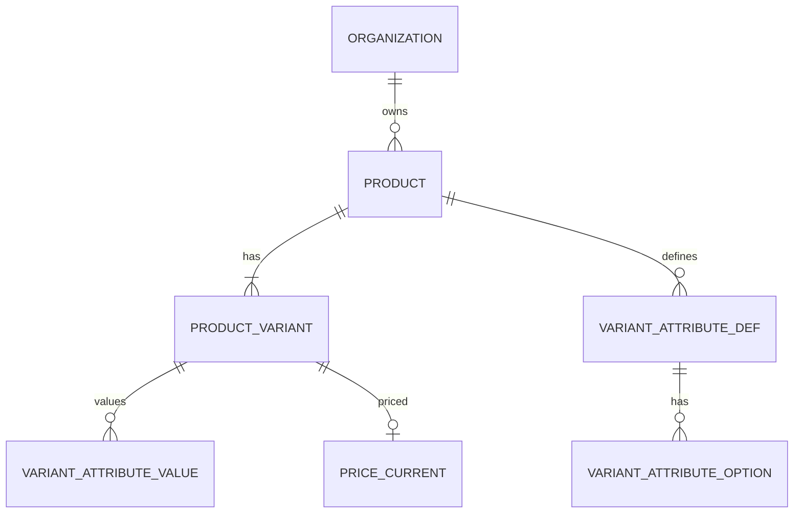
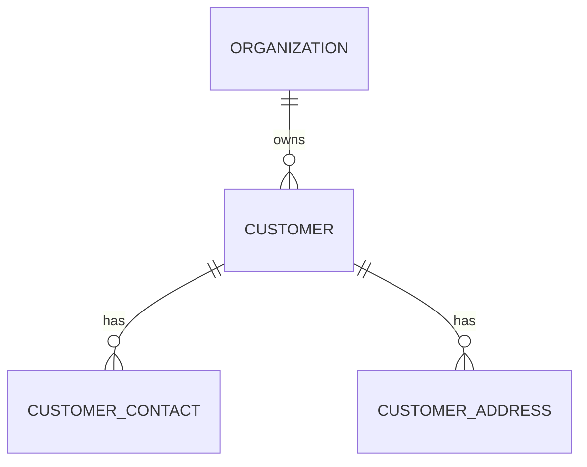
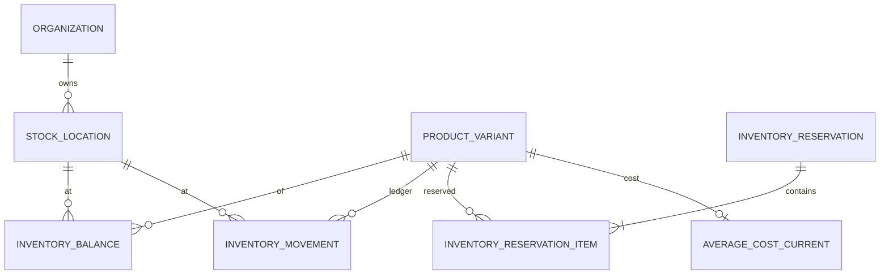
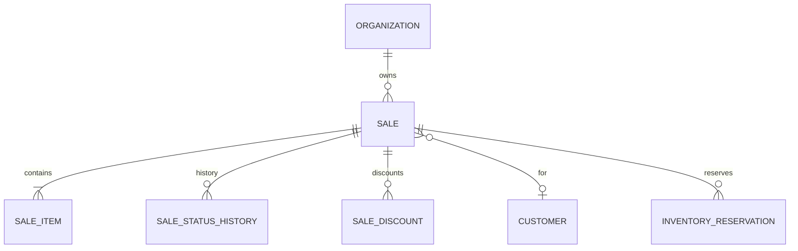
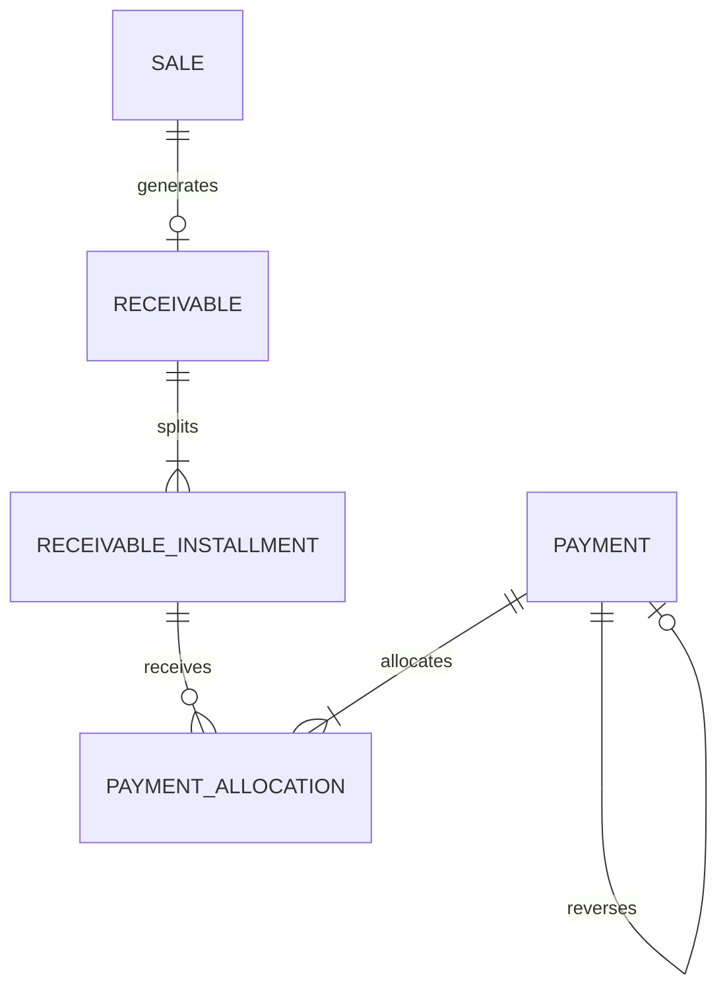
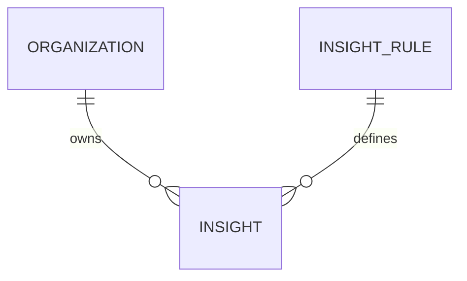
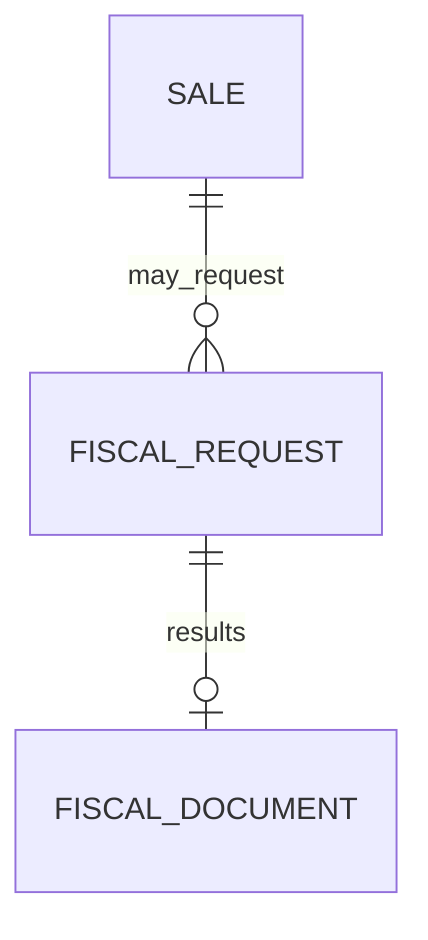
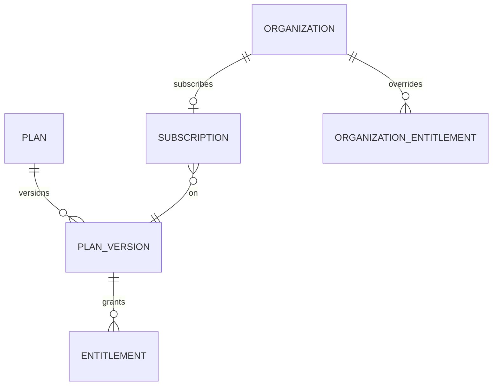

# ERD Lógico (Mermaid por contexto)

> Sem diagrama gigante. Cardinalidades simplificadas.

---

## Access

## Catalog

## Customers

## Inventory

## Sales

## Finance

## Insights

## Fiscal (fronteira)

## Subscriptions

