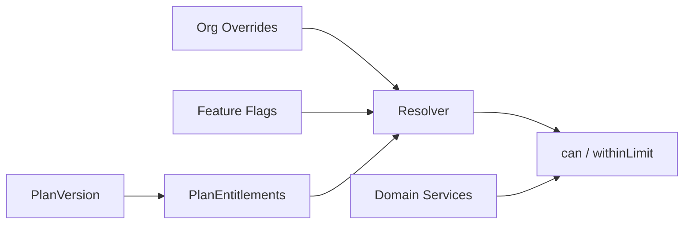

# Modelo Lógico — Entitlements e Feature Flags

---

## 1. Estruturas

### EntitlementDefinition
- key estável (`module.core`, `insights.projections`, `module.fiscal`, `max_users`, `max_sales_per_month`, …)
- type: boolean | limit | quota
- description

### PlanEntitlement
- plan_version_id, entitlement_key, value (bool/number/unlimited)

### OrganizationEntitlementOverride
- organization_id, entitlement_key, value, reason, expires_at
- Grandfathering / promo / admin override

### UsageCounter (quando limit)
- organization_id, counter_key, period_key, value
- **Recomendação:** preferir contagem real (COUNT) no MVP para limites críticos; counter é otimização com reconciliação

### FeatureFlag
- key, scope (global | organization), organization_id nullable, enabled, payload JSON controlado
- Ortogonal a entitlement

---

## 2. Resolução lógica

```
effective = merge(PlanEntitlements, OrgOverrides, FeatureFlags)
domain asks: can(key) / withinLimit(key, n) / limitOf(key)
```

Domínio **nunca** referencia nome de plano.

---

## 3. Diagrama



---

## 4. Invariantes
1. Autorização ≠ Entitlement (ambos necessários).
2. Limite atingido = bloqueio suave + upgrade path.
3. Overrides auditados.
4. Flags não substituem permission checks.
