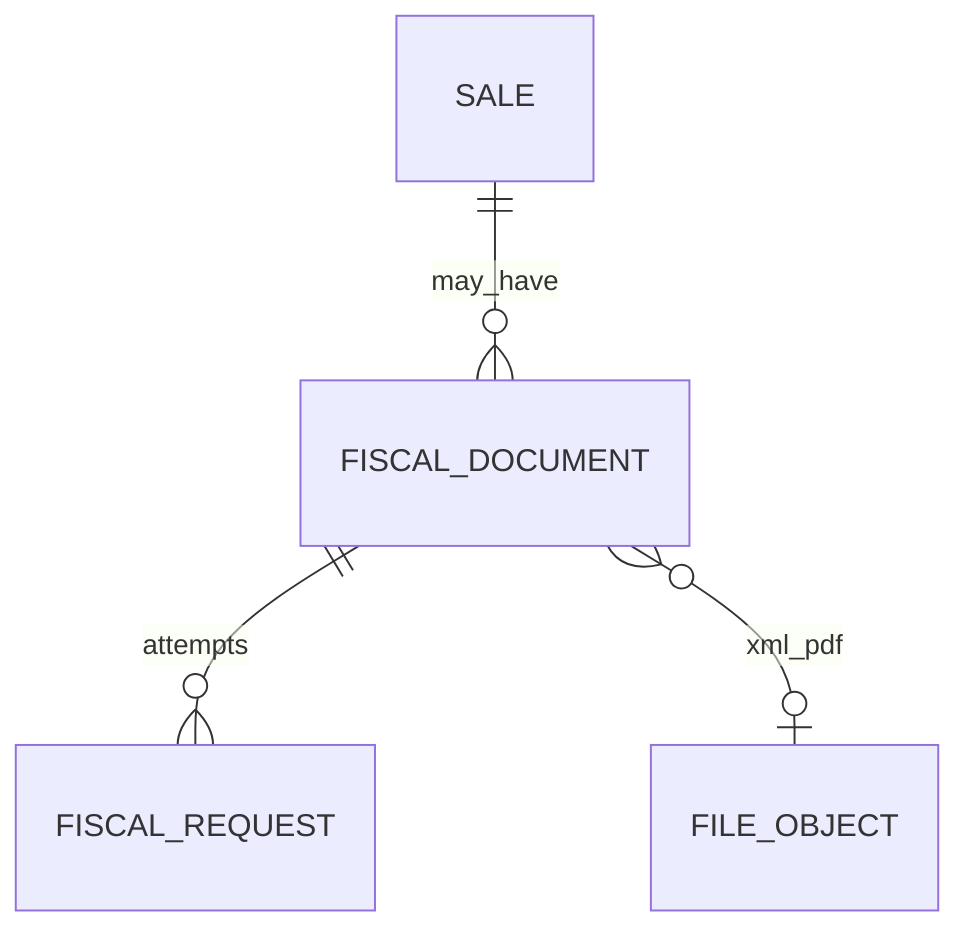

# Fronteira Lógica — Fiscal (V1)

> Sem regras tributárias no núcleo. Adapter substituível (ADR-0011).

---

## 1. Estruturas (V1)

### FiscalDocument
- organization_id, sale_id
- provider_code, provider_ref
- status: pending\|processing\|authorized\|rejected\|canceled
- access_key, issued_at
- xml_file_id, pdf_file_id
- snapshot fiscal mínimo (JSON versionado) da venda

### FiscalRequest
- document_id, idempotency_key, attempt, request_payload_ref, response_payload_ref, error

### FiscalWebhookEvent
- provider, external_event_id (unique), payload_ref, processed_at

---

## 2. Invariantes
- Idempotência de emissão por sale
- Não altera estoque/financeiro
- Sale confirmada independente do fiscal

---

## 3. Diagrama

