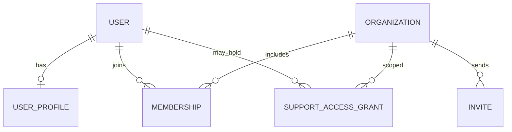

# Modelo Lógico — Identity & Multi-Tenancy

---

## 1. Estruturas

### User
- **Responsabilidade:** identidade global da pessoa.
- **Chave:** id (UUID).
- **Campos lógicos:** email (único), status (active/inactive), auth_provider_ref, created_at.
- **Não tem:** organization_id, roles.
- **Exclusão:** não física; inativar/anonimizar (LGPD).
- **Sensibilidade:** alta (PII).

### UserProfile
- nome de exibição, locale, timezone, preferências UI.
- 1:1 com User.

### Organization
- **Campos:** id, legal_name, trade_name, status, currency (padrão BRL), created_at, owner_user_id (denormalizado opcional — verdade no Membership).
- **Ciclo:** Active → Suspended → Canceled → Anonymized.
- **Tenant root.**

### Membership
- user_id, organization_id, status (invited/active/suspended/removed), joined_at, removed_at.
- Roles via MembershipRole ou role_ids.
- **Unicidade:** (organization_id, user_id) ativo único.
- Remoção preserva histórico (status=removed).

### Invite
- organization_id, email, role_set, token_hash, status, expires_at, invited_by, accepted_at.
- Uso único; aceitar cria Membership.

### SupportAccessGrant
- organization_id, supporter_user_id, scope, reason, expires_at, revoked_at, granted_by.
- Auditoria crítica.

### ActiveOrganizationPreference (opcional)
- user_id, organization_id, updated_at — preferência; não autoriza sozinha.

---

## 2. Diagrama

---

## 3. Cenários

| Cenário | Modelo |
|---|---|
| User em várias orgs | N Memberships |
| Papéis diferentes por org | Roles no Membership |
| Onboarding sem org | User existe; Organization criada no fluxo; Membership owner |
| Org suspensa | Memberships intactos; escrita bloqueada por status org |
| Aceite convite | Invite → Membership active |
| Remoção membro | Membership removed; tokens/sessões invalidados logicamente |

---

## 4. Índices conceituais
- User(email) unique
- Membership(organization_id, user_id)
- Membership(user_id, status)
- Invite(token_hash) unique
- Invite(organization_id, status, expires_at)

---

## 5. MVP
Tudo acima exceto multi-owner avançado e impersonação elaborada (grant simples basta).
