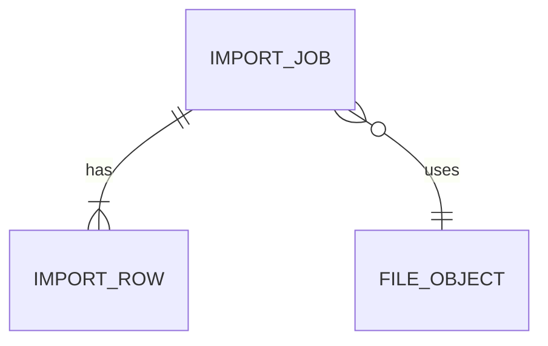

# Modelo Lógico — Importações

---

## 1. ImportJob

| Campo | |
|---|---|
| id, organization_id | |
| type | customers\|products\|variants\|opening_stock\|receivables |
| status | uploaded\|validated\|processing\|completed\|partial\|failed\|reverted\|canceled |
| file_id | |
| column_mapping | JSON controlado |
| idempotency_key | unique (org, key) |
| stats | totals/errors |
| created_by, created_at, finished_at | |

---

## 2. ImportRow

- job_id, row_number, raw_payload, status (valid\|invalid\|applied\|skipped)
- errors[], warnings[]
- created_entity_type/id (rastreio)
- natural_key (para dedup)

---

## 3. Idempotência / anti-duplicação
- Reexecução mesmo idempotency_key → mesmo job result
- natural_key por tipo (document, sku) + política update\|skip\|error
- Rollback lógico: marcar entidades com import_job_id e reverter se sem efeitos irreversíveis

---

## 4. Diagrama

---

## 5. Tipos MVP
Clientes, produtos/variantes, estoque inicial (movements entry + cost), recebíveis futuros (fronteira cuidadosa).
