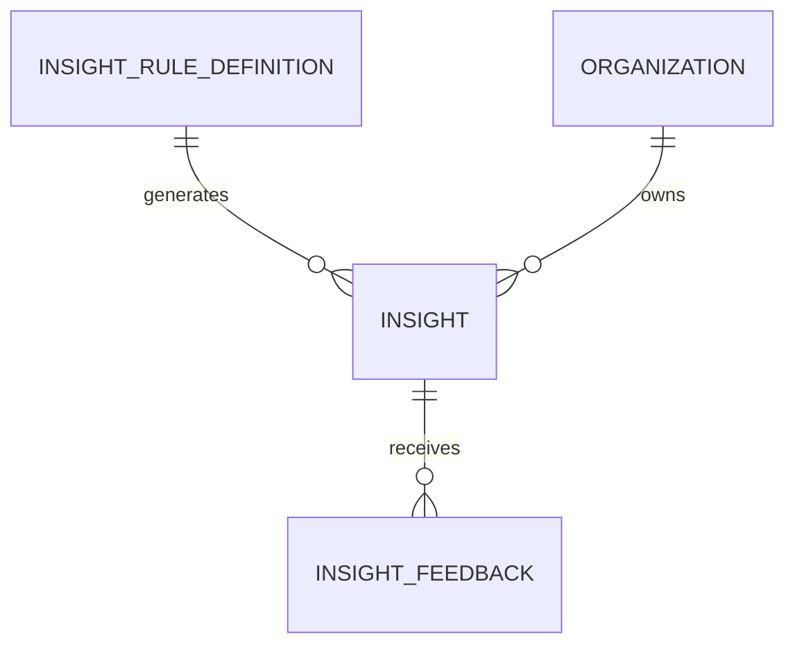

# Modelo Lógico — Insights (sem IA generativa)

---

## 1. InsightRuleDefinition (catálogo)

- rule_id, version, domain, category
- nature_default: fact\|projection\|recommendation
- severity_default
- params schema
- active

Versionar: mudar regra ≠ reescrever insights antigos.

---

## 2. Insight (resultado)

| Campo | Responde |
|---|---|
| rule_id + version | qual regra |
| evidence_refs (JSON ids) | quais registros |
| computed_at | quando |
| period_start/end | período |
| nature | fato/projeção/recomendação |
| title, explanation | por quê |
| suggested_action | ação |
| severity, relevance_score | prioridade |
| fingerprint / dedup_key | dedup |
| status | active\|dismissed\|resolved\|expired |
| expires_at | validade |
| organization_id | tenant |
| confidence / data_sufficient | |
| seen_at, dismissed_at, resolved_at | interação |

---

## 3. InsightFeedback
- insight_id, user_id, type (not_useful\|false_positive\|…), note

---

## 4. Diagrama

---

## 5. Dedup
Unique parcial: (organization_id, fingerprint) where status=active

---

## 6. Índices
- (org, status, relevance_score)
- (org, rule_id, status)
- (org, expires_at)
