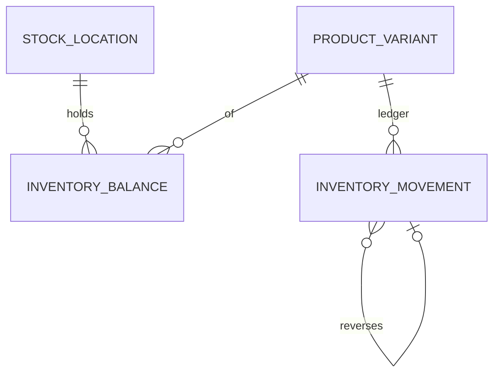

# Modelo Lógico — Estoque (Ledger)

> FD-01, FD-02. Ledger físico = fonte de verdade. Reserva em `ReservationModel.md`.

---

## 1. StockLocation

| Campo | Notas |
|---|---|
| id, organization_id | |
| code, name | |
| is_default | MVP: exatamente um default por org |
| status | active\|archived |

**Recomendação MVP:** um local padrão criado no onboarding; sem UI multi-depósito (OQ-10). Estrutura já existe para evolução.

---

## 2. InventoryBalance (DERIVADO / materializado)

Chave lógica: `(organization_id, location_id, variant_id)`

| Campo | Origem |
|---|---|
| qty_on_hand | Σ movimentos físicos |
| qty_reserved | Σ reservation items ativas |
| qty_available | on_hand − reserved |
| avg_cost | AverageCostCurrent |
| version | optimistic / lock target |

**Não é FT.** Reconstruível. Atualizado na mesma transação dos movimentos/reservas.

---

## 3. InventoryMovement (FT, IMUTÁVEL)

| Campo | Categoria |
|---|---|
| id, organization_id | id |
| location_id, variant_id | ref |
| type | enum: entry, exit, adjustment_plus, adjustment_minus, return, reversal |
| quantity | Quantity (>0) |
| unit_cost_applied | Money nullable (obrigatório em exit quando tracks cost) |
| total_cost_applied | Money |
| occurred_at | instante |
| recorded_at | instante |
| source_type | sale_confirm, sale_cancel, manual_entry, import, inventory_adjust, return, … |
| source_id | ref |
| reason | texto (obrigatório em adjust) |
| created_by | ref |
| correlation_id | |

**Proibido:** UPDATE/DELETE. Correção = novo movimento `reversal` apontando `reverses_movement_id`.

---

## 4. Classificação

| Estrutura | Imutável | Atualizável | Derivada | Reconstruível |
|---|---|---|---|---|
| InventoryMovement | sim | não | não | — (é FT) |
| InventoryBalance | não | sim | sim | sim |
| AverageCostCurrent | não | sim | sim | sim via ledger custo |
| Reservation | estados | sim | parcial | sim |

---

## 5. Diagrama

---

## 6. Invariantes
- I1–I9 domínio
- tracks_inventory=false → sem movement/reservation
- organization_id consistente variant/location/movement
- Negativo: conforme política (OQ-08 / RN-34 recomenda allow_with_alert)

---

## 7. Índices conceituais
- Balance PK (org, location, variant)
- Movement (org, variant, occurred_at)
- Movement (org, source_type, source_id)
- Movement (org, type, recorded_at)
