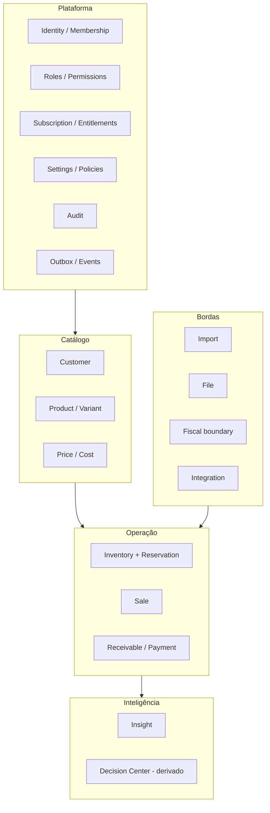
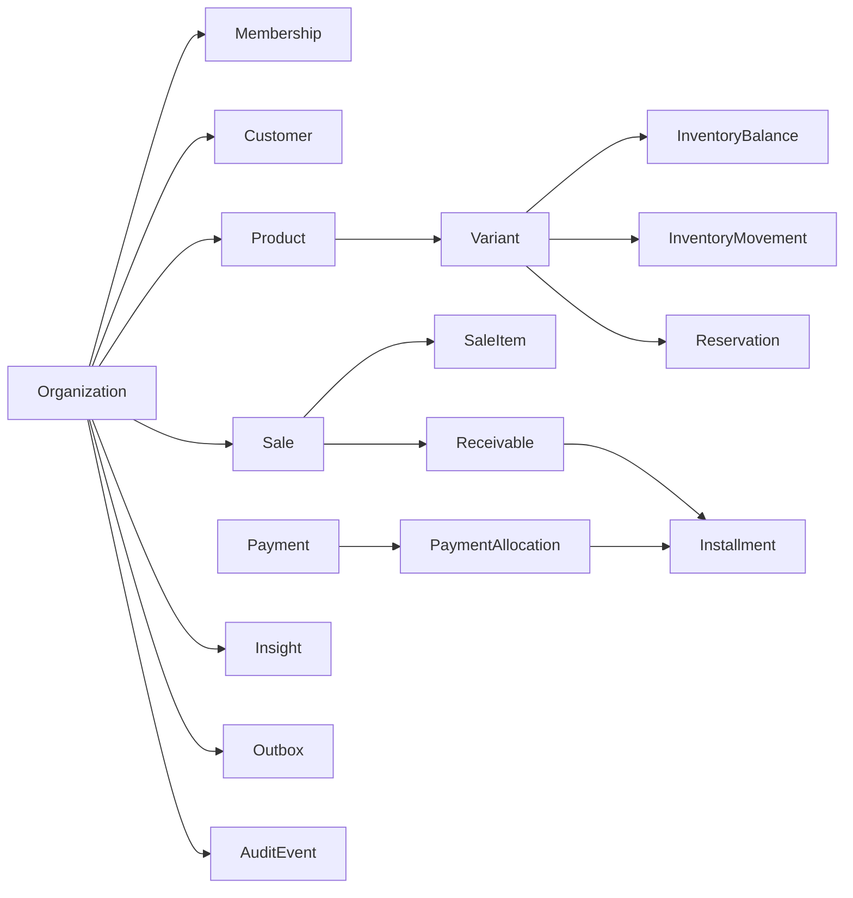

# Modelo Lógico — Visão Geral

> Mapa do modelo lógico do Rescript: camadas, fontes de verdade, agregados e evolução.
> Status: Design lógico (pré-implementação).

---

## 1. Princípios do modelo

1. **Tudo operacional tem `organization_id`** (tenant owner inequívoco).
2. **Ledgers são append-only**; saldos e situações são derivados ou materializações reconstruíveis.
3. **Snapshots comerciais** congelam dados na Sale; edição de cadastro não reescreve histórico.
4. **Reservation ≠ InventoryMovement.**
5. **Sale é o único agregado comercial do MVP** (sem tabela Order independente).
6. **Defesa em profundidade:** constraints + domínio + (futuro) RLS.
7. **Proporcional ao MVP:** fronteiras para V1/futuro sem complexidade prematura.

---

## 2. Camadas lógicas

---

## 3. Fontes de verdade vs. derivados

| Fonte de verdade | Derivado / materialização |
|---|---|
| InventoryMovement (ledger físico) | InventoryBalance (físico) |
| InventoryReservation (+ itens) | saldo reservado / disponível |
| AverageCost history + movimentos | AverageCostCurrent |
| Sale + SaleItem + descontos | totais da venda |
| Receivable + Installment + PaymentAllocation | situação/saldo do recebível |
| Payment | — |
| AuditEvent, DomainEvent/Outbox | — |
| Insight (resultado gerado) | blocos da Central de Decisão |
| Membership, RolePermission | effective permissions (cache opcional) |

---

## 4. Estratégia de identificação (conceitual)

| Tipo | Uso | Exemplo |
|---|---|---|
| **PK técnica** | Identificador interno opaco (UUID recomendado; v7 preferível para ordenação temporal) | `sale.id` |
| **Número sequencial por org** | Código humano (não segurança) | `sale_number` 2026-00042 |
| **Código editável** | SKU, código de cliente | único por org quando informado |
| **Idempotency key** | Operações críticas | único por org + operação |
| **External id** | Integrações | único por org + provider |
| **Public id** | Exposto em URLs (mesmo UUID ou ULID) | nunca sequencial global |

**Riscos:** sequenciais globais permitem enumeração; isolamento nunca depende de “adivinhar IDs”. Segurança = RLS + membership + permissão.

**Recomendação (não decisão física final):** UUID v7 como PK; números de documento por organização para UX.

---

## 5. Campos transversais (aplicação seletiva)

| Campo | Onde faz sentido |
|---|---|
| `id` | Toda estrutura persistente |
| `organization_id` | Todo dado operacional de tenant |
| `created_at` / `created_by` | Quase tudo |
| `updated_at` / `updated_by` | Entidades mutáveis (não ledgers) |
| `archived_at` / `archived_by` | Cadastros (Customer, Product) |
| `deleted_at` | Raro; preferir arquivar/inativar/cancelar |
| `version` | Optimistic locking (Sale pré-confirmação, Membership) |
| `external_id` | Integrações / import |
| `idempotency_key` | Operações críticas / payments / confirm |
| `correlation_id` | Audit, Outbox, requests |
| `source` | Origem (ui, import, api, system) |
| `metadata` | JSON controlado e versionado — uso parcimonioso |

### Diferenciação de “fim de vida”

| Conceito | Significado |
|---|---|
| **Inativação / arquivamento** | Cadastro fora de uso; histórico permanece |
| **Cancelamento** | Transação anulada com compensação |
| **Expiração** | Compromisso temporal (convite, reserva, orçamento) |
| **Estorno / reversão** | Compensação financeira/estoque |
| **Soft delete** | Só quando não há conceito de negócio melhor |
| **Exclusão física** | Temporários, previews; nunca ledger/audit/venda confirmada |

---

## 6. Locais de estoque (MVP)

**Recomendação:** um **StockLocation padrão implícito** por organização no MVP (estrutura presente para evolução), sem UI multi-depósito. Custo médio e saldo por `(organization, location, variant)`. Questão aberta formal: OQ-09 / OQ-10 em `OpenQuestions.md`.

---

## 7. Escopo temporal das estruturas

| Escopo | Exemplos |
|---|---|
| **MVP** | Identity, Sale, Inventory, Reservation, Receivable, Payment, Insight, Import, Audit, Outbox, Entitlements |
| **V1** | Fiscal documents, Interest/charges boundary, importações avançadas |
| **Futuro** | Multi-location UI, Order aggregate, price lists, credit limit, full financial ledger/GL |

---

## 8. Diagrama de módulos (visão geral)

