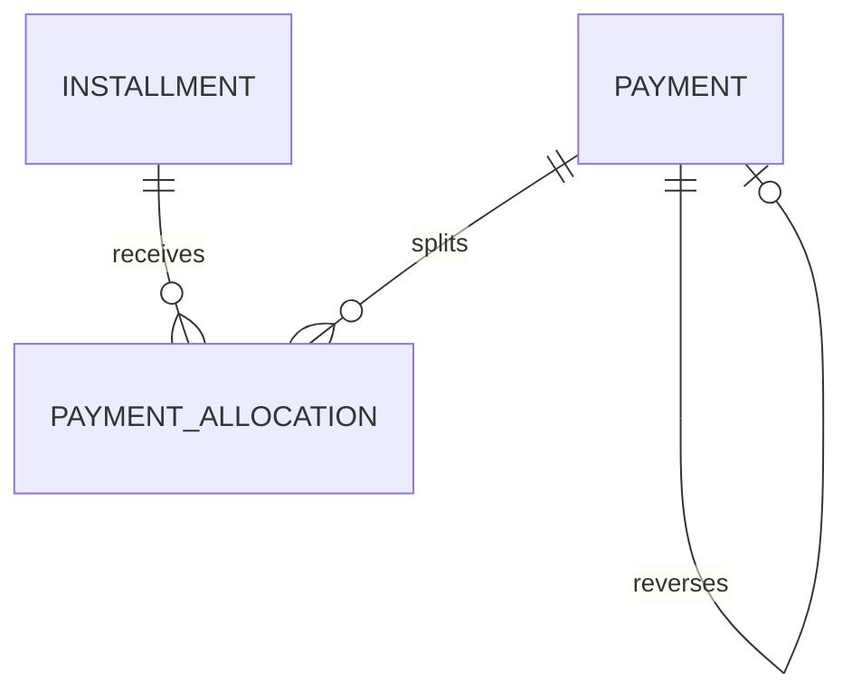

# Modelo Lógico — Pagamentos

---

## 1. Payment

| Campo | Notas |
|---|---|
| id, organization_id | |
| method | cash\|pix\|card\|boleto\|other (enum evolutivo) |
| amount | Money |
| paid_at | data do recebimento |
| status | pending\|confirmed\|partially_reversed\|reversed\|canceled\|failed |
| idempotency_key | unique (org, key) |
| external_ref | |
| source | ui\|import\|gateway |
| created_by, created_at | |
| reverses_payment_id | estorno |

**Não é booleano.**

---

## 2. PaymentAllocation (MVP)

**Decisão de modelagem (proporcional):**  
MVP tipicamente **1 Payment → 1 Installment**, mas a estrutura `PaymentAllocation` existe desde o início para não refatorar depois.

| Campo | |
|---|---|
| payment_id, installment_id | |
| amount | |
| Unicidade lógica evita double-alloc do mesmo valor |

Multi-allocation (um pagamento várias parcelas): suportado pelo modelo; UX pode restringir no MVP.

---

## 3. Estorno
- Novo Payment (ou status reversed) + Allocation negativa / reversal allocations
- **Recomendação:** Payment de estorno com `reverses_payment_id` + allocations que reabrem saldo
- Installment/Receivable recalculam status

---

## 4. Ledger financeiro completo?

**MVP:** Receivable + Installment + Payment + Allocation bastam para caixa realizado e a receber.  
**Não** construir General Ledger contábil agora (`FinancialProjectionModel.md`).

Opcional futuro: `FinancialCashMovement` append-only espelhando payments confirmados.

---

## 5. Diagrama

---

## 6. Estados
pending → confirmed → partially_reversed / reversed  
canceled / failed (integrações)

---

## 7. Índices
- (org, idempotency_key) unique
- (org, paid_at)
- (org, status)
- allocation (installment_id)
