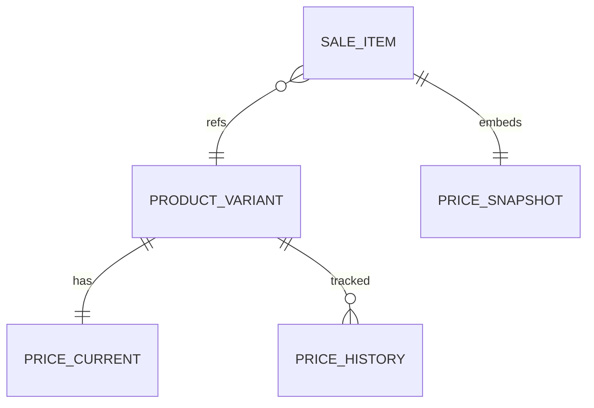

# Modelo Lógico — Preços

---

## 1. Estruturas MVP

### PriceCurrent
- organization_id, variant_id, amount (Money), updated_at, updated_by
- Preço de venda atual do catálogo

### PriceHistory
- variant_id, amount, effective_from, effective_to, changed_by, reason
- Append/close-interval — auditoria de mudança de preço

### CostCurrent (opcional denormalizado)
- Custo médio vigente vive em `AverageCostCurrent` (estoque), não confundir com “custo cadastral manual”
- Pode existir `manual_reference_cost` na variante para onboarding — **não** substitui médio

---

## 2. O que vai para a Sale (snapshot)

No SaleItem, **copiar e congelar**:
- unit_price (praticado)
- list_price / original_price (pré-desconto)
- currency
- (custo aplicado só na confirmação/saída — ver AverageCost)

Mudança posterior em PriceCurrent **não** altera SaleItem.

---

## 3. Futuro (fronteira, não MVP)
- PriceList, CustomerPrice, PromotionalPrice
- Modelar apenas como extensão: SaleItem já tem preços snapshotados

---

## 4. Diagrama

---

## 5. Invariantes
- Preço ≥ 0
- Histórico de preço não se reedita (novo intervalo)
- Descontos: `DiscountModel.md`
