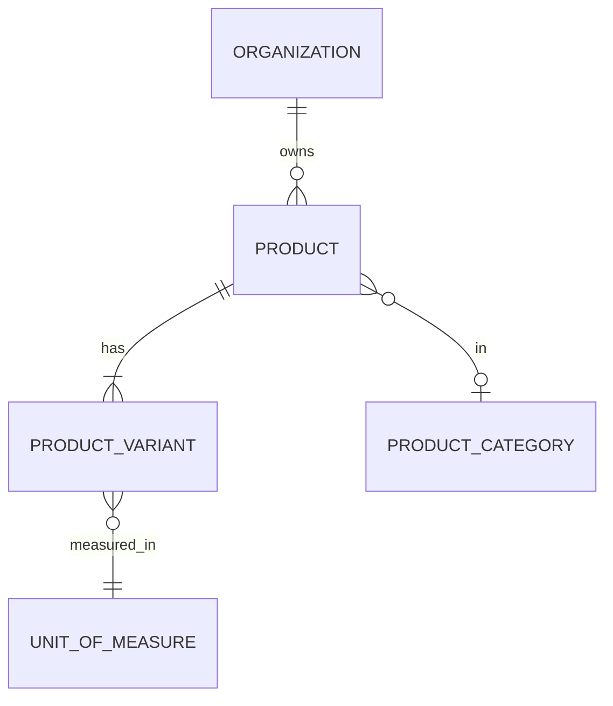

# Modelo Lógico — Produtos

---

## 1. Product

- organization_id, name, description, category_id nullable, status (active|archived), tracks_inventory_default (hint), created_*
- **Sempre** possui ≥1 ProductVariant
- Sem variações comerciais → cria **variante padrão** (`is_default=true`, sem atributos)

---

## 2. UnitOfMeasure

**Recomendação:** catálogo **híbrido**
- Platform defaults (un, cx, kg, g, m, L, pct…)
- Organization pode estender (custom units)

Campos: code, name, integer_only (bool), precision (casas — **OQ-01 aberto**), rounding_mode

---

## 3. ProductCategory
- Por organização; árvore simples opcional (parent_id)
- Não global obrigatória

---

## 4. Relação com estoque/preço
- Preço/custo/SKU/barcode/saldo → **Variant** (não Product)
- Product é agrupador conceitual + UI

---

## 5. Diagrama

---

## 6. Invariantes
- RN-25: unidade estocável = variante
- Produto com vendas: arquivar, não apagar
- UI oculta complexidade se só há variante padrão
