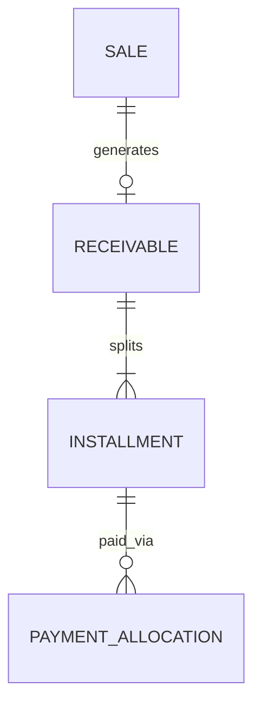

# Modelo Lógico — Recebíveis

> Sale ≠ Receivable ≠ Installment ≠ Payment. FD-04: sem juros/multa no MVP (campos futuros nullable/ausentes).

---

## 1. Receivable

| Campo | Notas |
|---|---|
| id, organization_id | |
| sale_id | origem (ou import_source) |
| status | open\|partially_settled\|settled\|canceled |
| original_amount, open_balance | Money; balance DER |
| currency | |
| created_at | |

---

## 2. ReceivableInstallment

| Campo | Notas |
|---|---|
| receivable_id, sequence | |
| due_date | |
| amount, open_balance | |
| status | open\|partial\|paid\|overdue\|canceled |
| overdue = derivado (due_date < today ∧ open_balance > 0) | |

**MVP sem:** interest_amount, fine_amount (fronteira V1).

---

## 3. Relação com Sale

| Cenário | Modelo |
|---|---|
| À vista pago na confirmação | Receivable settled + Payment+Allocation **ou** Payment alocado a installment única paga |
| A prazo 1x | 1 installment |
| A prazo Nx | N installments |
| Cancelamento Sale | cancela open; paid exige reverse payment |

---

## 4. Diagrama

---

## 5. Invariantes
- Σ installments.amount = receivable.original_amount
- open_balance = amount − Σ allocations válidas
- “Pago” nunca booleano na Sale
- Cancelamento não apaga histórico

---

## 6. Índices
- (org, status, due_date) — overdue
- (org, sale_id)
- (org, customer via sale snapshot/join)
