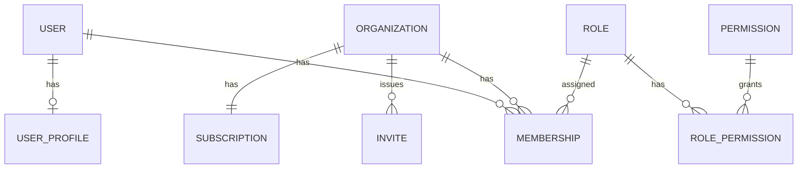
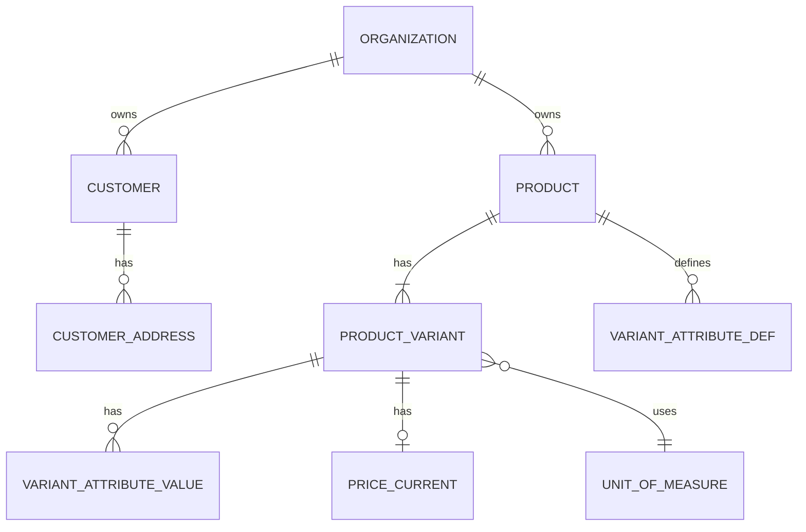
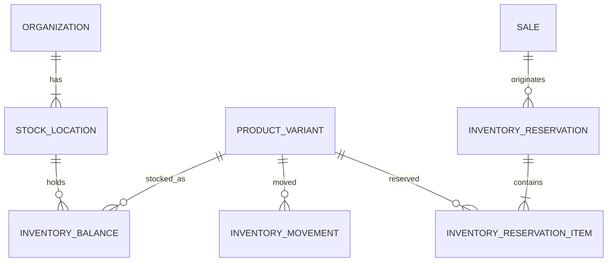
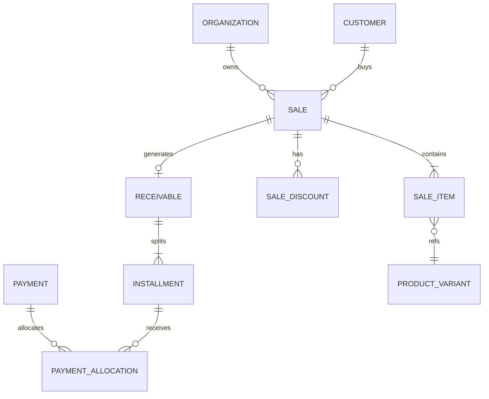

# Catálogo de Relacionamentos

> Cardinalidades e regras de vínculo. Isolamento: **nunca** relacionar entidades de organizações diferentes.

---

## 1. Identity & Tenancy

| De → Para | Card. | Regra |
|---|---|---|
| User → Membership | 1:N | Papéis só no membership |
| Organization → Membership | 1:N | ≥1 owner ativo |
| Organization → Invite | 1:N | Convite escopado à org |
| Membership → Role | N:N ou N:1 | MVP: um ou mais roles por membership |
| Organization → Subscription | 1:1 vigente | Histórico de mudanças versionado |

---

## 2. Catálogo

| De → Para | Card. | Regra |
|---|---|---|
| Product → Variant | 1:N (≥1) | Sempre existe variante padrão se sem atributos |
| Variant → Unit | N:1 | Unidade imutável após movimento (regra) |
| Variant → InventoryBalance | 1:N (por location) | Estoque na variante |

---

## 3. Estoque e reservas

| De → Para | Card. | Regra |
|---|---|---|
| Movement → Variant + Location + Org | N:1 | organization_id consistente |
| Reservation → Sale | N:1 | Origem tipicamente Sale (fase Pedido/Orçamento) |
| ReservationItem → Variant | N:1 | Quantidades ≥ 0 |

---

## 4. Sale → Financeiro

| De → Para | Card. | Regra |
|---|---|---|
| Sale → SaleItem | 1:N (≥1 na confirmação) | Snapshots no item |
| Sale → Receivable | 1:0..1 (MVP) | À vista pode criar receivable quitado ou pagamento direto alocado |
| Payment → Allocation → Installment | N:N via allocation | MVP: tipicamente 1 pagamento → 1 parcela; modelo permite N |

**Proibido:** Sale.organization_id ≠ Item/Receivable/Payment.organization_id.

---

## 5. Assíncrono e inteligência

| De → Para | Card. | Regra |
|---|---|---|
| Outbox → Aggregate | N:1 | aggregate_type + aggregate_id |
| Insight → Organization | N:1 | fingerprint único ativo |
| ImportJob → FileObject | N:1 | arquivo temporário |
| AuditEvent → Actor/Org | N:1 | append-only |

---

## 6. Integridade cross-tenant (invariante global)

Toda FK entre entidades tenantadas implica **mesmo `organization_id`**. Garantia futura: constraint composta / trigger / validação de domínio — catalogada em `ConstraintCatalog.md` (C-TENANT-01).
