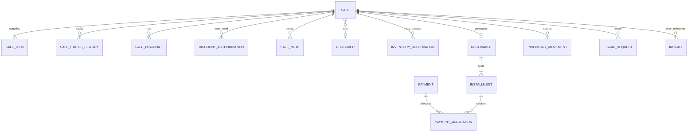

# Relacionamentos Lógicos

---

## 1. Legenda

| Tipo | Significado |
|---|---|
| Composition | filho não existe sem pai |
| Reference | FK lógica; lifecycle independente |
| Ownership | tenant `organization_id` |
| N:N | tabela de associação |

Delete behavior: **R**=restringe · **A**=arquiva cascata lógica · **C**=compensa · **X**=não aplica (imutável) · **S**=soft end

---

## 2. Matriz principal

| De | Para | Card. | Tipo | Delete | Obrig. |
|---|---|---|---|---|---|
| Organization | Membership | 1:N | composition | S membros | sim users |
| User | Membership | 1:N | reference | S | sim |
| Membership | Role | N:1 | reference | R | sim |
| Role | Permission | N:N | RolePermission | — | sim |
| Organization | Customer | 1:N | ownership | A | — |
| Customer | Address/Contact | 1:N | composition | A | — |
| Organization | Product | 1:N | ownership | A | — |
| Product | ProductVariant | 1:N | composition | A | ≥1 |
| Product | AttrDef | 1:N | composition | R se variantes | — |
| Variant | AttrValue | 1:N | composition | R | — |
| Variant | PriceCurrent | 1:1 | composition | — | sim se vende |
| Organization | StockLocation | 1:N | ownership | R se movimentos | ≥1 |
| Location+Variant | Balance | 1:1 | DER | rebuild | — |
| Location+Variant | Movement | 1:N | reference | **X** never delete | — |
| Sale | Reservation | 1:N | reference | C release | se Pedido |
| Reservation | ResItem | 1:N | composition | com reserva | sim |
| Sale | SaleItem | 1:N | composition | R pré; X pós-confirm | ≥1 confirm |
| Sale | Receivable | 1:0..1 | reference | C cancel | pós-confirm |
| Receivable | Installment | 1:N | composition | com recv | ≥1 |
| Payment | Allocation | 1:N | composition | com pay | ≥1 |
| Installment | Allocation | 1:N | reference | — | — |
| Payment | Payment (reversal) | 1:0..1 | reference | — | estorno |
| Sale | InventoryMovement | 1:N | reference source | **X** | confirm/cancel |
| Sale | FiscalRequest | 1:N | reference | FUT | — |
| Organization | Insight | 1:N | ownership | S expire | — |
| Organization | Outbox/Audit/Import/File | 1:N | ownership | retention | — |
| Organization | Subscription | 1:0..1 | reference | S | MVP típico 1 |

**Cross-tenant:** proibido. Toda FK entre entidades operacionais exige mesmo `organization_id` (constraint lógica C-TENANT).

---

## 3. Grafo da Sale (MVP)

### Vínculos explicados

| Objeto | Papel vs Sale |
|---|---|
| SaleItem | composição; snapshots comerciais |
| Reservation | referência; Pedido; consumida no confirm |
| InventoryMovement | referência `source=sale`; saída/estorno; **não** filho deletável |
| Receivable | 0..1 após confirm; cancelamento trata obrigação |
| Installment | filhos do receivable |
| Payment / Allocation | liquidação da obrigação; não são campos da Sale |
| FinancialEntry | **FUT**; MVP não exige — Payment basta |
| FiscalDocument | fronteira assíncrona; Sale permanece válida sem NF |
| Insight | pode apontar sale_id em source_refs; não acopla ciclo |

---

## 4. Lifecycle notes

- Confirmar Sale: cria movements + receivable (+ payment?) + consome reservation — mesma TX  
- Cancelar pré-confirm: libera reservation; sem movement  
- Cancelar pós-confirm: movements compensatórios; receivable cancel; payments conforme FQ-01  
- Arquivar Customer/Product: não cascateia delete em Sale  

Ver `SoftDelete.md`, `Retention.md`.
