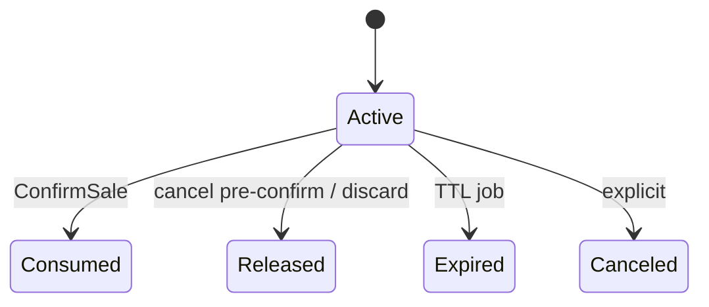
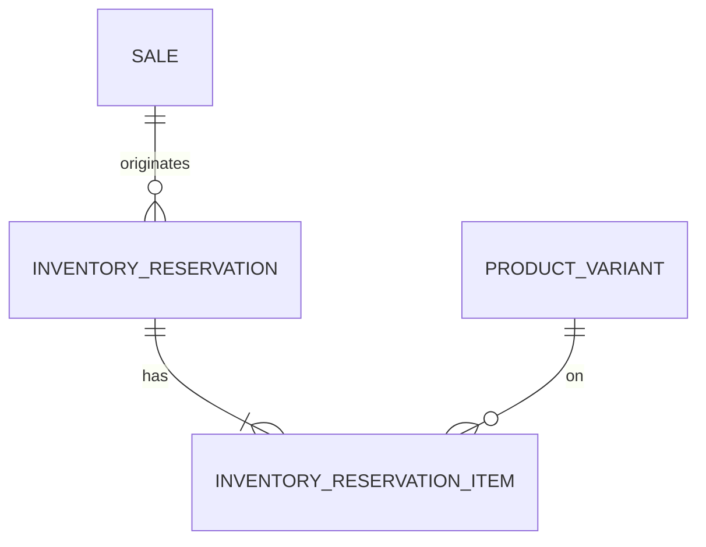

# Modelo Lógico — Reservas (FD-02)

> Reservation **não** é InventoryMovement.

---

## 1. InventoryReservation

| Campo | Notas |
|---|---|
| id, organization_id | |
| source_type | sale (MVP) |
| source_id | Sale.id |
| status | active\|consumed\|released\|expired\|canceled |
| created_at, expires_at | expires opcional (OQ-02) |
| created_by | |
| consumed_at, released_at, … | |

---

## 2. InventoryReservationItem

| Campo | Notas |
|---|---|
| reservation_id, variant_id, location_id | |
| qty_reserved | Quantity original |
| qty_consumed | |
| qty_released | |
| Invariante | consumed + released ≤ reserved; remaining ≥ 0 |

---

## 3. Estados

---

## 4. Relação com Sale

| Fase Sale | Efeito típico |
|---|---|
| Pedido | Cria/atualiza Reservation active (MVP) |
| Orçamento | Conforme política `quote_reserves` (OQ-03) |
| Confirmada | status→Consumed + InventoryMovement exit |
| PedidoCancelado / OrçamentoExpirado / Recusado / Descartada | Released |

---

## 5. Invariantes (impedir)
- Reserva duplicada ativa conflitante sem política (recomendação: uma reservation ativa por Sale; itens por variante)
- Consumo > reserved
- Liberação > remaining
- Consumo se expired/canceled
- qty ≤ 0
- Variante sem tracks_inventory
- reserved balance negativo

---

## 6. Diagrama

---

## 7. Índices
- (org, status, expires_at) — job expiração
- (org, source_type, source_id)
- (org, variant_id, status) — disponibilidade
