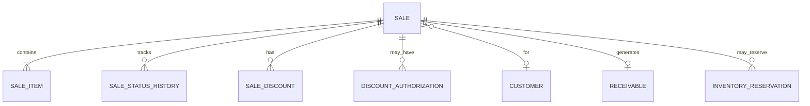

# Modelo Lógico — Sale (agregado comercial único — FD-03)

> Sem tabela Order independente no MVP.

---

## 1. Sale

| Campo lógico | Notas |
|---|---|
| id, organization_id | |
| sale_number | sequencial por org (humano) |
| status | ver máquina oficial |
| customer_id | nullable (venda avulsa) |
| customer_snapshot | JSON/cols — ver SaleSnapshots |
| seller_user_id / responsible_user_id | |
| currency | da org |
| quote_valid_until | para Orçamento |
| confirmed_at, canceled_at, … | |
| channel / source | ui, import, api |
| notes | |
| version | optimistic lock pré-confirmação |
| idempotency_key | na confirmação |
| subtotal, discount_total, total | DER persistido na confirmação; recalculado antes |
| created_*, updated_* | |

### Status oficiais
Rascunho · Orçamento · Pedido · Confirmada · Cancelada  
Terminais: Descartada · OrçamentoRecusado · OrçamentoExpirado · PedidoCancelado  

Mesma identidade (`Sale.id`) em todas as fases — muda comportamento/status, não vira outra entidade.

---

## 2. SaleItem

| Campo | Notas |
|---|---|
| sale_id, line_no | |
| variant_id | ref |
| snapshots | description, sku, unit, attributes (SaleSnapshots) |
| quantity | Quantity |
| unit_price, list_price | Money |
| line_discount | Money / % |
| line_total | DER |
| tracks_inventory_at_confirm | snapshot bool |

Itens editáveis só pré-confirmação.

---

## 3. Dependentes

| Estrutura | Uso |
|---|---|
| SaleStatusHistory | de, para, at, by, reason |
| SaleDiscount | ver DiscountModel |
| DiscountAuthorization | ver DiscountModel |
| SaleNote | observações |
| SaleAdjustment | fronteira futura |

---

## 4. Diagrama

---

## 5. Comportamento por status (resumo)

| Status | Reserva | Financeiro | Edição itens |
|---|---|---|---|
| Rascunho | normalmente não | não | sim |
| Orçamento | OQ-03 | não | limitada |
| Pedido | sim (MVP) | não | limitada |
| Confirmada | consumida | receivable/payment | não |
| Cancelada | — (já consumida; estorno físico) | compensação | não |

---

## 6. Índices
- (org, sale_number) unique
- (org, status, updated_at)
- (org, customer_id, confirmed_at)
- (org, confirmed_at) — relatórios
- (org, idempotency_key) unique where not null
