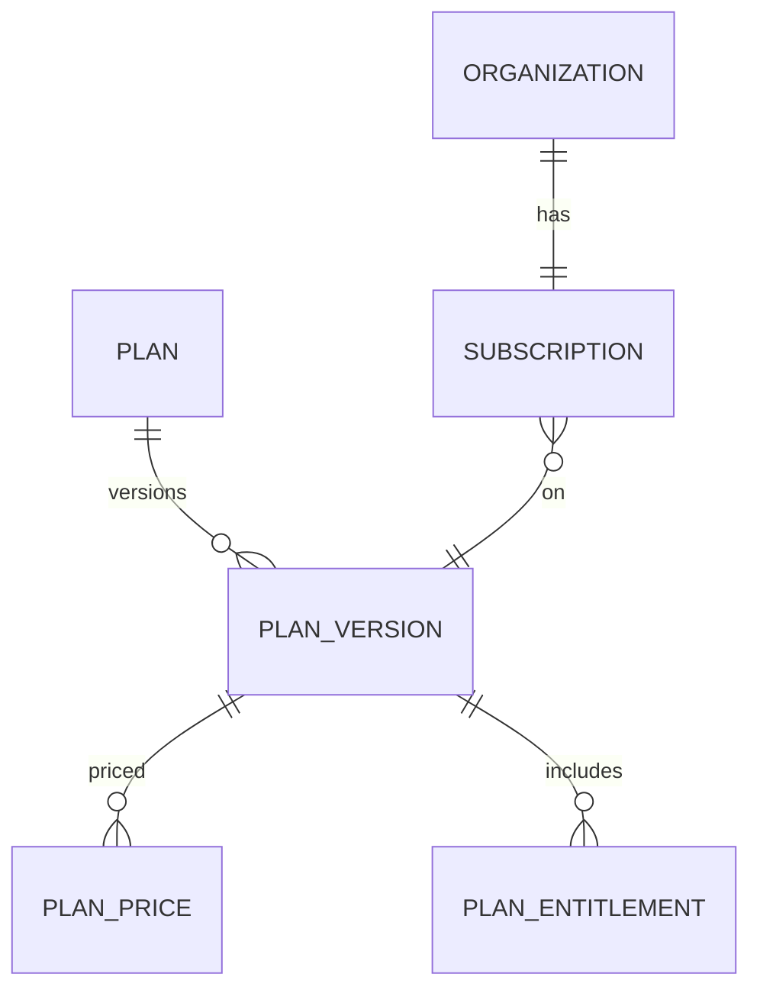

# Modelo Lógico — Assinaturas e Planos

---

## 1. Separação crítica

**Subscription/Billing (SaaS)** ≠ **Receivable/Payment (financeiro do cliente)**. Ledgers e estruturas separados.

---

## 2. Estruturas

### Plan (definição comercial)
- code interno estável (não exibir como verdade no domínio operacional)
- name, marketing_label
- Não espalhar “Free/Profissional” no núcleo — só ids/codes de plano

### PlanVersion
- plan_id, version, effective_from
- mapa de entitlements/limits (referências)
- Permite mudar pacote sem reescrever histórico (grandfathering)

### PlanPrice
- plan_version_id, amount (Money), billing_period, currency

### Subscription
- organization_id, plan_version_id, status, trial_ends_at, current_period_start/end
- external_billing_ref (gateway)
- status: trial | active | past_due | suspended | canceled

### SubscriptionEvent
- histórico de mudanças de plano/status (FT)

### Promotion / TemporaryAccess (opcional MVP-light)
- organization_id, entitlement overrides, expires_at

---

## 3. Diagrama

---

## 4. Estados (Subscription)

Trial → Active ↔ PastDue → Suspended → Canceled  
(conforme `StateMachines.md` domínio)

Efeito: Organization pode ser suspensa por inadimplência SaaS; **não apaga** dados operacionais.

---

## 5. MVP vs futuro
- MVP: Plan, PlanVersion, Subscription, vínculo entitlements, trial, status, webhook do gateway (boundary).
- Futuro: promoções complexas, add-ons granulares, multi-currency pricing.
